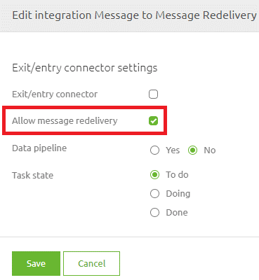

    

        <main class="micro-learning">
        <ul class="doc-nav">
            <li class="doc-nav__item"><a href="../../docs/microlearning/intermediate-message-redelivery-index" class="doc-nav__link">Home</a></li>
            <li class="doc-nav__item"><a href="#intro" class="doc-nav__link">Intro</a></li>
            <li class="doc-nav__item"><a href="#theory" class="doc-nav__link">Theory</a></li>
            <li class="doc-nav__item"><a href="#practice" class="doc-nav__link">Practice</a></li>
            <li class="doc-nav__item"><a href="#solution" class="doc-nav__link">Solution</a></li>
        </ul>

##### Intro

# Message Redelivery - Configuration

In this microlearning, we will learn how you can define a specific flow towards a system whether you want to activate Message Redelivery or not. Note that you should only use the message redelivery functionality when there are consistent issues with delivering messages without an alternative of resolving that problem on the side of the external system.

Should you have any questions, please get in touch with academy@emagiz.com.

- Last update: April 5th, 2022
- Required reading time: 5 minutes

## 1. Prerequisites
- Basic knowledge of the eMagiz platform

## 2. Key concepts
This microlearning is about message redelivery.

- Use the Message Redelivery only when there are no other options in the external system that will reduce outage
- Message Redelivery is only helpful on asynchronous flows
- Configuration of Message Redelivery can only be done after consultation with your partner manager
- To configure message redelivery on a specific flow, you need to activate a checkbox in Design
- Once you have not activated the checkbox, you cannot easily add Message Redelivery to your solution. If there is a specific need, contact your partner manager for support.

##### Theory

## 3. Message Redelivery - Configuration

In this microlearning, we will learn how you can define a specific flow towards a system whether you want to activate Message Redelivery or not. Note that you should only use the message redelivery functionality when there are consistent issues with delivering messages without an alternative of resolving that problem on the side of the external system.

Before diving into the configuration itself, let us introduce some key considerations when configuring Message redelivery. Below you will find these considerations:

- Use the Message Redelivery only when there are no other options in the external system that will reduce outage
- Message Redelivery is only helpful on asynchronous flows
- Configuration of Message Redelivery can only be done after consultation with your partner manager
- To configure message redelivery on a specific flow, you need to activate a checkbox in Design
- Once you have not activated the checkbox, you cannot easily add Message Redelivery to your solution. If there is a specific need, contact your partner manager for support.

To configure message redelivery on a specific flow, you need to open the Edit integration screen. In this pop-up, you select the checkbox called "Allow message redelivery."

When you have done so, eMagiz will generate the correct configuration in your flows to activate message redelivery on that particular part of the solution. Note that when you do this for the first time in your model, eMagiz will also update your JMS server. eMagiz will update the JMS server to host a dead letter address. This address will temporarily keep messages waiting to be redelivered.

This concludes our microlearning on the configuration of message redelivery. In the next microlearning, we will learn how you can view the available messages in message redelivery, and we will learn what you can do with these messages. To navigate towards that microlearning directly, please follow this [link](intermediate-message-redelivery-redelivery-in-manage.md).

##### Practice

## 4. Assignment

As this is a feature flagged functionality, no assignment will be associated with this microlearning. 

## 5. Key takeaways

- Use the Message Redelivery only when there are no other options in the external system that will reduce outage
- Message Redelivery is only helpful on asynchronous flows
- Configuration of Message Redelivery can only be done after consultation with your partner manager
- To configure message redelivery on a specific flow, you need to activate a checkbox in Design
- Once you have not activated the checkbox, you cannot easily add Message Redelivery to your solution. If there is a specific need, contact your partner manager for support.

##### Solution

## 6. Suggested Additional Readings

There are no suggested additional readings on this topic.

## 7. Silent demonstration video

This video demonstrates how you could have handled the assignment and gives you some context on what you have just learned.

<iframe width="1280" height="720" src="../../vid/microlearning/intermediate-message-redelivery-configuration.mp4" frameborder="0" allow="accelerometer; autoplay; clipboard-write; encrypted-media; gyroscope; picture-in-picture" allowfullscreen></iframe>

</main>

