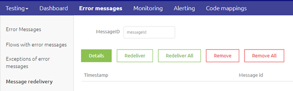
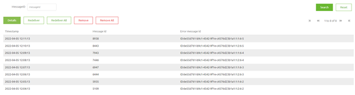
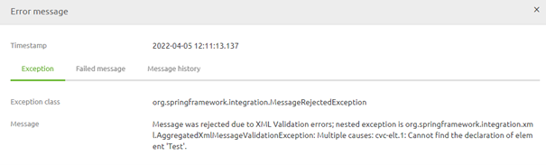
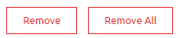

    

        <main class="micro-learning">
        <ul class="doc-nav">
            <li class="doc-nav__item"><a href="../../docs/microlearning/intermediate-message-redelivery-index" class="doc-nav__link">Home</a></li>
            <li class="doc-nav__item"><a href="#intro" class="doc-nav__link">Intro</a></li>
            <li class="doc-nav__item"><a href="#theory" class="doc-nav__link">Theory</a></li>
            <li class="doc-nav__item"><a href="#practice" class="doc-nav__link">Practice</a></li>
            <li class="doc-nav__item"><a href="#solution" class="doc-nav__link">Solution</a></li>
        </ul>

##### Intro

# Message Redelivery - Redelivery in Manage

In this microlearning, we will learn how you can view the messages that are currently waiting for message redelivery. On top of that, we will learn how you can perform actions on these messages. The primary step we will be focusing on is the redelivery of the message itself.

Should you have any questions, please get in touch with academy@emagiz.com.

- Last update: April 5th, 2022
- Required reading time: 5 minutes

## 1. Prerequisites
- Basic knowledge of the eMagiz platform

## 2. Key concepts
This microlearning is about redelivering messages from the message redelivery overview in Manage.

- The message redelivery overview shows metadata about each message that is yet to be redelivered
- Via the Details button you can see the accompanying two weeks (assuming the message was not place in message redelivery more than two weeks ago)
- With the help of the Redelivery button you can redeliver a specific message
- With the help of the Remove button you can remove a specific message
- With the help of the Redeliver All button you can redeliver all messages
- With the help of the Remove All button you can remove all messages waiting to be redelivered

##### Theory

## 3. Message Redelivery - Redelivery in Manage

In this microlearning, we will learn how you can view the messages that are currently waiting for message redelivery. On top of that, we will learn how you can perform actions on these messages. The primary step we will be focusing on is the redelivery of the message itself.

The message redelivery overview can be found in the Manage phase of eMagiz. Within Manage you can navigate to Error Message -> Message Redelivery to access the overview.

Once the overview contains messages it will look something as follows. For each message we have a timestamp and two IDs.

By selecting a specific message and pressing the Details button eMagiz will search for the accompanying error message from the error message dashboard. If eMagiz can find the accompanying error message eMagiz will show you the error message details.

Note that there is not always an accompanying error message to be found. In those cases eMagiz will show you an empty error messages pop-up.

### 3.1 Redeliver Message(s)

When you want to redeliver a message you simply select the message and press the button Redeliver. In case all errors originate from the same cause and the cause is resolved you could opt for the option "Redeliver All". This will redeliver all messages at once.

Note that when the message could not be redelivered after you press the redeliver button the old message will disappear from the screen and a new message corresponding to the new error will appear again in your list.

### 3.2 Remove Message(s)

When you determine that it is not relevant anymore to redeliver a certain message you can have the option to remove a message by selecting it and pressing the button "Remove". On top of that you have the option to "Remove All". This will remove all messages at once.

##### Practice

## 4. Assignment

As this is a feature flagged functionality, no assignment will be associated with this microlearning. 

## 5. Key takeaways

- The message redelivery overview shows metadata about each message that is yet to be redelivered
- Via the Details button you can see the accompanying two weeks (assuming the message was not place in message redelivery more than two weeks ago)
- With the help of the Redelivery button you can redeliver a specific message
- With the help of the Remove button you can remove a specific message
- With the help of the Redeliver All button you can redeliver all messages
- With the help of the Remove All button you can remove all messages waiting to be redelivered

##### Solution

## 6. Suggested Additional Readings

There are no suggested additional readings on this topic.

## 7. Silent demonstration video

This video demonstrates how you could have handled the assignment and gives you some context on what you have just learned.

<iframe width="1280" height="720" src="../../vid/microlearning/intermediate-message-redelivery-redelivery-in-manage.mp4" frameborder="0" allow="accelerometer; autoplay; clipboard-write; encrypted-media; gyroscope; picture-in-picture" allowfullscreen></iframe>

</main>

