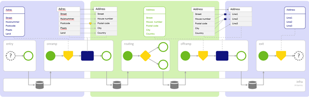

    

        <main class="micro-learning">
        <ul class="doc-nav">
            <li class="doc-nav__item"><a href="../../docs/microlearning/intermediate-orchestration-of-data-packets-index" class="doc-nav__link">Home</a></li>
            <li class="doc-nav__item"><a href="#intro" class="doc-nav__link">Intro</a></li>
            <li class="doc-nav__item"><a href="#theory" class="doc-nav__link">Theory</a></li>
            <li class="doc-nav__item"><a href="#practice" class="doc-nav__link">Practice</a></li>
            <li class="doc-nav__item"><a href="#solution" class="doc-nav__link">Solution</a></li>
        </ul>

##### Intro

# Queues - How do they work
 
In this microlearning, we will explore how queues work and how they work with the JMS. This method ensures that data is data delivered via the messaging pattern in eMagiz.

Should you have any questions, please get in touch with academy@emagiz.com.

- Last update: August 5th, 2021
- Required reading time: 5 minutes

## 1. Prerequisites
- Intermediate knowledge of the eMagiz platform

## 2. Key concepts
This microlearning centers on the concept of how queues work and how they work with the JMS.

- The key aspects are:
    - Queues are part of the messaging layer
    - The queues reside on infra level (JMS)
    - Endpoint of the entry is the first queue in the messaging layer
    - Consumers subscribe to queues to process data

##### Theory
  
## 3. Queues - How do they work

In this microlearning, we will explore how queues work and how they work with the JMS. This method ensures that data is data delivered via the messaging pattern in eMagiz.

- The key aspects are:
    - Queues are part of the messaging layer
    - The queues reside on infra level (JMS)
    - Endpoint of the entry is the first queue in the messaging layer
    - Consumers subscribe to queues to process data

When you use the messaging engine in eMagiz, you will use the queue mechanism inside the messaging engine to transport data between the various processes. In the picture shown below, we clarified this method.

This picture tells us a lot about how the messaging engine in eMagiz works. First, it tells us that we discern five layers in eMagiz to process data from one system to another. The five layers we distinguish are the entry, the onramp, the routing, the offramp, and the exit. We also see in the picture that the messaging engine consists of a process layer (the top part) and a messaging layer (the infra part on the bottom). If we zoom in on the infra part, we see four queues involved in this process. 

Why not five, you ask? That is because the entry (that ensures that data comes in) does not have a queue. For a more in-depth analysis of why this is, please check out this [microlearning](intermediate-key-concepts-emagiz-platform-entry-not-a-queue.md). The picture also tells us that the queue acts as the bridge between two processes. For example, if we zoom in on the left part of the picture that depicts the offramp and the exit, we see that the offramp process is done when it successfully delivers the message on the next queue in line (the exit). This queue is automatically the starting point of the following process (the exit). 

So in a sense, the responsibilities of each process are separated from each other. Another thing to notice about this picture is that the depicting of the entry and the exit differs. This difference stems from the fact that the starting point of your process and the endpoint of your process will be something else. This connection can be a REST endpoint, or a database, or an SFTP server. The entry ensures the data is received (or retrieved) from an external system. The exit makes sure to deliver the data to an external system.

The last thing to notice about this picture is the background color. We have blue, green, blue in this picture. In eMagiz, we use blue to depict that those processes are related to a specific system. As we explained before, this holds for the entry and the exit. The green portion is happening internally in the eMagiz engine, and since the start and the end are eMagiz queues and eMagiz structures, the background color is green. This distinction also allows you to deploy your entries and exit on a separate machine compared to your onramp, offramp, and routing processes.

When stepping outside of the confines of the picture, we have one last thing to discuss before we wrap up this microlearning. As we learned previously, the queues are part of the messaging layer (i.e., the infra). The JMS process within eMagiz governs the messaging layer and will dynamically create or drop queues based on what you deploy with the help of your release. This functionality makes the process of adding and removing processes from your integration data model dynamic in nature.

This explanation concludes how eMagiz uses queues to split the functional process into five steps, each with its function.

##### Practice

## 4. Assignment

See if you can find the queues for one of your processes within an (Academy) project you can access.

## 5. Key takeaways

- The key aspects are:
    - Queues are part of the messaging layer
    - The queues reside on infra level (JMS)
    - Endpoint of the entry is the first queue in the messaging layer
    - Consumers subscribe to queues to process data

##### Solution

## 6. Suggested Additional Readings

If you are interested in this topic, please boost your knowledge with the help of the internet.

## 7. Silent demonstration video

As this is a more theoretical microlearning, we have no video for this.

</main>

