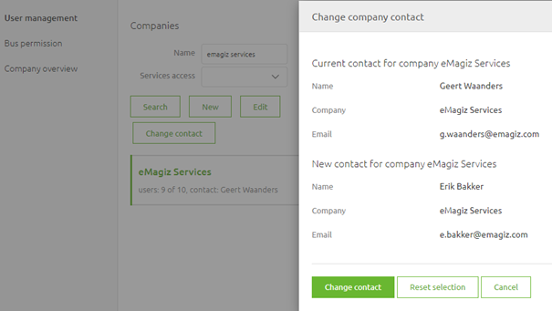

    

        <main class="micro-learning">
        <ul class="doc-nav">
            <li class="doc-nav__item"><a href="../../docs/microlearning/intermediate-portal-security-index" class="doc-nav__link">Home</a></li>
            <li class="doc-nav__item"><a href="#intro" class="doc-nav__link">Intro</a></li>
            <li class="doc-nav__item"><a href="#theory" class="doc-nav__link">Theory</a></li>
            <li class="doc-nav__item"><a href="#practice" class="doc-nav__link">Practice</a></li>
            <li class="doc-nav__item"><a href="#solution" class="doc-nav__link">Solution</a></li>
        </ul>

##### Intro

# Understanding the role of bus owner and company contact
 
A crucial part of correctly managing the platform is correctly handling user management within your company and within your integration data models (i.e. projects or buses). In this microlearning, we will zoom in on user management to explain it. Furthermore, we will zoom in on two crucial roles when it comes to user management. These roles are the bus owner role and the company contact.

Should you have any questions, please contact academy@emagiz.com.

- Last update: August 3th, 2021
- Required reading time: 6 minutes

## 1. Prerequisites
- Intermediate knowledge of the eMagiz platform

## 2. Key concepts
This microlearning centers on Understanding the role of bus owner and company contact.

- The key aspects are:
    - A bus owner grants permissions on integration data model (i.e project) level
    - A company contact can add, activate and deactivate users for a specific company
    - Both bus owners and company contacts can transfer their rights to another portal user
    - A bus owner is the first point of contact for eMagiz support and eMagiz Expert Services

##### Theory
  
## 3. Runtime security

A crucial part of correctly managing the platform is correctly handling user management within your company and within your integration data models (i.e. projects or buses). In this microlearning, we will zoom in on user management to explain it. Furthermore, we will zoom in on two crucial roles when it comes to user management. These roles are the bus owner role and the company contact.

- The key aspects are:
    - A bus owner grants permissions on integration data model (i.e project) level
    - A company contact can add, activate and deactivate users for a specific company
    - Both bus owners and company contacts can transfer their rights to another portal user
    - A bus owner is the first point of contact for eMagiz support and eMagiz Expert Services

### 3.1 User management on platform level
On the platform level, there are several forms of user management embedded within the portal. In this section we will discuss user access to integration projects, user authorizations to integration projects, the role of the bus owner, transferring your bus owner role, and the company contact role.

#### 3.1.1 Users access to Integration Projects
Users can be added to Integration projects, which hold all the configurations required to run the different integrations for the TAP environments. Integration projects are connected to organizations in eMagiz to ensure the integration project remains within the limits of the license agreements. Users can be added to integration projects of the organization where the user belongs to. Users can't be added to integration projects of other clients. The bus owner and the company contact have the right to add/remove users from an integration project.

#### 3.1.2 User authorizations to Integration projects.
Every integration project has a bus owner who can distribute rights across functionalities and environments. In the picture below, one can see the various options available across the Integration Life Cycle (ILM) Phases Capture through Manage. The bus owner manages the user permissions and needs to have the MFA authentication level passed before making any changes. 
- In case of Edit permission is granted on an ILM phase, all the sub-options can be configured
- View rights mean that all options can be viewed only
- In case the user has no Edit or View rights to a certain ILM phase, the phase will not be displayed at all in the eMagiz iPaaS Portal
- When you create a new project you will automatically be the bus owner of that project
- The bus owner can transfer his/her rights to another portal user that is active within the context of that project
- An audit trail is kept of the changes made in the project permission structure

### 3.2 Bus owner
The bus owner is an eMagiz user that is the first point of contact for a certain integration project. By being a bus owner you can add/remove users to/from the integration project you are bus owner for. Requests of users to get more or fewer rights should pass through you. If you are no longer associated with an integration project you have the option to transfer your role to another active user on that integration project. How to do so is explained in more detail in the following section

#### 3.2.1 Change contact
When you navigate to Administration -> User Management -> Bus permissions you will see a list of integration projects you are the bus owner (contact) for. Select the integration project for which you want to transfer your bus owner responsibilities and press Change Contact.
Select the user that will be the new bus owner and press Change contact.

### 3.3 Company Contact
Every Company that is registered within eMagiz has a so-called company contact. The company contact has two specific functions:
- Add/Deactive Users within that Company
- Backup for the bus owner to add/remove a user, and give the appropriate rights, from a specific integration project

#### 3.3.1 User management
When you navigate to Administration -> User Management -> User management you will see a list of companies you are the company contact for. Select the company for which you want to add/edit/deactivate users and based on the action press New, Edit, or Deactivate.
Follow the instructions of eMagiz based on the choice you have made to successfully perform the required action.

#### 3.3.2 Change contact
When you navigate to Administration -> User Management -> User management you will see a list of companies you are the contact for. Select the company for which you want to transfer your bus owner responsibilities and press Change Contact. Select the user that will be the company contact and press Change contact.

##### Practice

## 4. Assignment

Check out if the bus owner for the projects in which you are involved is someone that is still active on the project.

## 5. Key takeaways

- The key aspects are:
    - A bus owner grants permissions on integration data model (i.e project) level
    - A company contact can add, activate and deactivate users for a specific company
    - Both bus owners and company contacts can transfer their rights to another portal user
    - A bus owner is the first point of contact for eMagiz support and eMagiz Expert Services

##### Solution

## 6. Suggested Additional Readings

If you are interested in this topic and want more information please check out the [Security Guide](../fundamental/fundamental-emagiz-security-guide.md)

## 7. Silent demonstration video

As this is a more theoretical microlearning we have no video for this.

</main>

