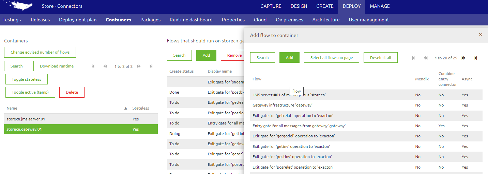
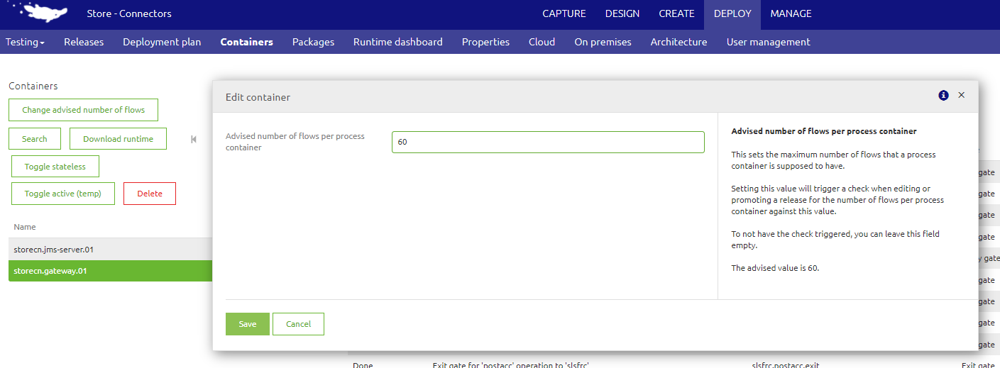

    

        <main class="micro-learning">
        <ul class="doc-nav">
            <li class="doc-nav__item"><a href="../../docs/microlearning/intermediate-release-management-index" class="doc-nav__link">Home</a></li>
            <li class="doc-nav__item"><a href="#intro" class="doc-nav__link">Intro</a></li>
            <li class="doc-nav__item"><a href="#theory" class="doc-nav__link">Theory</a></li>
            <li class="doc-nav__item"><a href="#practice" class="doc-nav__link">Practice</a></li>
            <li class="doc-nav__item"><a href="#solution" class="doc-nav__link">Solution</a></li>
        </ul>

##### Intro

# Managing releases - Best practice
 
In previous microlearnings, we have already explained quite a lot about what releases are and how you should handle releases. In this microlearning, we will take a look at the management part of releases. This microlearning will focus on how to ensure flows are assigned to containers and why that is important.

Should you have any questions, please contact academy@emagiz.com.

- Last update: October 13th, 2021
- Required reading time: 5 minutes

## 1. Prerequisites
- Intermediate knowledge of the eMagiz platform

## 2. Key concepts
This microlearning centers on containers. Containers in this context are the same as the runtimes of eMagiz that you will see in the runtime dashboard of eMagiz under Deploy - Runtime Dashboard. Each system in the model will create a runtime or container. You have to explain eMagiz what flows will run on what container. Notably important for the process container that holds the onramps and offramps - selection can be made how to spread these across one or more containers

**Some basic considerations:**
- Default behavior of new onramps and offramps is that these will be spread over all process containers. In some cases this desirable (2 containers - failover setup), but in some case one has to be specific and ensure the flows are put on the right process container
- In case a certain flow is made part of a release, but has not been assigned to any container than that release can't be set to active
- Entry and Exit flow are always put on the system specific container
- Exit gate flows are always put on the Gateway Container
- Event processors are always put on the Event Container

Please make sure that the maximum number of flows on any container is approx. 60 flows

##### Theory
  
## 3. Container management

### 3.1 Container assignments

Navigate to Deploy --> Containers. Select the runtime where the flow needs to be added and press Add. Select the flow and press Add once more in the pop-up.

### 3.2 Setting maxiumum number of flows per container 

Busowners have the option to limit the number of flows on a process container. This option will impact the behavior of Release management where a release can't be promoted to a next environment or set as active in case the flows on the process containers exceeeds this limit.

##### Practice

## 4. Assignment

Check out if the best practices detailed above are applied within your (Academy) project. If not open up a discussion on why those choices are made to learn from that.

## 5. Key takeaways

The key aspects are:
    - Ensure to consider the container assigments when making releases
	- Considering setting the maximum number of flows on a process container to allow optimal performance of the container

##### Solution

## 6. Suggested Additional Readings

If you are interested in this topic please read the help text eMagiz provides you in the container section in the Deploy phase. Try to set the maximum of process flows to a low value to trigger the alert on the release level

## 7. Silent demonstration video

As this is a more theoretical microlearning we have no video for this.

</main>

