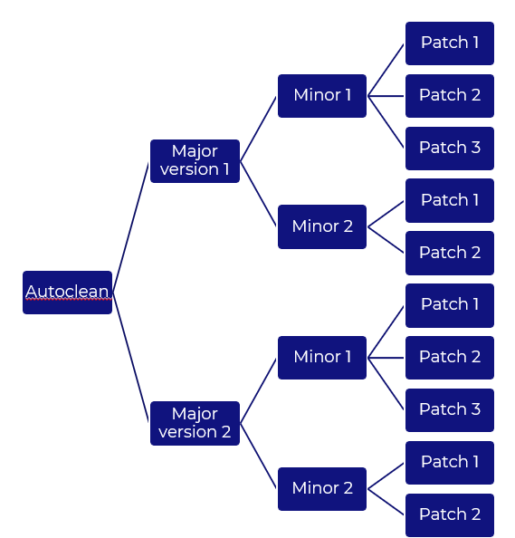
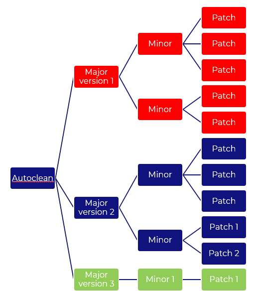
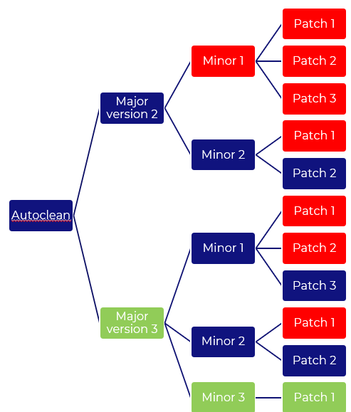
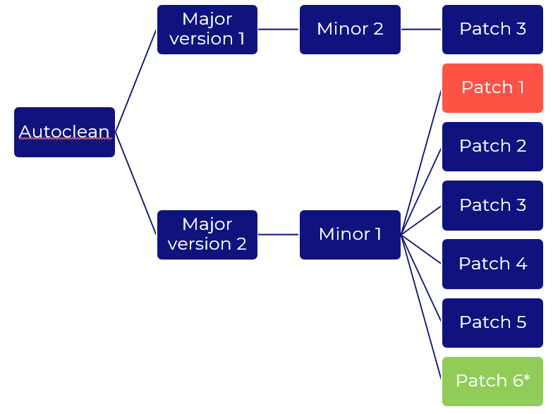

    

        <main class="micro-learning">
        <ul class="doc-nav">
            <li class="doc-nav__item"><a href="../../docs/microlearning/intermediate-release-management-index" class="doc-nav__link">Home</a></li>
            <li class="doc-nav__item"><a href="#intro" class="doc-nav__link">Intro</a></li>
            <li class="doc-nav__item"><a href="#theory" class="doc-nav__link">Theory</a></li>
            <li class="doc-nav__item"><a href="#practice" class="doc-nav__link">Practice</a></li>
            <li class="doc-nav__item"><a href="#solution" class="doc-nav__link">Solution</a></li>
        </ul>

##### Intro

# Autoclean releases
 
eMagiz has implemented an approach since early 2022 to automatically the releases inside the Deploy phases. Up until early 2022, releases had to manually be deleted and failure to do so resulted in reduced performance in the specific section of the Portal. With this functionality, there will be a maximum number of releases preserved for users and releases are automatically removed from the model.

Should you have any questions, please contact academy@emagiz.com.

- Last update: February 2021
- Required reading time: 10 minutes

## 1. Prerequisites
- Intermediate knowledge of the eMagiz platform

## 2. Key concepts

A release in eMagiz holds the key information what flows are to be deployed in what environment exactly. You will find the specific flows with the relevant version information listed, added with key flows that are required to make the release active. Active means that the release can be deployed effectively. Each release will have a distinct name to indicate the change made in the release, as well as a version. That version is based on the idea of having major, minor and patch releases. Condusive with the general way of working on IT. In the approach taken by eMagiz to clean releases, we have leveraged these version indication to find out what the older releases are.

In cases wheran environment uses clear cut major, minor and patch releases to update athe Test, Acceptance and Production environment

##### Theory
  
## 3. Autoclean mechanism explained

### 3.1 Cleaning rules

Below are the general rules that are applied to locate a release that can be deleted from list. It's probably easiest to understand to regard these rules in the form of a graph or decision tree. In the following sections you will find an example

1. Firstly, verify Major branches
	- There will be always 1 active, major release
	- There will be always 1 major release next to the active major
2. Secondly, verify the Minor across all branches
	- There will be always 1 active minor release
	- There will be always 2 minor releases across all branches beyond the active minor 
	- The minor for an saved major releases will be preserved regardless
3. Thirdly, verify the Patches across all branches
	- There will be always 1 active patch release
	- There will be always 3 patch releases across all branches beyond the active patch 
	- The patch for an saved minor releases will be preserved regardless
	- The patch for an saved major releases will be preserved regardless
4. No-active releases with versions higher than the active will be not be regarded

Starting point for the section below is the following state of the releases in Deploy	

### 3.2 Impact adding a major releases

When adding a new major releases AND making that release active, the following will happen:

- Red	: releases removed
- Green	: release added
- The entire major branche of version 1 is removed as that violates the rule for the major branche evaluation.

### 3.3 Impact adding a minor releases

When adding a new minor releases AND making that release active, the following will happen:

- Red	: releases removed
- Green	: release added
- Adding a minor would evaluate whether a major needs to be removed or not - check rule 1 major + 1 major active
- Adding a minor would evaluate whether a minor needs to be removed or not - check rule 2 minor + 1 minor active
- In the example below, the addition of a minor in the major 3 branche results in the cleanup of the entire major branche 1 and removing all patches in the oldest minor branche. Furthermore, once the new minor is made active there will be an additional minor active beyond the 1 active + 2 minor. An addition of a patch or major could result in a cleanup of minors as well.

### 3.4 Impact adding a patch releases

When adding a new patch releases AND making that release active, the following will happen:

- Red	: releases removed
- Green	: release added
- Once a new patch is created, all patches in the major branche are evaluated to check for 1 active releases + 3 previous patches in that branche. Making that same new patch active means that there are 5 patches present. An addition of a minor or major could result in a cleanup of patches as well.

##### Practice

## 4. Assignment

Check out if the best practices detailed above are applied within your (Academy) project. If not open up a discussion on why those choices are made to learn from that.

## 5. Key takeaways

The key takeways are
- Releases are automatically clean for users so that there is maximum number of releases available
- Cleaning of releases happens at the moment when a release is created (not at the moment when it's set as active)
- Leverage the versioning of releases to incidate what release is on what environment. 
	
	
##### Solution

## 6. Suggested Additional Readings

N/A

## 7. Silent demonstration video

As this is a more theoretical microlearning we have no video for this.

</main>

