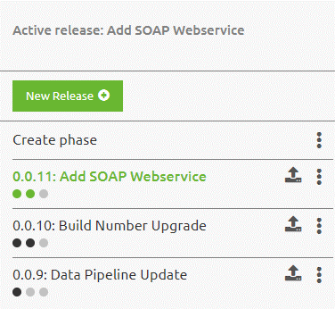
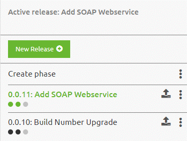

    

        <main class="micro-learning">
        <ul class="doc-nav">
            <li class="doc-nav__item"><a href="../../docs/microlearning/intermediate-release-management-index" class="doc-nav__link">Home</a></li>
            <li class="doc-nav__item"><a href="#intro" class="doc-nav__link">Intro</a></li>
            <li class="doc-nav__item"><a href="#theory" class="doc-nav__link">Theory</a></li>
            <li class="doc-nav__item"><a href="#practice" class="doc-nav__link">Practice</a></li>
            <li class="doc-nav__item"><a href="#solution" class="doc-nav__link">Solution</a></li>
        </ul>

##### Intro

# Managing releases - Best practice
 
In previous microlearnings, we have already explained quite a lot about what releases are and how you should handle releases. In this microlearning, we will take a look at the management part of releases. What we see quite often is a long and unclear list of releases that are not properly managed. This microlearning aims to give you guidance on how to best manage your releases.

Should you have any questions, please contact academy@emagiz.com.

- Last update: August 4th, 2021
- Required reading time: 4 minutes

## 1. Prerequisites
- Intermediate knowledge of the eMagiz platform

## 2. Key concepts
This microlearning centers on managing releases.

- The key aspects are:
    - Keep the list of releases short and clear
    - When creating a new release determine whether an old one is a deletion candidate
    - Preferably use the same release across environments to prevent copy+paste mistakes

##### Theory
  
## 3. Managing releases - Best practice

In previous microlearnings, we have already explained quite a lot about what releases are and how you should handle releases. In this microlearning, we will take a look at the management part of releases. What we see quite often is a long and unclear list of releases that are not properly managed. This microlearning aims to give you guidance on how to best manage your releases.

- The key aspects are:
    - Keep the list of releases short and clear
    - When creating a new release determine whether an old one is a deletion candidate
    - Preferably use the same release across environments to prevent copy+paste mistakes

You can check out the overview of releases when you navigate to Deploy -> Releases. On the right-hand side of the page, you will see all releases that still exists within your context.

This release overview tells how many releases you have created but not yet deleted. Furthermore, it gives information on what the release is about, on which environment it is active and for which environments it has been approved. In the example shown above, we see that the latest release is active in both Test and Acceptance. This is a sign of a project in which there is little turmoil on what holds priority. We do however also see large projects in which multiple teams work on completely different sets of integrations. In those scenarios, we advise using separate releases per environment to limit the risk of deploying flows too early or too late to a certain environment.

What we can also learn from the picture shown is that we have three releases of which two are not active and are older compared to our active release. This means that the oldest one is a deletion candidate. As a rule of thumb, we like to adhere to the best practice that you should always keep one release in the bag per environment. So at a maximum, you should have six releases on this list. The dream scenario would be that you build everything the first time right which means you only need one release. If we apply our own set of management rules to our release overview the result will be:

##### Practice

## 4. Assignment

Check out if the best practices detailed above are applied within your (Academy) project. If not open up a discussion on why those choices are made to learn from that.

## 5. Key takeaways

- The key aspects are:
    - Keep the list of releases short and clear
    - When creating a new release determine whether an old one is a deletion candidate
    - Preferably use the same release across environments to prevent copy+paste mistakes

##### Solution

## 6. Suggested Additional Readings

If you are interested in this topic please read the help text eMagiz provides you.

## 7. Silent demonstration video

As this is a more theoretical microlearning we have no video for this.

</main>

