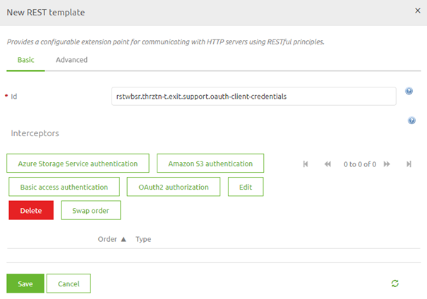
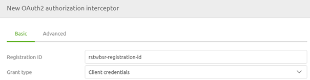
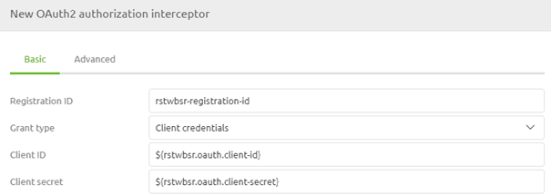
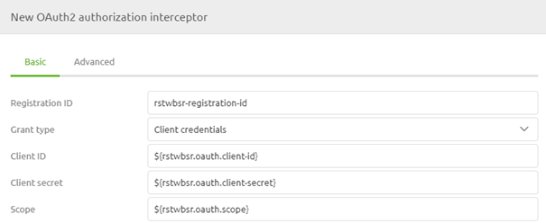
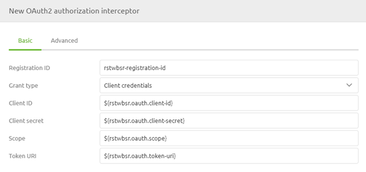
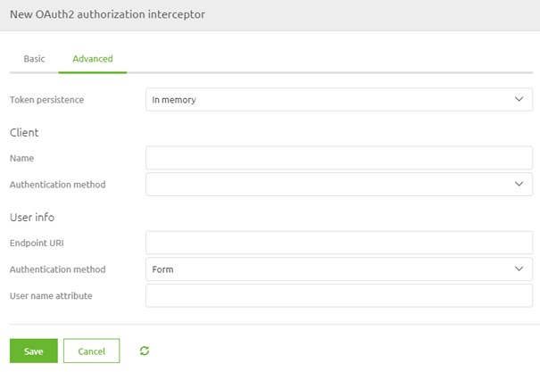
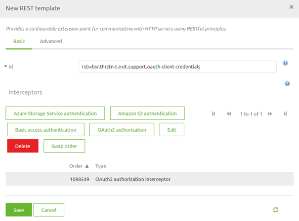
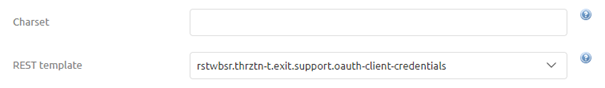
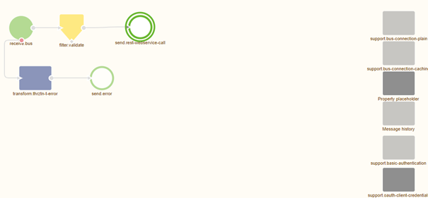

    

        <main class="micro-learning">
        <ul class="doc-nav">
            <li class="doc-nav__item"><a href="../../docs/microlearning/intermediate-rest-webservice-connectivity-index" class="doc-nav__link">Home</a></li>
            <li class="doc-nav__item"><a href="#intro" class="doc-nav__link">Intro</a></li>
            <li class="doc-nav__item"><a href="#theory" class="doc-nav__link">Theory</a></li>
            <li class="doc-nav__item"><a href="#practice" class="doc-nav__link">Practice</a></li>
            <li class="doc-nav__item"><a href="#solution" class="doc-nav__link">Solution</a></li>
        </ul>

##### Intro

# Authorization - OAuth 2.0 Client Credentials

In this microlearning, we will discuss how you can ensure that the correct credentials are sent to the external system. There are many forms of OAuth 2.0 authorization flows. The one that we see most for interchanging data between applications is the client credentials flow. In this microlearning, we will learn how you need to configure certain components within your flow to successfully send the relevant authentication information to the external system. In the following microlearning, we will look at a different OAuth 2.0 authorization flow, the authorization code flow.
 
Should you have any questions, please contact academy@emagiz.com.

- Last update: April 6th, 2021
- Required reading time: 7 minutes

## 1. Prerequisites
- Intermediate knowledge of the eMagiz platform

## 2. Key concepts
This microlearning centers around authenticating ourselves with an external REST web service via the OAuth 2.0 Client Credentials flow.
With OAuth 2.0 flow, we mean: A specific flow that enables a third-party application to obtain limited access to an HTTP service
With REST, we mean: A web service that adheres to the RESTful principles

- The application (eMagiz) pushes data to an external REST web service (or API)
- To do so eMagiz needs to be authorized to read and/or write data
- OAuth 2.0 is an industry-standard that is widely implemented, especially in combination with API development

##### Theory    

## 3. Authorization - OAuth 2.0 Client Credentials

There are many forms of OAuth 2.0 authorization flows. The one that we see most for interchanging data between applications is the client credentials flow. In this microlearning, we will learn how you need to configure certain components within your flow to successfully send the relevant authentication information to the external system. In the following microlearning, we will look at a different OAuth 2.0 authorization flow, the authorization code flow. Key parts to consider for this microlearning are:

- The application (eMagiz) pushes data to an external REST web service (or API)
- To do so eMagiz needs to be authorized to read and/or write data
- OAuth 2.0 is an industry-standard that is widely implemented, especially in combination with API development

Within eMagiz, you have a lot of components that help you build your flows. The same applies when you want to authorize yourselves with an external party with the help of OAuth 2.0. So let us discuss how we should make that happen.

### 3.1 REST Template

When you navigate to the Create phase you can open an exit flow and see whether you already have an HTTP outbound component within your exit flow. If not please add an HTTP outbound component (gateway or channel adapter) to the flow. In the previous microlearning, we focused on these components so we won't focus on these components in this microlearning.

To ensure that a certain authorization is added to this HTTP outbound component we need to add the support object called REST Template to the flow:

After you have added the support object to the canvas and given it a name you can open it by double clicking on the component. eMagiz will show you the following pop-up:

As you can see here you can select various authentication schemes. In this microlearning, the focus is on OAuth 2.0 Client Credentials therefore we select the button called OAuth2 authorization. Selecting this option will open another pop-up. In this pop-up, we need to fill in the relevant information for the authentication scheme that we have selected.

In this case, we have to fill in several items. At first, we need to fill in a registration ID. This can be anything you want. The best practice is to name it after the runtime you are currently working on. The second configuration element is the Grant Type. Here you can select the various grant types that are available within the various OAuth 2.0 authorization flows. For this microlearning, we will select the Client Credentials option.

The second part of your configuration has to do with the 'username' and 'password' you need to send to the OAuth 2.0 endpoint to retrieve a token you can use in subsequent calls. In OAuth 2.0 the 'username' and 'password' are called client id and client secret. As always in scenarios where an information element can change between environments, you should use a property reference and determine the correct value on a per-environment basis.

The third part of your configuration has to do with the scope. When the external party has defined a scope (i.e. to what do you have access exactly) you should define that exact scope in this configuration. If the external party has not defined any scope you can fill it with a default static value. As always in scenarios where an information element can change between environments, you should use a property reference and determine the correct value on a per-environment basis.

Our fourth part of the config on the basic tab identifies which endpoint will provide us with the token necessary to authenticate ourselves in subsequent calls to the actual endpoints. In most cases, these endpoint has the word token in it. As always in scenarios where an information element can change between environments, you should use a property reference and determine the correct value on a per-environment basis.

Now that we have configured the basic tab we need to turn our attention to the advanced tab. Here we need to configure some additional elements. For token persistence, we choose the option In Memory as it is not necessary to store the data somewhere so it can be used again later in this OAuth 2.0 flow. Furthermore, we select the option Form as Authentication Method. This will ensure that the information is sent correctly to the endpoint.

When you are satisfied you can press Save. This will lead you back to the original pop-up that now indicates the authentication scheme you have selected.

Once again you can press Save if you are satisfied with your configuration.

### 3.2 Link REST Template to HTTP Outbound Component

Now that we have successfully configured the REST Template the last thing we need to do is link the REST Template to the HTTP Outbound component in your flow. To do so open the HTTP Outbound component by double-clicking on the component. After you have opened the component you need to navigate to the advanced tab. On this tab, you can select a REST Template. Select the one we have just configured from the drop-down menu and press Save.

Now you have successfully linked the REST Template to the HTTP Outbound Gateway. If you ever want to validate whether a support object is indeed linked to your component simply click on it once. That way eMagiz will show the selected component and all other components that are linked to it.

##### Practice

## 4. Assignment

Navigate to a flow within your (Academy) project in which you call a REST Webservice.
Add OAuth 2.0 Authentication - Client Credentials as an authentication scheme to this flow and ensure that the logic will work.
This assignment can be completed with the help of the (Academy) project that you have created/used in the previous assignment.

## 5. Key takeaways

- eMagiz pushes data to or retrieves data from the external party
- eMagiz offers two HTTP Outbound components to call a REST Webservice. Choose based on whether you want a response or not
- To do so eMagiz needs to be authorized to read and/or write data
- OAuth 2.0 is an industry-standard that is widely implemented, especially in combination with API development
- Don't forget to link the support object to the HTTP Outbound component

##### Solution

## 6. Suggested Additional Readings

If you are interested in this topic and want more information on it please read the help text provided by eMagiz.

## 7. Silent demonstration video

This video demonstrates how you could have handled the assignment and gives you some context on what you have just learned.

<iframe width="1280" height="720" src="../../vid/microlearning/intermediate-rest-webservice-connectivity-authorization-oauth-client-credentials.mp4" frameborder="0" allow="accelerometer; autoplay; clipboard-write; encrypted-media; gyroscope; picture-in-picture" allowfullscreen></iframe>

</main>

