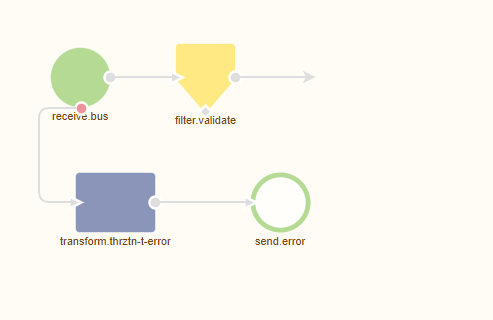
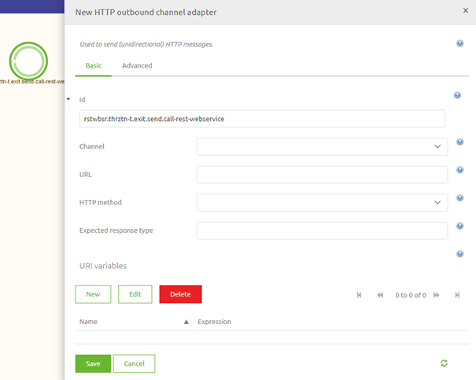
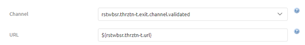
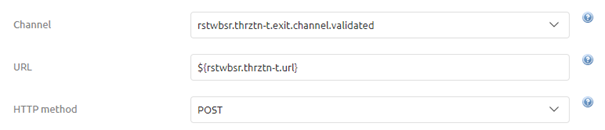
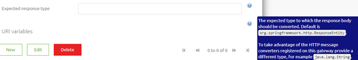
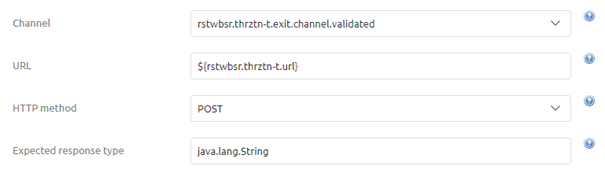
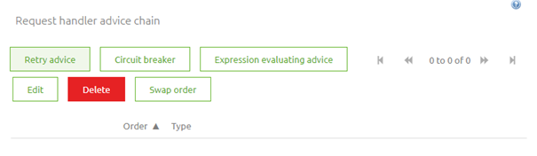
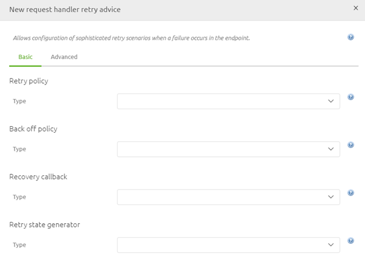
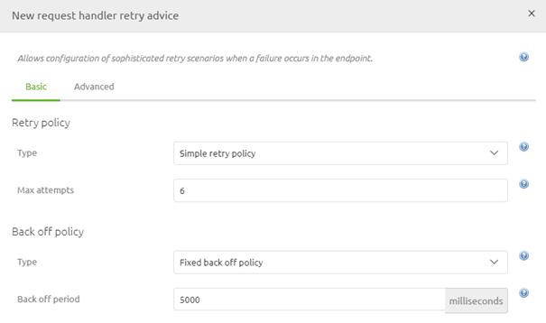
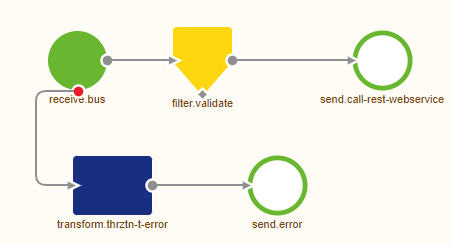

    

        <main class="micro-learning">
        <ul class="doc-nav">
            <li class="doc-nav__item"><a href="../../docs/microlearning/intermediate-rest-webservice-connectivity-index" class="doc-nav__link">Home</a></li>
            <li class="doc-nav__item"><a href="#intro" class="doc-nav__link">Intro</a></li>
            <li class="doc-nav__item"><a href="#theory" class="doc-nav__link">Theory</a></li>
            <li class="doc-nav__item"><a href="#practice" class="doc-nav__link">Practice</a></li>
            <li class="doc-nav__item"><a href="#solution" class="doc-nav__link">Solution</a></li>
        </ul>

##### Intro

# Call a REST Webservice

In the previous microlearning, we discussed how you can host a REST web service. In this microlearning, we will focus on the other end of the spectrum, namely how to call a REST Webservice. Knowing this will lay the foundation for other microlearnings that will follow this microlearning on various types of authentication that are typically associated with calling a REST Webservice.
 
Should you have any questions, please contact academy@emagiz.com.

- Last update: April 6th, 2021
- Required reading time: 7 minutes

## 1. Prerequisites
- Intermediate knowledge of the eMagiz platform

## 2. Key concepts
This microlearning centers around calling a REST Webservice within eMagiz.
With REST, we mean: A web service that adheres to the RESTful principles

- To call a REST Webservice you need either:
    - A HTTP Outbound Gateway (in case you want a response)
    - A HTTP Outbound Channel Adapter (in case you **do not** want a response)
- Critical information when configuring this component:
    - URL
    - HTTP Method (i.e. GET, POST, PUT, etc.)
    - Expected Response Type
    - Retry Advice
    - Authentication

##### Theory    

## 3. Call a REST Webservice

In the previous microlearning, we discussed how you can host a REST web service. In this microlearning, we will focus on the other end of the spectrum, namely how to call a REST Webservice. Knowing this will lay the foundation for other microlearnings that will follow this microlearning on various types of authentication that are typically associated with calling a REST Webservice.

Calling a REST Webservice within eMagiz can be done with the help of either an HTTP Outbound Gateway or an HTTP Outbound Channel Adapter. In case you want to do something with the response you should opt for the HTTP Outbound Gateway. In scenarios where the response is irrelevant, you should use the HTTP Outbound Channel Adapter. To correctly configure this component you need to consider the following elements:

- URL
- HTTP Method (i.e. GET, POST, PUT, etc.)
- Expected Response Type
- Retry Advice
- Authentication

We will discuss the first four items in this list in this microlearning. In the microlearnings that will follow this microlearning, we will delve deeper into various authentication possibilities.

Before we delve into the configuration of the component let us first move to Create and open an exit flow in which we want to call the REST Webservice. When you open the exit flow it will look similar to this:

Now that we have opened the flow and are in "Start Editing" mode we need to add one of our components (HTTP Outbound Gateway or HTTP Outbound Channel Adapter) to start with. In this microlearning, we are not interested in the response so we will add an HTTP Outbound Channel Adapter to the flow.

### 3.1 URL

Now that we have added the correct component to the canvas it has become time to configure the component correctly. The first thing to configure when calling a REST Webservice is determining and registering the endpoint (URL) eMagiz should call to deliver the message too. As always in scenarios where an information element can change between environments, you should use a property reference and determine the correct value on a per-environment basis.

### 3.2 HTTP Method

The second part of the configuration is to determine the correct HTTP Method that is linked to the endpoint and does what you want to do. For example, you choose a GET when you want to retrieve certain information from the external party. On the other hand, you would most typically use a POST when you want to deliver new data to the external party. In this example, we want to deliver new information to the external party and therefore will opt for the POST as HTTP Method

### 3.3 Expected Response Type

As you can imagine, for the scenarios in which you do not want a response this field is not as interesting to you. However, if you do want a response you need to be aware that when you leave this empty eMagiz will return the HTTPResponseEntity.

As you can read in the help text when you do want a response and you want to do something with the body of that response message you should change your expected response type to java.lang.String. That is the reason it has become a best practice when implementing this component to enter by default java.lang.String.

### 3.4 Retry Advice

The fourth and last configuration setting we will discuss in this microlearning is an advanced setting on the HTTP Outbound components. With retry advice, you can guard your solution against temporary connection losses between eMagiz and the external party. As this can happen from time to time the best practice is to configure such a Retry Advice on every HTTP Outbound component. To add the Retry Advice move to the Advanced tab and move down to the Request handler advice chain segment. Within this segment, you will see a button called Retry Advice.

When you click on the Retry Advice button you will be prompted with a pop-up. In here you need to configure the exact settings

The best practice for this configuration is as follows for asynchronous solutions:
- Select the option called Simple Retry Policy
- Set the max attempts at 6
- Select the Fixed back off policy
- Set the backoff period at 5000 (ms)

When you have done so the configuration should look as follows. The only thing left is to press Save to save your Retry Advice configuration

Now that we have configured the HTTP Outbound component to our liking we can press Save on the component level to store our changes. As a result the flow will look as follows:

##### Practice

## 4. Assignment

Navigate to a flow within your (Academy) project call a REST Webservice from an external party.
In this REST Webservice, you can assume that you need to call a POST operation on the following endpoint: http://localhost:port/microlearning/rest-webservice/demo
This assignment can be completed with the help of the (Academy) project that you have created/used in the previous assignment.

## 5. Key takeaways

- eMagiz pushes data to or retrieves data from the external party
- eMagiz offers two HTTP Outbound components to call a REST Webservice. Choose based on whether you want a response or not
- There are five key configuration elements:
    - URL
    - HTTP Method (i.e. GET, POST, PUT, etc.)
    - Expected Response Type
    - Retry Advice
    - Authentication

##### Solution

## 6. Suggested Additional Readings

If you are interested in this topic and want more information on it please read the help text provided by eMagiz.

## 7. Silent demonstration video

This video demonstrates how you could have handled the assignment and gives you some context on what you have just learned.

<iframe width="1280" height="720" src="../../vid/microlearning/intermediate-rest-webservice-connectivity-call-a-rest-webservice.mp4" frameborder="0" allow="accelerometer; autoplay; clipboard-write; encrypted-media; gyroscope; picture-in-picture" allowfullscreen></iframe>

</main>

