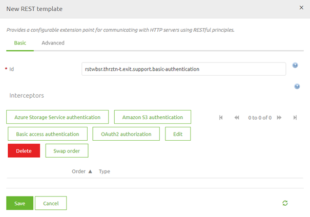
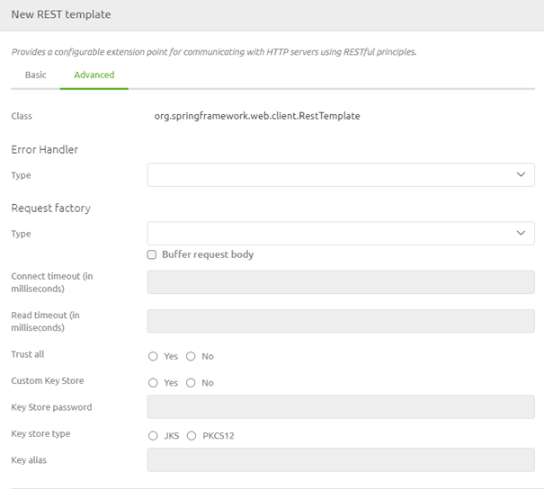
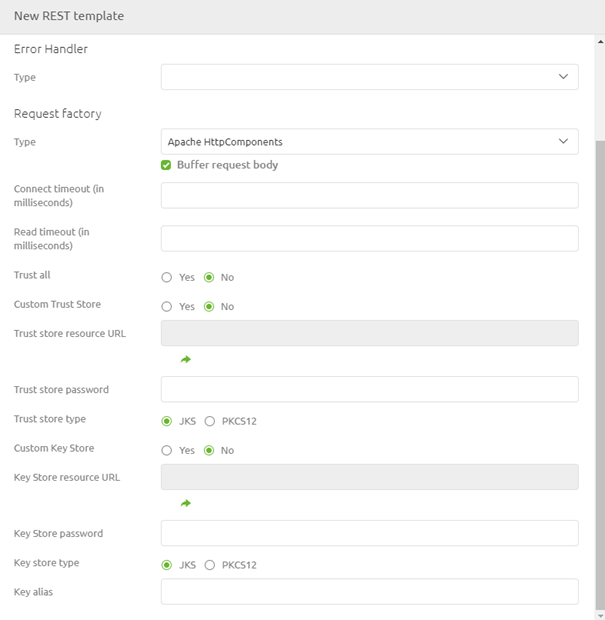
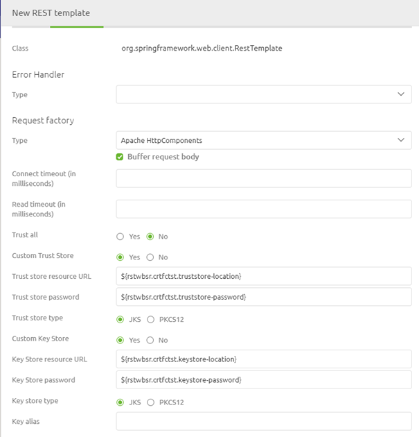
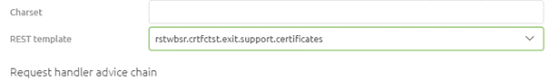
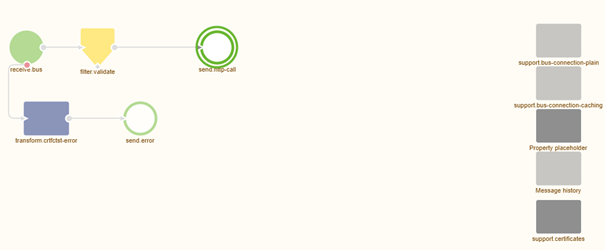

    

        <main class="micro-learning">
        <ul class="doc-nav">
            <li class="doc-nav__item"><a href="../../docs/microlearning/intermediate-rest-webservice-connectivity-index" class="doc-nav__link">Home</a></li>
            <li class="doc-nav__item"><a href="#intro" class="doc-nav__link">Intro</a></li>
            <li class="doc-nav__item"><a href="#theory" class="doc-nav__link">Theory</a></li>
            <li class="doc-nav__item"><a href="#practice" class="doc-nav__link">Practice</a></li>
            <li class="doc-nav__item"><a href="#solution" class="doc-nav__link">Solution</a></li>
        </ul>

##### Intro

# Sending certificates to a REST web service

This microlearning will teach us how to use certificates (both trust as client) when sending data to a REST web service. In a previous course, we introduced the concept of certificates and learned about sending certificates to a SOAP web service. If you need a refresher, please check out that [course](novice-securing-your-data-traffic-index.md). We will build upon that knowledge in this microlearning and apply our expertise to the world of REST web services.
 
Should you have any questions, please get in touch with academy@emagiz.com.

- Last update: September 8th, 2021
- Required reading time: 6 minutes

## 1. Prerequisites
- Intermediate knowledge of the eMagiz platform
- Basic knowledge of certificates. More information can be found [here](novice-securing-your-data-traffic-index.md)

## 2. Key concepts
This microlearning centers around sending certificates when calling a REST Webservice.
By certificates, we mean: A trustworthy document that is interchanged between parties to verify that both parties are whom they claim to be

In most cases, when you send a certificate to a REST service, we talk about sending a client certificate along with the REST service call. In some cases, however, the endpoint we call is not secured via a certificate chain containing a known CA. In those cases, we need to explicitly trust the party to whom we are sending data by placing data in the truststore.

In another microlearning, we will learn how to create the Keystore and truststore. The focal point of this microlearning is how you need to configure eMagiz correctly to make this work.

##### Theory    

## 3. Sending certificates to a REST web service

This microlearning will teach us how to use certificates (both trust as client) when sending data to a REST web service. In a previous course, we introduced the concept of certificates and learned about sending certificates to a SOAP web service. If you need a refresher, please check out that [course](novice-securing-your-data-traffic-index.md). We will build upon that knowledge in this microlearning and apply our expertise to the world of REST web services.

We need a support object to ensure that the proper certificates are sent along with the call to the REST web service. Support objects are components in eMagiz that support the working of other elements. In this case, we need a REST Template as our support object.

### 3.1 REST Template

When you navigate to the Create phase, you can open an exit flow and see whether you already have an HTTP outbound component within your exit flow. If not, please add an HTTP outbound component (gateway or channel adapter) to the flow. In a previous microlearning, we focused on these components so that we won't focus on these components in this microlearning.

To ensure that specific authorization is added to this HTTP outbound component, we need to add the support object called REST Template to the flow:

After adding the support object to the canvas and giving it a name, you can open it by double-clicking on the component. eMagiz will show you the following pop-up:

As you can see here, you can select various authentication schemes. Those are discussed in other microlearnings. Today the focus will be on the Advanced tab on this screen. 

In this case, we first have to select the type of request factory (ApacheHttpComponents). This will allow us to define the correct configuration. After we have chosen this option, you will notice that the options on the page change.

As you can see, most of the configuration is set to default values. These default values are correct in most cases. Only deviate from them with a good reason—the only thing left for us to define the proper truststore and Keystore, including password. As a best practice, we want to enter those values with the help of properties to alter them per environment.

Once you are satisfied, you can press Save.

### 3.2 Link REST Template to HTTP Outbound Component

Now that we have successfully configured the REST Template, the last thing we need to do is link the REST Template to the HTTP Outbound component in your flow. To do so, open the HTTP Outbound component by double-clicking on the component. After you have opened the component, you need to navigate to the advanced tab. On this tab, you can select a REST Template. Select the one we have just configured from the drop-down menu and press Save.

Now you have successfully linked the REST Template to the HTTP Outbound Gateway. If you ever want to validate whether a support object is linked to your component, click on it once. That way, eMagiz will show the selected element and all other parts that are linked to it.

##### Practice

## 4. Assignment

Navigate to a flow within your (Academy) project in which you call a REST Webservice.
Add a reference to a Keystore and truststore that hold certificates.
This assignment can be completed with the help of the (Academy) project that you have created/used in the previous assignment.

## 5. Key takeaways

- eMagiz pushes data to or retrieves data from the external party
- eMagiz offers two HTTP Outbound components to call a REST Webservice. Choose based on whether you want a response or not
- To do so, eMagiz needs to be authorized to read and write data
- You could use certificates for the authorization and verification.
- Don't forget to link the support object to the HTTP Outbound component

##### Solution

## 6. Suggested Additional Readings

If you are interested in this topic and want more information, please read the help text provided by eMagiz.

## 7. Silent demonstration video

This video demonstrates how you could have handled the assignment and gives you some context on what you have just learned.

<iframe width="1280" height="720" src="../../vid/microlearning/intermediate-rest-webservice-connectivity-certificates-when-calling-a-rest-webservice.mp4" frameborder="0" allow="accelerometer; autoplay; clipboard-write; encrypted-media; gyroscope; picture-in-picture" allowfullscreen></iframe>

</main>

