

	

		<main class="micro-learning">
		<ul class="doc-nav">
			<li class="doc-nav__item"><a href="../../docs/microlearning/expert-solution-architecture-index" class="doc-nav__link">Home</a></li>
			<li class="doc-nav__item"><a href="#intro" class="doc-nav__link">Intro</a></li>
			<li class="doc-nav__item"><a href="#theory" class="doc-nav__link">Theory</a></li>
			<li class="doc-nav__item"><a href="#practice" class="doc-nav__link">Practice</a></li>
			<li class="doc-nav__item"><a href="#solution" class="doc-nav__link">Solution</a></li>
		</ul>

##### Intro

# Configuration REST web service

In this microlearning, we will discuss how you can manually host a REST web service outside the API management layer of eMagiz.
The main idea of hosting a web service, whether it be SOAP/XML or REST/JSON (or any other combination) is that the process you are supporting wants to be informed in real-time 
or wants to execute actions in real-time without any support from the integration. 
In other words, you want the application to push the requests to eMagiz instead of eMagiz having to pull the data out of an application.
 
In this microlearning, we will focus on the REST web service and how you can host this in eMagiz through some simple steps.
To summarize, hosting a REST web service gives you:
-	A way to listen for messages instead of actively needing to pull them.
-	A way to receive messages via various HTTP methods (GET, PUT, POST, DELETE, etc.)

Should you have any questions, please contact academy@emagiz.com.

- Last update: March 9th, 2021
- Required reading time: 11 minutes

## 1. Prerequisites
- Intermediate knowledge of the eMagiz platform

## 2. Key concepts
This microlearning centers around configuring a REST web service.
With configuration, we mean: The steps you need to execute to achieve a certain result
With REST, we mean: A web service that adheres to the RESTful principles

- The application (client) pushes the data to eMagiz
-	To summarize, hosting a REST web service gives you:
	-	A way to listen for messages instead of actively needing to pull them.
	-	A way to receive messages via various HTTP methods (GET, PUT, POST, DELETE, etc.)

##### Theory	

## 3. Configuration REST web service

The main idea of hosting a web service, whether it be SOAP/XML or REST/JSON (or any other combination) is that the process you are supporting wants to be informed in real-time 
or wants to execute actions in real-time without any support from the integration. 
In other words, you want the application to push the requests to eMagiz instead of eMagiz having to pull the data out of an application.
 
In this microlearning, we will focus on the REST web service and how you can host this in eMagiz through some simple steps.
To summarize, hosting a REST web service gives you:
-	A way to listen for messages instead of actively needing to pull them.
-	A way to receive messages via various HTTP methods (GET, PUT, POST, DELETE, etc.)

Before we delve into the steps required to configure a REST Webservice let us first turn our attention to the Best Practices when configuring a REST Webservice

### 3.1 Best practices

-	Don’t change your process when executing Capture and Design. Those steps don’t change if you want the output of what is being delivered on your REST endpoint transformed to a CDM and beyond
-	Use naming conventions to make it clear to the calling party what the build-up of the endpoint is, which methods are allowed and which content types are allowed
-	Keep the connectivity in the entry and the transformation in the onramp
-	Use one HTTP Inbound Gateway per HTTP Operation (i.e. GET /order/{uuid} or POST /order)

### 3.3 Setting up Capture & Design
As with all solutions, we start our journey in Capture and from there we move through the various ILM phases of eMagiz. 
In Capture you need to, just as with other solutions check whether the system already exists and if not create a new system. 
Subsequently, you draw the lines and fill in the relevant information.

In the Design phase, there is one deviation from the standard approach in Design. And that deviation is that you need to select the option called Combined Entry Connector on the system level.

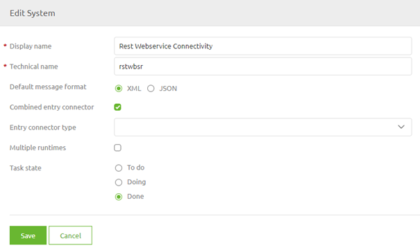

After you have selected this option you need to select the option Custom as Entry Connector Type

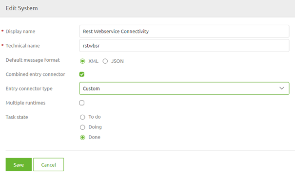

### 3.2 Configuring the server
The first part of the solution in Create is configuring the server that will host all endpoints. 
By configuring the server you will give yourself the option to publish certain endpoints (one per HTTP Inbound Gateway).

Because you want to host all endpoints on *one* server this part of the configuration only needs to be executed once. 

To create the server you need a support object called Jetty Server

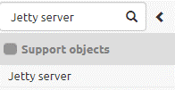

After you have added the Jetty Server to the canvas you can open it and fill in the details.

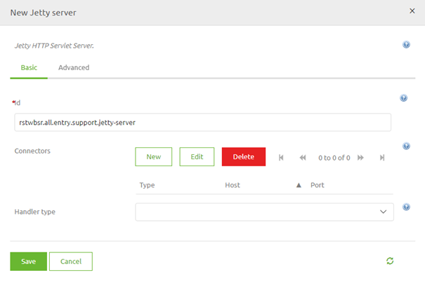

The first step is to select a connector. When running in AWS or if you want to handle the authentication without a client certificate requirement the Select channel connector is the option of your choice. In most cases, this is used
In the pop-up that follows you need to fill in the port (with the help of a property)

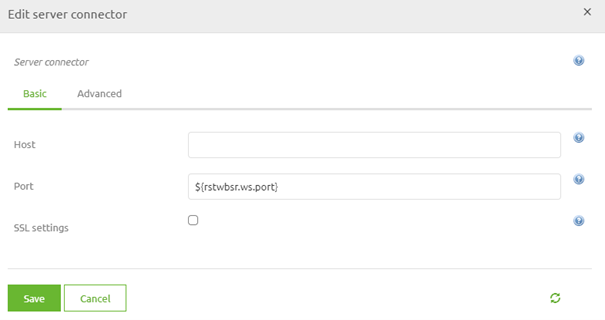

After you have done this you need to select the handler type. Always choose the option Servlet context handler (unless you have very strong arguments to deviate from this).
This will result in the following

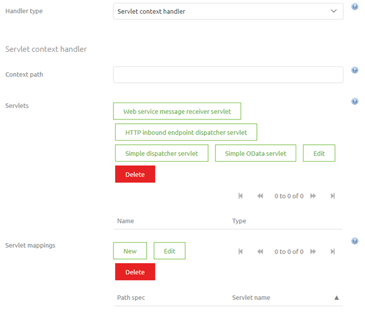

The next step will be to add a context path. This will become the first part of your endpoint after the host itself. You can opt for a single / or you could opt for something more specific.
After that, you select the option called HTTP Inbound endpoint dispatcher servlet and give it a name.

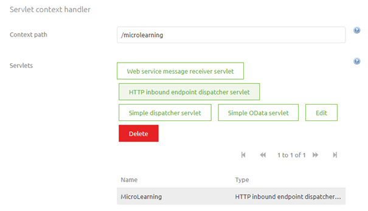

The last step of our server configuration is to select a Servlet Mapping. This is the second part of your endpoint and gives you the option to group various endpoints. 
For example, you could use /apigateway or /messaging as such a group identifier. 
Always ensure that with this configuration you leave yourself the possibility to differentiate between the specific operations.

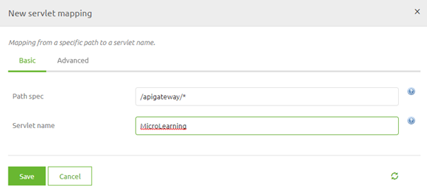

The only thing left to do is to save this configuration. This concludes the first steps for successfully making endpoints available.

Based on the above configuration the endpoint will now look as follows: http://localhost:port/microlearning/apigateway/*

In the next part of this microlearning, we will explain which steps you need to take per operation that you want to expose to the outside world.

### 3.3 Configuring an HTTP Inbound Gateway
Per operation that you want to expose you need to have an HTTP Inbound Gateway as a starting point of your solution.
Ensure that you create two channels (one for the request and one for the response) within your solution. 
You will need those channels as input and output of your HTTP Inbound Gateway.

The next step would be to open the HTTP Inbound Gateway and configure it accordingly

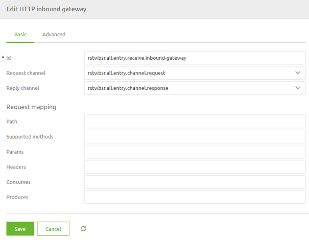

At least you need to add a path that will make the endpoint specific for a certain HTTP Operation and define the HTTP Operation (POST, GET, DELETE)

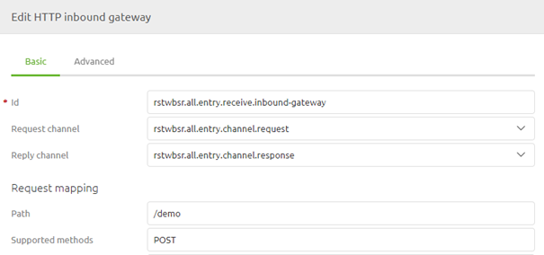

Furthermore, you can define settings such as params that are required or that your endpoint only consumes JSON for example to further limit the options given to clients calling the endpoint.

Apart from the settings on the Basic tab you need to set a couple of things on the Advanced tab. One of these settings is the request payload type and the error channel.
For the request payload, you should enter the value java.lang.String and for Error channel you should select the channel to which you want to route error messages.

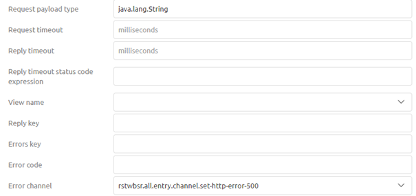

Furthermore, when you use paramaters (path or query) you can place them in the message headers with a simple SpEL expression:

- #pathVariables['{nameofpathparam}']
- #requestParams['{nameofqueryparam}']

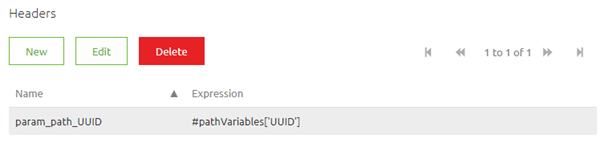

Based on the above configuration the endpoint will now look as follows: http://localhost:port/microlearning/apigateway/demo

### 3.4 Error Handling

Giving back a 401
In case you secure the web service with the help of an ApiKey you can validate whether what the client sends to the web service for authentication is indeed a correct ApiKey. This can be done via the following steps:
1.	Place a standard filter in your entry to validate if the ApiKey provided by the client is valid. This can be done via a SpEL expression comparable to the following (headers['Authorization'] == '${authentication.inbound.api-key}')
2.	In cases where the client is not authorized lead the message back to a standard header enricher. In this standard header, enricher add a header called http_statusCode with a value of 401
3.	Add a standard transformer to set a default message that can be given back to the client. An example would be '{ "errors": [{ "internalMessage": "Unauthorized" }]}'.

Giving back a 403
In case you have secured your REST web service with the help of a client certificate and the client is unable to provide the correct certificate eMagiz will return a 403 by default. No other changes in the flow are needed

Giving back a 404
eMagiz will give back a 404 by default if the endpoint is not configured in one of the HTTP inbound channel adapters in your flow. You can override this functionality via the following steps.
1.	Add a separate HTTP inbound channel adapter that resolves to /* (this catches everything that cannot be resolved by any other HTTP inbound channel adapter)
2.	Set a standard header enricher and add a header called http_statusCode with a value 404
3.	Add a standard transformer to set a default message that can be given back to the client. An example would be '{ "errors": [{ "internalMessage": "Het aangeroepen endpoint is niet gevonden" }]}’.

  
Giving back a 500
eMagiz will give back a 500 by default if the flow results in an unresolvable error. To counteract this for most scenarios the error handling in eMagiz for synchronous flows has changed in such a way that the message or error will be given back to the client. To specify the HTTP code and body of the response you can follow these steps.
1.	Use the standard filter eMagiz gives you in a synchronous flow (with the SpEL expression headers['emagiz_error_isErrorMessage']!=true) and make sure that instead of throwing a default error the error channel leads to a standard header enricher
2.	Set a standard header enricher and add a header called http_statusCode with a value of 500
3.	Add a standard transformer to set a default message that can be given back to the client. An example would be '{ "errors": [{ "internalMessage": "Een technische error heeft plaatsgevonden in de integratie" }]}’.

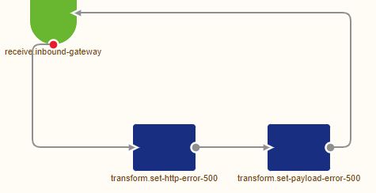

##### Practice

## 4. Assignment

Navigate to a flow within your (Academy) project and configure a REST Webservice that eMagiz will host without worrying about error handling and authentication.
In this REST Webservice expose the POST operation on the following endpoint: http://localhost:port/microlearning/apigateway/demo
This assignment can be completed with the help of the (Academy) project that you have created/used in the previous assignment.

## 5. Key takeaways

- The application (client) pushes the data to eMagiz
-	To summarize, hosting a REST web service gives you:
	-	A way to listen for messages instead of actively needing to pull them.
	-	A way to receive messages via various HTTP methods (GET, PUT, POST, DELETE, etc.)
- Error handling can be modeled out

##### Solution

## 6. Suggested Additional Readings

If you are interested in this topic and want more information on it please read the help text provided by eMagiz.

## 7. Silent demonstration video

This video demonstrates how you could have handled the assignment and gives you some context on what you have just learned.

<iframe width="1280" height="720" src="../../vid/microlearning/intermediate-rest-webservice-connectivity.mp4" frameborder="0" allow="accelerometer; autoplay; clipboard-write; encrypted-media; gyroscope; picture-in-picture" allowfullscreen></iframe>

</main>

