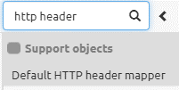
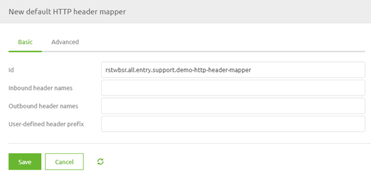
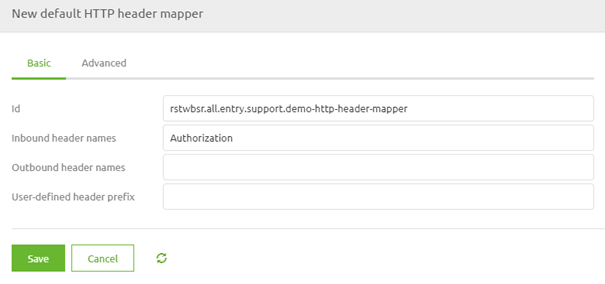
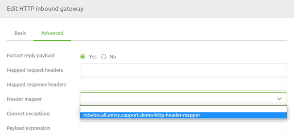
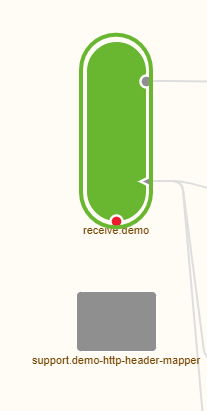

    

        <main class="micro-learning">
        <ul class="doc-nav">
            <li class="doc-nav__item"><a href="../../docs/microlearning/intermediate-rest-webservice-connectivity-index" class="doc-nav__link">Home</a></li>
            <li class="doc-nav__item"><a href="#intro" class="doc-nav__link">Intro</a></li>
            <li class="doc-nav__item"><a href="#theory" class="doc-nav__link">Theory</a></li>
            <li class="doc-nav__item"><a href="#practice" class="doc-nav__link">Practice</a></li>
            <li class="doc-nav__item"><a href="#solution" class="doc-nav__link">Solution</a></li>
        </ul>

##### Intro

# HTTP Headers

This microlearning will look at how you can use HTTP Headers on incoming REST calls within your operational process of transporting (and transforming) information between systems. 
 
Should you have any questions, please get in touch with academy@emagiz.com.

- Last update: September 9th, 2021
- Required reading time: 5 minutes

## 1. Prerequisites
- Intermediate knowledge of the eMagiz platform

## 2. Key concepts
This microlearning centers around using incoming HTTP headers when transporting (and transforming) information.
With HTTP Headers, we mean: HTTP headers are the name or value pairs displayed in the request and response messages of message headers for Hypertext Transfer Protocol (HTTP).

- Each HTTP Header has a name
- There is a list of standard HTTP headers defined (https://en.wikipedia.org/wiki/List_of_HTTP_header_fields)
- HTTP Header is not the same as a parameter (path, query)

##### Theory    

## 3. HTTP Headers

This microlearning will look at how you can use HTTP Headers on incoming REST calls within your operational process of transporting (and transforming) information between systems.

- Each HTTP Header has a name
- There is a list of standard HTTP headers defined (https://en.wikipedia.org/wiki/List_of_HTTP_header_fields)
- A HTTP Header is not the same as a parameter (path, query)

To use the HTTP header information in our operational process, we need to transform our (relevant) HTTP headers to message headers. When achieving that, the information becomes part of the message, and we can use this information for the transportation (and transformation) of data.

To do so, we navigate to the Create phase. In the Create phase, we open the all-entry flow in which we host our REST service. In this flow, we need to add a default HTTP header mapper to create a message header for each corresponding HTTP header.

After adding the component to the canvas, it becomes time to fill in the correct configuration to ensure that the relevant HTTP header(s) are transformed into message headers. Within the component, you can fill in the Inbound header names, the Outbound header names, and a user-defined header prefix.

In this case, we need the Inbound header names (just as the help text tells us). You can define specific header names in this field, but you could also get all HTTP headers by filling in HTTP_REQUEST_HEADERS. The best practice is to be as detailed as possible and only create message headers you need later. In this example, we retrieve the authorization via an Authorization header, and we want to check whether or not the client calling our REST service is authorized to do so. To make this work, we need to create a message header with the name Authorization that the HTTP header Authorization will fill. To get that to work, we fill in the word Authorization in the Inbound header names field.

You can press Save to store your changes when you have defined the proper name(s).

### 3.2 Link HTTP header mapper to HTTP Inbound Component

Now that we have successfully configured the HTTP header mapper, the last thing we need to do is link the HTTP header mapper to the HTTP Inbound Component in your flow. To do so, open the HTTP Inbound Component by double-clicking on the component. After you have opened the component, you need to navigate to the advanced tab. On this tab, you can select an HTTP header mapper. Select the one we have just configured from the drop-down menu and press Save.

Now you have successfully linked the HTTP header mapper to the HTTP Inbound Gateway. If you ever want to validate whether a support object is linked to your component, click on it once. That way, eMagiz will show the selected component and all other components that are linked to it.

##### Practice

## 4. Assignment

Navigate to a flow within your (Academy) project in which you host a REST Webservice.
Add a default HTTP header mapper to create a message header based on the value of an HTTP header.
This assignment can be completed with the help of the (Academy) project that you have created/used in the previous assignment.

## 5. Key takeaways

- eMagiz offers a component that creates a message header based on the defined HTTP headers
- This is useful when you need this information further downstream
- Best practice is to be specific about which information you need

##### Solution

## 6. Suggested Additional Readings

If you are interested in this topic and want more information, please read the help text provided by eMagiz.

## 7. Silent demonstration video

This video demonstrates how you could have handled the assignment and gives you some context on what you have just learned.

<iframe width="1280" height="720" src="../../vid/microlearning/intermediate-rest-webservice-connectivity-http-headers.mp4" frameborder="0" allow="accelerometer; autoplay; clipboard-write; encrypted-media; gyroscope; picture-in-picture" allowfullscreen></iframe>

</main>

