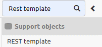
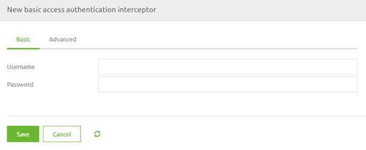
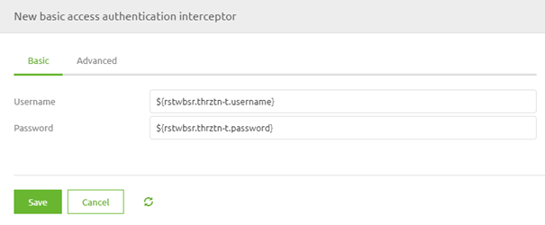
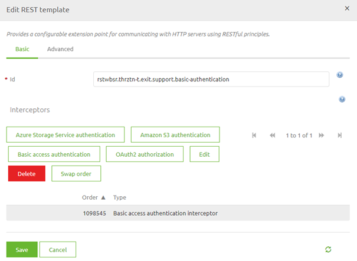
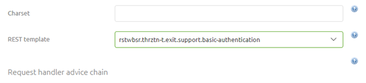
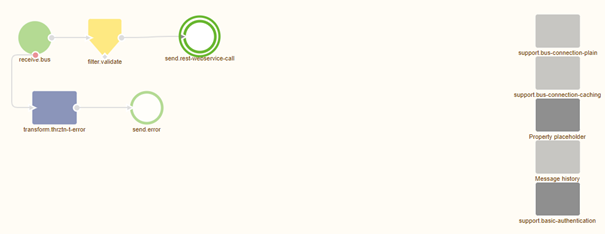

    

        <main class="micro-learning">
        <ul class="doc-nav">
            <li class="doc-nav__item"><a href="../../docs/microlearning/intermediate-rest-webservice-connectivity-index" class="doc-nav__link">Home</a></li>
            <li class="doc-nav__item"><a href="#intro" class="doc-nav__link">Intro</a></li>
            <li class="doc-nav__item"><a href="#theory" class="doc-nav__link">Theory</a></li>
            <li class="doc-nav__item"><a href="#practice" class="doc-nav__link">Practice</a></li>
            <li class="doc-nav__item"><a href="#solution" class="doc-nav__link">Solution</a></li>
        </ul>

##### Intro

# Authorization - Basic Authentication

In the previous microlearning, we discussed how you can call a REST web service. In this microlearning, we will focus on the simplest form of authentication when it comes to calling a REST Webservice. This form is called Basic Authentication. Knowing how you can easily configure the correct authentication pattern for the REST Webservice you need to call will significantly improve the quality and speed at which you can deliver your solution.
 
Should you have any questions, please contact academy@emagiz.com.

- Last update: April 6th, 2021
- Required reading time: 6 minutes

## 1. Prerequisites
- Intermediate knowledge of the eMagiz platform

## 2. Key concepts
This microlearning centers around using Basic Authentication as the form of authentication when calling a REST Webservice.
With REST, we mean: A web service that adheres to the RESTful principles
With Basic Authentication, we mean: A specific authentication implementation based on a username/password combination

- The application (eMagiz) pushes data to an external REST web service (or API)
- To do so eMagiz needs to be authorized to read and/or write data
- Basic authentication was an industry standard that is still widely implemented.

##### Theory    

## 3. Authorization - Basic Authentication

In the previous microlearning, we discussed how you can call a REST web service. In this microlearning, we will focus on the simplest form of authentication when it comes to calling a REST Webservice. This form is called Basic Authentication. Knowing how you can easily configure the correct authentication pattern for the REST Webservice you need to call will significantly improve the quality and speed at which you can deliver your solution.

To ensure that the proper authorization is sent along with the call to the REST web service we need a support object. Support objects are components in eMagiz that support the working of other components. In this case, we need a REST Template as our support object.

### 3.1 REST Template

When you navigate to the Create phase you can open an exit flow and see whether you already have an HTTP outbound component within your exit flow. If not please add an HTTP outbound component (gateway or channel adapter) to the flow. In the previous microlearning, we focused on these components so we won't focus on these components in this microlearning.

To ensure that a certain authorization is added to this HTTP outbound component we need to add the support object called REST Template to the flow:

After you have added the support object to the canvas and given it a name you can open it by double clicking on the component. eMagiz will show you the following pop-up:

As you can see here you can select various authentication schemes. In this microlearning, the focus is on Basic Authentication therefore we select the button called Basic access authentication. Selecting this option will open another pop-up. In this pop-up, we need to fill in the relevant information for the authentication scheme that we have selected.

In this case, we have to fill in the username and password that will be used to authorize ourselves with the external party. As always in scenarios where an information element can change between environments, you should use a property reference and determine the correct value on a per-environment basis.

When you are satisfied you can press Save. This will lead you back to the original pop-up that now indicates the authentication scheme you have selected.

Once again you can press Save if you are satisfied with your configuration.

### 3.2 Link REST Template to HTTP Outbound Component

Now that we have successfully configured the REST Template the last thing we need to do is link the REST Template to the HTTP Outbound component in your flow. To do so open the HTTP Outbound component by double-clicking on the component. After you have opened the component you need to navigate to the advanced tab. On this tab, you can select a REST Template. Select the one we have just configured from the drop-down menu and press Save.

Now you have successfully linked the REST Template to the HTTP Outbound Gateway. If you ever want to validate whether a support object is indeed linked to your component simply click on it once. That way eMagiz will show the selected component and all other components that are linked to it.

##### Practice

## 4. Assignment

Navigate to a flow within your (Academy) project in which you call a REST Webservice.
Add Basic Authentication as an authentication scheme to this flow and ensure that the logic will work.
This assignment can be completed with the help of the (Academy) project that you have created/used in the previous assignment.

## 5. Key takeaways

- eMagiz pushes data to or retrieves data from the external party
- eMagiz offers two HTTP Outbound components to call a REST Webservice. Choose based on whether you want a response or not
- To do so eMagiz needs to be authorized to read and/or write data
- Basic authentication was an industry standard that is still widely implemented.
- Don't forget to link the support object to the HTTP Outbound component

##### Solution

## 6. Suggested Additional Readings

If you are interested in this topic and want more information on it please read the help text provided by eMagiz.

## 7. Silent demonstration video

This video demonstrates how you could have handled the assignment and gives you some context on what you have just learned.

<iframe width="1280" height="720" src="../../vid/microlearning/intermediate-rest-webservice-connectivity-authorization-basic-authentication.mp4" frameborder="0" allow="accelerometer; autoplay; clipboard-write; encrypted-media; gyroscope; picture-in-picture" allowfullscreen></iframe>

</main>

