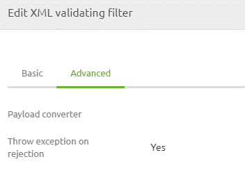
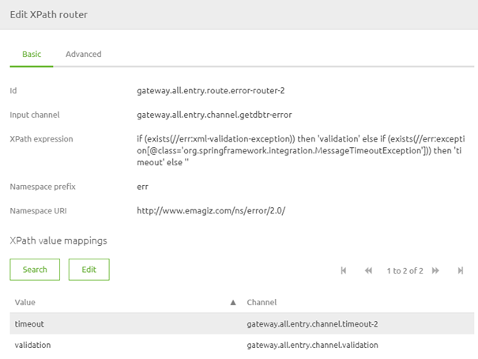

    

        <main class="micro-learning">
        <ul class="doc-nav">
            <li class="doc-nav__item"><a href="../../docs/microlearning/intermediate-rest-webservice-connectivity-index" class="doc-nav__link">Home</a></li>
            <li class="doc-nav__item"><a href="#intro" class="doc-nav__link">Intro</a></li>
            <li class="doc-nav__item"><a href="#theory" class="doc-nav__link">Theory</a></li>
            <li class="doc-nav__item"><a href="#practice" class="doc-nav__link">Practice</a></li>
            <li class="doc-nav__item"><a href="#solution" class="doc-nav__link">Solution</a></li>
        </ul>

##### Intro

# Validation

In the previous microlearning, we learned how to configure a REST service. In this microlearning, we will discuss how you can validate whether the party calling your REST endpoint is sending the correct information in terms of the structure of the message. We will also learn how you can subsequently report back to the client that a validation error occurred.
 
Should you have any questions, please get in touch with academy@emagiz.com.

- Last update: September 8th, 2021
- Required reading time: 5 minutes

## 1. Prerequisites
- Intermediate knowledge of the eMagiz platform

## 2. Key concepts
This microlearning centers around validating incoming messages when hosting a REST web service.
With REST, we mean: A web service that adheres to the RESTful principles
With validation, we mean: Verifying whether the data structure we received is valid according to our definition

- The external application pushes data to a REST web service (or API) hosted by eMagiz
- When doing so, the external application should adhere to the defined data structure
- If not, we need to refuse the call and respond with an error message

##### Theory    

## 3. Validation

In the previous microlearning, we learned how to configure a REST service. In this microlearning, we will discuss how you can validate whether the party calling your REST endpoint is sending the correct information in terms of the structure of the message. We will also learn how you can subsequently report back to the client that a validation error occurred.

As you might know from SOAP web services implementation, the validation is automatically handled when the endpoint is called. This works differently for REST endpoints hosted by eMagiz. Therefore we need a little bit more elbow grease to get things going. Depending on your use of messaging or API Gateway, you might need to add an XML validating filter to your solution. For example, when hosting the REST web services in the all-entry of a messaging solution, you want to validate before placing it on your asynchronous onramp queue. You want to add an XML validating filter in the exit gate before calling the external system for a passthrough API GW. Note that when you select the option transformation for the API Gateway, eMagiz will do this automatically.

When adding or checking the XML validating filter, ensure that the checkbox (Throw an exception on rejection) is activated when the validation is done outside the all-entry.

As a result, the error handling will be triggered. In the case of an API Gateway solution, the error will automatically be given back to the previous step in the process. And since we advise validating the entry in case of messaging, we can send the message to the discard channel. Knowing that, we now need to follow that up. Since we need to give back the error to the client, the logical next step needs to happen in our all-entry. Here we need to make a distinction between validation errors and generic errors. We can do so by using an XPath router within the all-entry.

With the help of this configuration and a default output channel that leads to the generic setup (500 error), you can ensure that when an XML validating filter returns a validation error, you can define another HTTP status code and a different response body. You can use similar logic as with the generic setup for the 500 error. For specific information in setting that up please check out this [microlearning](intermediate-rest-webservice-connectivity-configuration.md).

Note that eMagiz will automatically create this setup when running an API Gateway solution. If you want to recreate the same experience in Messaging, please use the following XPath:

if (exists(//err:xml-validation-exception)) then 'validation' else if (exists(//err:exception[@class='org.springframework.integration.MessageTimeoutException'])) then 'timeout' else ''

##### Practice

## 4. Assignment

Navigate to a flow within your (Academy) project in which you host a REST Webservice.
Ensure that when a validation error is thrown, eMagiz will return a proper response to the client.
This assignment can be completed with the help of the (Academy) project that you have created/used in the previous assignment.

## 5. Key takeaways

- The external application pushes data to a REST web service (or API) hosted by eMagiz
- When doing so, the external application should adhere to the defined data structure
- If not, we need to refuse the call and respond with an error message
- eMagiz auto generates a lot when using the API Gateway
- You need to recreate this when using the same functionality in a messaging flow

##### Solution

## 6. Suggested Additional Readings

If you are interested in this topic and want more information, please read the help text provided by eMagiz.

## 7. Silent demonstration video

Please check out the store for a working example for a messaging solution.

</main>

