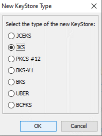
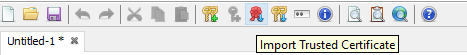
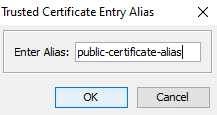
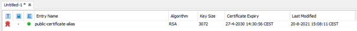
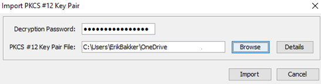
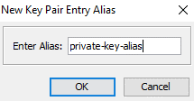

    

        <main class="micro-learning">
        <ul class="doc-nav">
            <li class="doc-nav__item"><a href="../../docs/microlearning/intermediate-securing-your-data-traffic-index" class="doc-nav__link">Home</a></li>
            <li class="doc-nav__item"><a href="#intro" class="doc-nav__link">Intro</a></li>
            <li class="doc-nav__item"><a href="#theory" class="doc-nav__link">Theory</a></li>
            <li class="doc-nav__item"><a href="#practice" class="doc-nav__link">Practice</a></li>
            <li class="doc-nav__item"><a href="#solution" class="doc-nav__link">Solution</a></li>
        </ul>

##### Intro

# Creating a JKS
 
In this microlearning, we will learn how you can create a JKS. We will focus on creating a JKS that will act as your truststore, and we will learn how to create a JKS that will serve as your Keystore.

Should you have any questions, please get in touch with academy@emagiz.com.

- Last update: August 20th, 2021
- Required reading time: 7 minutes

## 1. Prerequisites
- Basic knowledge of the eMagiz platform
- Basic Understanding of certificates
- A .cer (for the truststore) and a .p12 (for the Keystore)
- Keystore Explorer

## 2. Key concepts
This microlearning centers around creating a JKS.

By JKS, we mean: A Java Keystore that can act as a truststore or a Keystore in eMagiz.

When you secure your own hosted web service with a certificate or when you need to send a certificate to an external party for authentication, or in the case of SSL, you might need to create a JKS by hand. 

- Creating a JKS is easy with the help of several tools. We use Keystore Explorer in this microlearning
- A JKS can act as a truststore or as a Keystore (in eMagiz terminology)
- You need to link your JKS to the flow to use it

##### Theory
  
## 3. Creating a JKS

In this microlearning, we will learn how you can create a JKS. We will focus on creating a JKS that will act as your truststore, and we will learn how to create a JKS that will serve as your key store. In various other microlearnings, we discuss the implementation of certificates in flows, the cloud, and the runtime level. We also have a microlearning that explains certificates. If you read this and are unsure about certificates, please check out that [microlearning](novice-securing-your-data-traffic-what-are-certificates.md).

When you secure your own hosted web service with a certificate or when you need to send a certificate to an external party for authentication, or in the case of SSL, you might need to create a JKS by hand. 

- Creating a JKS is easy with the help of several tools. We use Keystore Explorer in this microlearning
- A JKS can act as a truststore or as a Keystore (in eMagiz terminology)
- You need to link your JKS to the flow to use it

To start things, let's first open Keystore Explorer.

After you have done this, you can press the button to create a new Keystore and select the option JKS. As a result, Keystore explorer will create a blank Keystore for you to turn into a truststore or Keystore.

### 3.1 Turning the JKS in a truststore

A truststore contains all public certificates of external parties that we want to trust to connect eMagiz and the external party. Therefore to turn your blank Keystore in an eMagiz truststore, you need to import the relevant public certificate(s). To import a certificate, click on the rosette icon. With this option, you can import a trusted certificate. Subsequently, select the relevant certificates from your local folder and let Keystore explorer import the trusted certificate.

To finish the import, we need to define a proper alias for our certificate. In this case, we will name it public-certificate-alias.

As a result, the public certificate is added to the truststore. Note that you can import as many trusted certificates as you want. Especially when an external party has secured their HTTPS endpoint with the help of local CA authorities that Java might not trust on default. In those cases, you need to include the full path to the CA in the truststore.

The last thing to do for us is to save this Keystore. Before you can save it, you need to secure your JKS with a password. Use a tool like Keystore explorer to generate a valid password. Afterward, give the JKS a logical name by which you can recognize it later on.

### 3.2 Turning the JKS in a Keystore

A Keystore contains all key pairs unique for the person/client who has access to it. So, where the truststore contains the public part, the Keystore contains the private part of the equation. As this is more sensitive information, the private keys themselves are also secured with the help of a password. Note that the most effortless setup of a working Keystore in eMagiz needs the same password for the private key within the Keystore and the Keystore itself.

Once again, we start with an empty Keystore. To import a private key into the Keystore, click on the icon of the two keys with the green arrow pointing to the bottom. With this functionality, you can import the key pair.

After you have selected this option, Keystore explorer will ask what type of key pair you want to import. In most cases, you want to import a PKCS #12(.p12). Which also happens to be the default option.

Next, you need to fill in the decryption password and the path to where the Keystore is located in your local folder.

After that step, we need to define a proper alias for our certificate. In this case, we will name it private-key-alias.

To finish the import, we need to define a password for our keypair. The last thing to do for us is to save this Keystore. As noted before, remember this as you need to reuse the password when saving the Keystore. Afterward, give the JKS a logical name by which you can recognize it later on.

With this information, you can create a JKS that you can then upload in eMagiz via the standard ways.

##### Practice

## 4. Assignment

Create a truststore and a Keystore with the help of Keystore explorer.

## 5. Key takeaways

- Creating a JKS is easy with the help of several tools. We use Keystore Explorer in this microlearning
- A JKS can act as a truststore or as a Keystore (in eMagiz terminology)
- You need to link your JKS to the flow to use it

##### Solution

## 6. Suggested Additional Readings

If you are interested in this topic and want more information on it, please read the help texts provided by eMagiz

## 7. Silent demonstration video

As this is a more theoretical microlearning, we have opted not to provide a video.

</main>

