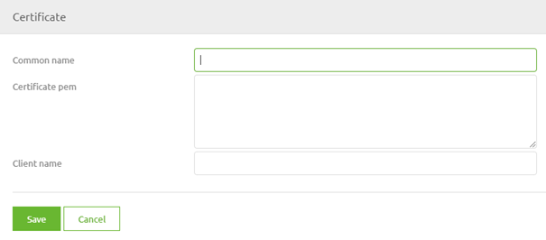
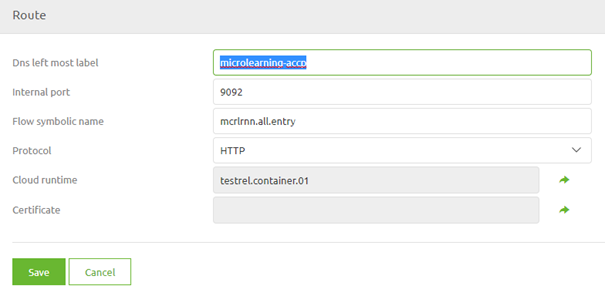
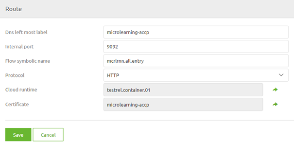

    

        <main class="micro-learning">
        <ul class="doc-nav">
            <li class="doc-nav__item"><a href="../../docs/microlearning/intermediate-securing-your-data-traffic-index" class="doc-nav__link">Home</a></li>
            <li class="doc-nav__item"><a href="#intro" class="doc-nav__link">Intro</a></li>
            <li class="doc-nav__item"><a href="#theory" class="doc-nav__link">Theory</a></li>
            <li class="doc-nav__item"><a href="#practice" class="doc-nav__link">Practice</a></li>
            <li class="doc-nav__item"><a href="#solution" class="doc-nav__link">Solution</a></li>
        </ul>

##### Intro

# Securing a hosted web service with certificates in the eMagiz Cloud
 
In this microlearning, we will learn how you can secure the (SOAP/REST) web service that you have created in eMagiz and that will be running in the eMagiz Cloud.

Should you have any questions, please contact academy@emagiz.com.

- Last update: April 22th, 2021
- Required reading time: 6 minutes

## 1. Prerequisites
- Basic knowledge of the eMagiz platform
- Basic Understanding of certificates
- Flow that hosts the web service is successfully created and deployed to the correct environment
- Route in Deploy Architecture has been configured for this specific web service

## 2. Key concepts
This microlearning centers around learning how you can secure the (SOAP/REST) web service that you have created in eMagiz and that will be running in the eMagiz Cloud.

By certificates we mean: A trustworthy document that is interchanged between parties to verify that both parties are who they claim to be

It is a best practice to either secure your web service with the help of OAuth2.0 (note this only works for REST) or with a combination of API-Key and certificate (works for both SOAP as REST).
In this microlearning, we will focus on the latter of the two options and focus specifically on the configuration that is needed on the eMagiz Cloud level to ensure that only clients that can provide a valid certificate are given access to the web service.

- Configuration on eMagiz Cloud level is done via Deploy -> Architecture
- Certificate is generated via the support department (with or without CSR)
- No actions are needed on flow level, only on Cloud level
- All you need for the configuration is the common name of the certificate

##### Theory
  
## 3. Securing a hosted web service with certificates in the eMagiz Cloud

In this microlearning, we will learn how you can secure the (SOAP/REST) web service that you have created in eMagiz and that will be running in the eMagiz Cloud.

It is a best practice to either secure your web service with the help of OAuth2.0 (note this only works for REST) or with a combination of API-Key and certificate (works for both SOAP as REST).
In this microlearning, we will focus on the latter of the two options and focus specifically on the configuration that is needed on the eMagiz Cloud level to ensure that only clients that can provide a valid certificate are given access to the web service.

Important things to remember are:

- Configuration on eMagiz Cloud level is done via Deploy -> Architecture
- Certificate is generated via the support department (with or without CSR)
- No actions are needed on flow level, only on Cloud level
- All you need for the configuration is the common name of the certificate

Now that we have introduced the topic let us see how to configure the certificate within Deploy -> Architecture. The first step is to open the Deploy phase of the project for which you want to configure the certificate. After that, you need to select the correct environment (TAP). In this environment open the Architecture page. On this page, you can manage everything related to the eMagiz Cloud.

Among others, you can also configure your certificates. To do so open the context menu via a right-mouse click on the whitespace alongside your landscape overview. Note that you need to be in "Start Editing" mode to configure certificates.

In the pop-up that follows press New or Edit (in case you want to change an existing certificate configuration). In this microlearning we use the option New. The following pop-up will be shown:

In this pop-up, you enter the Common Name (as received from Support) and a Client Name (can be anything you like). The moment you are satisfied with your result press Save. Close the other pop-up and open the context menu again. This time select the option Routes. For this example, we assume the route already exists.

Select the route that belongs to the runtime in which you are hosting the web service and press Edit.

In here click on the icon on the right of the certificate entry and select the correct Certificate in the pop-up that is presented. After you have selected it eMagiz will automatically link the certificate to the route as shown below.

When you are content press Save. The only thing left to do after this is to actualize the changes in the eMagiz Cloud. You can do so by pressing the Apply to environment button. Note that this button will apply all changes so in case of others have also made changes these will also be automatically changed in the eMagiz Cloud. So always think before you act.

##### Practice

## 4. Assignment

Check whether any route with an accompanying certificate is registered within your environment and see if you can reproduce the steps and analyze what someone has configured.

## 5. Key takeaways

- Certificates are all about trust
- With relative ease, you can secure your eMagiz web service in the eMagiz Cloud

##### Solution

## 6. Suggested Additional Readings

If you are interested in this topic and want more information on it please read the help texts provided by eMagiz

## 7. Silent demonstration video

As this is a highly specific case that requires a valid certificate to work we have opted to not create a video for this.

</main>

