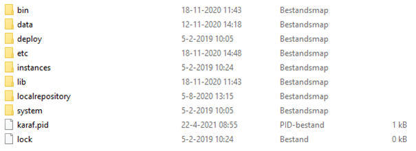
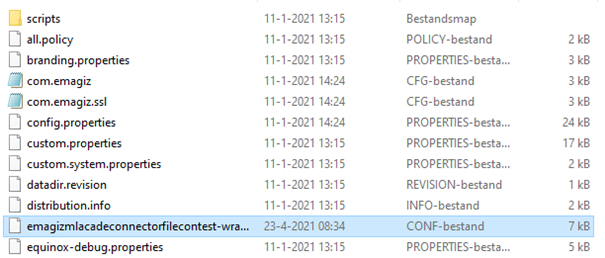

    

        <main class="micro-learning">
        <ul class="doc-nav">
            <li class="doc-nav__item"><a href="../../docs/microlearning/intermediate-securing-your-data-traffic-index" class="doc-nav__link">Home</a></li>
            <li class="doc-nav__item"><a href="#intro" class="doc-nav__link">Intro</a></li>
            <li class="doc-nav__item"><a href="#theory" class="doc-nav__link">Theory</a></li>
            <li class="doc-nav__item"><a href="#practice" class="doc-nav__link">Practice</a></li>
            <li class="doc-nav__item"><a href="#solution" class="doc-nav__link">Solution</a></li>
        </ul>

##### Intro

# Securing a hosted web service with certificates on-premise
 
In this microlearning, we will learn how you can secure the (SOAP/REST) web service that you have created in eMagiz and that will be running on-premise.

Should you have any questions, please contact academy@emagiz.com.

- Last update: April 23rd, 2021
- Required reading time: 6 minutes

## 1. Prerequisites
- Basic knowledge of the eMagiz platform
- Basic Understanding of certificates
- Flow that hosts the web service is successfully created and deployed to the correct environment

## 2. Key concepts
This microlearning centers around learning how you can secure the (SOAP/REST) web service that you have created in eMagiz and that will be running on-premise.

By certificates we mean: A trustworthy document that is interchanged between parties to verify that both parties are who they claim to be

It is a best practice to either secure your web service with the help of OAuth2.0 (note this only works for REST) or with a combination of API-Key and certificate (works for both SOAP as REST).
In this microlearning, we will focus on the latter of the two options and focus specifically on the configuration that is needed on the on-premise level to ensure that only clients that can provide a valid certificate are given access to the web service that is running on-premise.

- Configuration on on-premise runtime level is done on the runtime itself
- Certificate is generated via the support department (with or without CSR)
- No actions are needed on flow level, only on on-premise runtime level
- You need a valid truststore and keystore to make it work

##### Theory
  
## 3. Securing a hosted web service with certificates on-premise

In this microlearning, we will learn how you can secure the (SOAP/REST) web service that you have created in eMagiz and that will be running on-premise.

It is a best practice to either secure your web service with the help of OAuth2.0 (note this only works for REST) or with a combination of API-Key and certificate (works for both SOAP as REST).
In this microlearning, we will focus on the latter of the two options and focus specifically on the configuration that is needed on the on-premise level to ensure that only clients that can provide a valid certificate are given access to the web service that is running on-premise.

Important things to remember are:

- Configuration on on-premise runtime level is done on the runtime itself
- Certificate is generated via the support department (with or without CSR)
- No actions are needed on flow level, only on on-premise runtime level
- You need a valid truststore and keystore to make it work

Now that we have introduced the topic let us see how to configure the certificate on-premise at the runtime level. The first step is gaining access to the on-premise server on which the runtime is (going to be) running. After you have gained access the first thing you should do is to stop the runtime in question. On a Windows server, you can do this via the services page. On a Linux server, you can do this by entering the correct command via Putty.

Now that the runtime is stopped we can change the configuration of how the runtime should operate. At first, we navigate to the installation folder of the runtime. In this folder you will see the following folders:

Because we are storing data on runtime level we need to create another folder called resources. Within this folder, you should store the keystore & truststore that you have created/gotten. After you have done this please navigate to the etc folder and locate the wrapper config file. After you have located the file please open it in Notepad ++ (or something similar). See below for an example.

Within this wrapper config file, you need to add the following additional wrapper.java rules. Note that the numbering should be correct otherwise default configurations are wiped in favor of your custom config.

- wrapper.java.additional.15=-Djavax.net.ssl.keyStore=
- wrapper.java.additional.16=-Djavax.net.ssl.keyStorePassword=
- wrapper.java.additional.17=-Djavax.net.ssl.trustStore=
- wrapper.java.additional.18=-Djavax.net.ssl.trustStorePassword=
- wrapper.java.additional.18=-Demagiz.ssl.mappings=

Subsequently, you need to enter the proper values and Save the wrapper config file. An example of a configuration is shown below

- wrapper.java.additional.15=-Djavax.net.ssl.keyStore=resources/test-keystore.jks
- wrapper.java.additional.16=-Djavax.net.ssl.keyStorePassword=GoedWachtwoord1!
- wrapper.java.additional.17=-Djavax.net.ssl.trustStore=resources/test-truststore.jks
- wrapper.java.additional.18=-Djavax.net.ssl.trustStorePassword=GoodPassword1!
- wrapper.java.additional.18=-Demagiz.ssl.mappings=resources/sslconfig.properties

Now that we have changed the wrapper config file we need to start the runtime back up again. After this, your web service will be secured with the help of certificates.

##### Practice

## 4. Assignment

Check whether any on-premise runtime is secured with an accompanying certificate within your environment and see if you can reproduce the steps and analyze what someone has configured.

## 5. Key takeaways

- Certificates are all about trust
- With custom changes on runtime level you can achieve the desired result on-premises at the eMagiz runtime level
- Be aware that this is not an easy task to do so be careful

##### Solution

## 6. Suggested Additional Readings

If you are interested in this topic and want more information on it please read the help texts provided by eMagiz

## 7. Silent demonstration video

As this is a highly specific case that requires a valid certificate and a working on-premise setup to work we have opted to not create a video for this.

</main>

