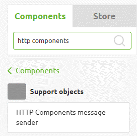
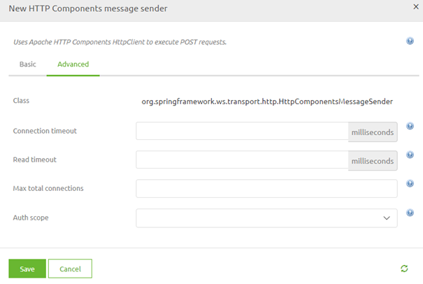
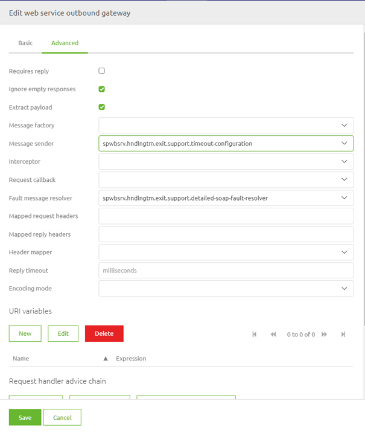

    

        <main class="micro-learning">
        <ul class="doc-nav">
            <li class="doc-nav__item"><a href="../../docs/microlearning/novice-soap-webservice-connectivity-index" class="doc-nav__link">Home</a></li>
            <li class="doc-nav__item"><a href="#intro" class="doc-nav__link">Intro</a></li>
            <li class="doc-nav__item"><a href="#theory" class="doc-nav__link">Theory</a></li>
            <li class="doc-nav__item"><a href="#practice" class="doc-nav__link">Practice</a></li>
            <li class="doc-nav__item"><a href="#solution" class="doc-nav__link">Solution</a></li>
        </ul>

##### Intro

# Handling web service Timeouts
 
When talking to external parties via a SOAP web service, you need to define in eMagiz that you want to call a SOAP web service so eMagiz will form a correct SOAP message. In our previous [course](novice-soap-webservice-connectivity-index.md), we learned how to call a SOAP web service and how you can ensure that detailed faults are returned to the user. In this microlearning, we will build on this knowledge by learning what you can do when confronted with webservice timeouts from an external party.

Should you have any questions, please get in touch with academy@emagiz.com.

- Last update: April 7th, 2022
- Required reading time: 5 minutes

## 1. Prerequisites
- Basic knowledge of the eMagiz platform

## 2. Key concepts
This microlearning centers around handling web service timeouts on SOAP Webservice calls.

With SOAP, we mean A messaging protocol specification for exchanging structured information in implementing web services in computer networks.

- To manipulate the standard timeout on a SOAP web service in eMagiz, you need an HTTP Components message sender (support object)

##### Theory
  
## 3. Calling a SOAP Webservice

When talking to external parties via a SOAP web service, you need to define in eMagiz that you want to call a SOAP web service so eMagiz will form a correct SOAP message. In our previous [course](novice-soap-webservice-connectivity-index.md), we learned how to call a SOAP web service and how you can ensure that detailed faults are returned to the user. In this microlearning, we will build on this knowledge by learning what you can do when confronted with webservice timeouts from an external party.

By default, eMagiz will wait a maximum of 60 seconds to receive a response before throwing a timeout. However, sometimes we see that external parties need more time (for whatever reason) before they can respond to the request we send to the external party. At first, you should discuss alongside the external party whether the response can be delivered quicker to eMagiz to stay within the default timeout of 60 seconds.

In cases where this is not possible, you could use a support object called HTTP Components message sender to influence when eMagiz throws a timeout.

Once you have dragged it onto the canvas and have provided a correct name, you should configure the component. You can do so on the Advanced tab of the support object.

Here you can manipulate the Connection timeout and the Read timeout to have a different value compared to the default of 60 seconds. Note that the value needs to be entered in milliseconds. So, for example, if the timeout needs to be 120 seconds, you should enter 120000 as a value in both the connection and the read timeout. Once you have done so, you can save the component. Do note that increasing this value to a huge number could mean that other messages need to wait a long time before being processed, as eMagiz will only process one message simultaneously (under default configuration).

Now that we have saved the component, the last step is to link the support object to the web service outbound gateway to ensure that your changed setting will be applied to the web service call. Then, open the web service outbound gateway and select your support object as the message sender.

##### Practice

## 4. Assignment

Build a flow within your project in which you manipulate the default timeouts on a web service call.
This assignment can be completed with the help of the (Academy) project that you have created/used in the previous assignment.

## 5. Key takeaways

- To manipulate the default timeout, use the HTTP Components message sender
- Note that the values need to be supplied in milliseconds
- Don't forget to link the support object to the functional component
- Don't fill in a crazily high number for the timeout, as that could lead to slower processing of messages

##### Solution

## 6. Suggested Additional Readings

If you are interested in this topic and want more information, please read the help text provided by eMagiz.

## 7. Silent demonstration video

<iframe width="1280" height="720" src="../../vid/microlearning/intermediate-soap-webservice-connectivity-handling-webservice-timeouts.mp4" frameborder="0" allow="accelerometer; autoplay; clipboard-write; encrypted-media; gyroscope; picture-in-picture" allowfullscreen></iframe>

</main>

