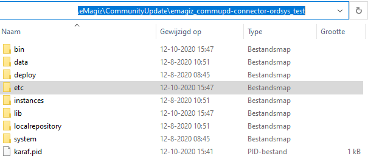
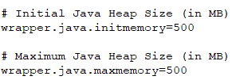

    

        <main class="micro-learning">
        <ul class="doc-nav">
            <li class="doc-nav__item"><a href="../../docs/microlearning/intermediate-solution-architecture-index" class="doc-nav__link">Home</a></li>
            <li class="doc-nav__item"><a href="#intro" class="doc-nav__link">Intro</a></li>
            <li class="doc-nav__item"><a href="#theory" class="doc-nav__link">Theory</a></li>
            <li class="doc-nav__item"><a href="#practice" class="doc-nav__link">Practice</a></li>
            <li class="doc-nav__item"><a href="#solution" class="doc-nav__link">Solution</a></li>
        </ul>

##### Intro

# Edit memory for on-premise runtime (Windows)

Sometimes you have runtimes running on-premises. What we mean by that is that the runtimes are running within a data center of the customer instead of running in the eMagiz Cloud. For running a runtime on-premise we support running them on either Windows or Linux as the operating system. In this microlearning, we will learn how you can edit the memory settings of a runtime that is deployed on-premise on Windows.

Should you have any questions, please contact academy@emagiz.com.

- Last update: April 5th, 2022
- Required reading time: 6 minutes

## 1. Prerequisites
- Basic knowledge of the eMagiz platform

## 2. Key concepts
This microlearning centers on editing the memory settings for an on-premise runtime that is running on Windows

With an on-premise runtime we mean: A runtime that is running within a data center of the customer instead of running in the eMagiz Cloud

The focal point of this microlearning will be to learn how you can safely edit the memory settings for an on-premise runtime running on Windows

- The key aspects are:
    - eMagiz can help you determine the correct size you need to configure via Design -> Architecture
    - You need access to the on-premise location to perform the action
    - Only change the wrapper.conf file. Nothing else

##### Theory
  
## 3. Edit memory for on-premise runtime (Windows)

Sometimes you have runtimes running on-premises. What we mean by that is that the runtimes are running within a data center of the customer instead of running in the eMagiz Cloud. For running a runtime on-premise we support running them on either Windows or Linux as the operating system. In this microlearning, we will learn how you can edit the memory settings of a runtime that is deployed on-premise on Windows.

The focal point of this microlearning will be to learn how you can safely edit the memory settings for an on-premise runtime running on Windows

- The key aspects are:
    - eMagiz can help you determine the correct size you need to configure via Design -> Architecture
    - You need access to the on-premise location to perform the action
    - Only change the wrapper.conf file. Nothing else

### 3.1 Check adviced size

Within Design Architecture you can see for each connector runtime what the advised sizing of eMagiz is based on how you have configured your integration data model. To do so navigate to Design -> Architecture and open the context menu on connector runtime level via a right mouse click.

When selecting the option View container a pop-up will be shown. Within this pop-up, you will see the advised heap and non-heap memory settings of that particular runtime.

### 3.2 Edit memory

Now that we know what the advised size is we can navigate to our on-premise location to edit the memory settings. Below we will detail the various steps needed to make this happen.

- At first we navigate to the etc folder of your runtime installation which is named according to the following naming convention -> emagiz_{technicalbusname}-{containertype}-{technicalnameofruntime}_{environment}. In this example that would mean emagiz_commupd-connector-ordsys_test.

- Within this folder you will find a wrapper.conf file that is named based on the runtime name.

- When you open this file you can change the memory settings, both heap, and metaspace. In the figures shown below, you can see which parts of the file you need to change to change the memory settings.

**Heap memory:**

**Metaspace memory:**

- Save the file as administrator
- Restart the runtime to ensure your changes have been actualized

##### Practice

## 4. Assignment

As this is a more theoretical microlearning we do not have an assignment

## 5. Key takeaways

- The key aspects are:
    - eMagiz can help you determine the correct size you need to configure via Design -> Architecture
    - You need access to the on-premise location to perform the action
    - Only change the wrapper.conf file. Nothing else

##### Solution

## 6. Suggested Additional Readings

None

## 7. Silent demonstration video

As this is a more theoretical microlearning we have no video for this

</main>

