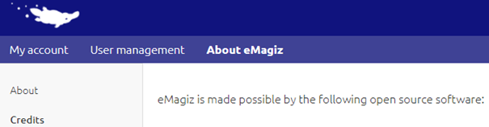
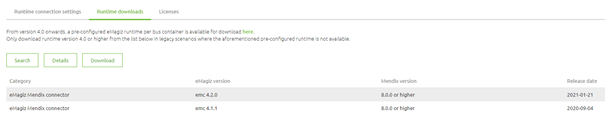

    

        <main class="micro-learning">
        <ul class="doc-nav">
            <li class="doc-nav__item"><a href="../../docs/microlearning/intermediate-solution-architecture-index" class="doc-nav__link">Home</a></li>
            <li class="doc-nav__item"><a href="#intro" class="doc-nav__link">Intro</a></li>
            <li class="doc-nav__item"><a href="#theory" class="doc-nav__link">Theory</a></li>
            <li class="doc-nav__item"><a href="#practice" class="doc-nav__link">Practice</a></li>
            <li class="doc-nav__item"><a href="#solution" class="doc-nav__link">Solution</a></li>
        </ul>

##### Intro

# Explaining Platform components
 
In this microlearning, we will focus on the eMagiz platform and the various components that are part of the eMagiz platform. Knowing which components make up the eMagiz solution will help you better understand the product and in turn, will also make it easier to manage your eMagiz solution. Per component, we will introduce what it is and what it is good for.

Should you have any questions, please contact academy@emagiz.com.

- Last update: April 10th, 2021
- Required reading time: 9 minutes

## 1. Prerequisites
- Basic knowledge of the eMagiz platform
- Understanding of the flow testing functionality

## 2. Key concepts
This microlearning centers around explaining the components that make up the platform.

By components we mean: A part that is needed to successfully run the eMagiz solution. Some of these parts are generic. Others are only relevant for specific cases

There are six key components within the eMagiz platform:

- eMagiz iPaaS Portal
- Runtime
- Cloud Templates
- Build numbers
- eMagiz Connector for Mendix (Messaging)
- eMagiz Connector for Mendix (Event Streaming)

##### Theory
  
## 3. Explaining Platform components

In this microlearning, we will focus on the eMagiz platform and the various components that are part of the eMagiz platform. Knowing which components make up the eMagiz solution will help you better understand the product and in turn, will also make it easier to manage your eMagiz solution. Per component, we will introduce what it is and what it is good for.

There are six key components within the eMagiz platform:

    - eMagiz iPaaS Portal
    - Runtime
    - Cloud Templates
    - Buildnumbers
    - eMagiz Connector for Mendix (Messaging)
    - eMagiz Connector for Mendix (Event Streaming)

### 3.1 eMagiz iPaaS Portal

The eMagiz iPaaS Portal provides web-based access to the eMagiz project where users can create, update and delete integrations across the Test, Acceptance, and Productions environments. Holds access to all configuration options of the eMagiz platform instance required to run these integrations optimally. The portal is divided into five phases (Capture, Design, Create, Deploy and Manage). Each of these phases has a unique purpose.

Note that the eMagiz iPaaS Portal (https://my.emagiz.com) is updated every 2 weeks to allow for user interface improvements and improvements to the integration model. According to the EULA, clients can expect a downtime of max. 2 hours of the eMagiz Portal. All other services inside the client platform such as messaging and monitoring services, are not affected and will continue to run as normal.

### 3.2 Runtime

The runtime is the component into which the individual integration flows are deployed into. It's a Java-based application container that can run in the Cloud or Local. A runtime is visually displayed and described in the eMagiz iPaaS Portal as a container (holding the onramps, offramps, routing, error) or a connector (holding the exits and entries).

Note that eMagiz plans a major release once per year that involves migration activities of the current client installation. A separate eMagiz Release should be created and tested to isolate a potential impact on the current configuration. eMagiz makes the best efforts to make these migrations as smooth as possible with as little effort as possible for client installations.

#### 3.2.1 Supported Version(s)

- Version 5.0.2 - released October 19th, 2018
- Version 5.0.3 - released May 17th, 2019 

See also release notes under the Community section of the eMagiz iPaaS Portal or this link: https://emagiz.github.io/docs/release-notes/index_runtime.html

### 3.3 Cloud Templates

Cloud templates are the blueprints for the cloud slot. They translate your architectural design to virtual or physical resources in the cloud. In other words, the cloud template is responsible to provides the components such as OS, Java versions, etc. in which the runtime components can operate in. On top of that these templates also provide various auto-healing and managing tools to enhance the performance and stability of the platform instance. These are Cloud platform-specific.

Note that you can automatically upgrade your Cloud Template with the Upgrade functionality located in Deploy -> Architecture. With the help of this function, you can schedule the cloud template upgrade at a time most convenient for you. This functionally is currently supported for Test and Acceptance. We are working on making it supported for Production.

These Cloud templates are released per Cloud environment such as AWS and are updated on average 4-6 times a year. Note that you can automatically upgrade your Cloud Template with the Upgrade functionality located in Deploy -> Architecture. With the help of this function, you can schedule the cloud template upgrade at a time most convenient for you. This functionally is currently supported for Test and Acceptance. We are working on supporting it for Production. Messaging traffic is only impacted with a delay - no messages are lost.

#### 3.3.1 Supported Versions

- R17 Single Lane
- R16 Single Lane
- R10 Double lane
- R11 Double lane

See also release notes under the Community section of the eMagiz iPaaS Portal or this link: https://emagiz.github.io/docs/release-notes/index_cloud.html

### 3.4 Build numbers

Every deployment package of a flow has a specific build number. This deployment package (build) contains the (eMagiz) software components that work in conjunction with the functional components as configured in the Create phase of the eMagiz Portal.

As eMagiz makes use of various open source technologies such as Spring, Apache, ActiveMQ Artemis, Saxon, Netty, and others we need to ensure that we keep our dependency on those pieces of software up to date. Apart from that we also make updates to various functional components that are available to you in the Create phase. Those updates (adding a new component, removing a component, changing a component) result in different code that needs to be stored in the deployment package. So every time we change something in that area (repository or runtime level) a new build number is released.

We strive to ensure that all build numbers that are released are backward compatible with previous build numbers. We are dedicated to ensuring client platforms are unaffected by these build numbers improvements.

Note that you can find all open source technology (including versions) that eMagiz uses under Administration -> About eMagiz -> Credits

#### 3.4.1 Supported Versions

- All build numbers higher than or equal to build 46

See also release notes under the Community section of the eMagiz iPaaS Portal or this link: https://emagiz.github.io/docs/release-notes/index_build.html

### 3.5 eMagiz Connector for Mendix (Messaging)

Contains the Mendix module that allows the Mendix project to interact with the eMagiz iPaaS instance through the Messaging pattern. Holds the configuration details to connect to the eMagiz instance as well as the Java actions that can be referred to inside Mendix Microflows. With the help of this module, you can considerably speed up the development of messaging integrations between Mendix and eMagiz

Note that you can download the available version under Deploy -> On-premises -> Runtime Downloads

#### 3.5.1 Supported Versions

- All EMC versions higher or equal than version 3.0.2

See also release notes under the Community section of the eMagiz iPaaS Portal or this link: https://emagiz.github.io/docs/release-notes/index_runtime.html

### 3.6 eMagiz Connector for Mendix (Event Streaming)

Contains the Mendix module that allows the Mendix project to interact with the eMagiz Cluster through the Event Streaming pattern. Holds the configuration details to connect to the eMagiz instance as well as example microflows on how to produce and consume on the topics within the eMagiz Cluster. With the help of this module, you can considerably speed up the development of event streaming integrations between Mendix and eMagiz

Note that you can download the available version under Deploy -> On-premises -> Runtime Downloads

#### 3.6.1 Supported Versions

- All versions higher or equal than version 1.0.0

See also release notes under the Community section of the eMagiz iPaaS Portal or this link: https://emagiz.github.io/docs/release-notes/index_runtime.html

##### Practice

## 4. Assignment

Read up on the release notes of the various platform components and determine for the projects in which you operate what the status is of your eMagiz solution on the eMagiz platform.

## 5. Key takeaways

- The eMagiz platform consists of a lot of components.
- The following six components are most relevant for our user community:
    - eMagiz iPaaS Portal
    - Runtime
    - Cloud Templates
    - Buildnumbers
    - eMagiz Connector for Mendix (Messaging)
    - eMagiz Connector for Mendix (Event Streaming) 

##### Solution

## 6. Suggested Additional Readings

If you are interested in this topic and want more information on it please read the release notes provided by eMagiz

## 7. Silent demonstration video

As this is a more theoretical microlearning we have no video for this

</main>

