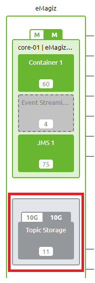
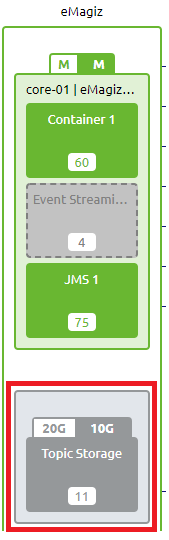
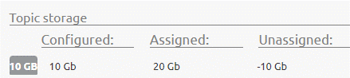

    

        <main class="micro-learning">
        <ul class="doc-nav">
            <li class="doc-nav__item"><a href="../../docs/microlearning/intermediate-solution-architecture-index" class="doc-nav__link">Home</a></li>
            <li class="doc-nav__item"><a href="#intro" class="doc-nav__link">Intro</a></li>
            <li class="doc-nav__item"><a href="#theory" class="doc-nav__link">Theory</a></li>
            <li class="doc-nav__item"><a href="#practice" class="doc-nav__link">Practice</a></li>
            <li class="doc-nav__item"><a href="#solution" class="doc-nav__link">Solution</a></li>
        </ul>

##### Intro

# Topic Storage
 
A key element within using the Event Streaming platform is the topic storage. As you have learned in the crash course platform the event streaming pattern is all about topics and retention. As you can imagine the total amount of GB configured in retention across environments and topics defines the total amount of configured topic storage. In this microlearning, we will learn how you can determine the configured size of the topic storage (per environment). Further, we will learn what you should do in case you exceed your allotted amount of topic storage.

Should you have any questions, please contact academy@emagiz.com.

- Last update: July 29th, 2021
- Required reading time: 5 minutes

## 1. Prerequisites
- Basic knowledge of the eMagiz platform

## 2. Key concepts
This microlearning centers on topic storage.

With topic storage we mean: The total configured amount of retention on all topics (across environments) 

The focal point of this microlearning will be topic storage.

- The key aspects are:
    - eMagiz compares the allotted topic storage (contractually allowed) with the configured topic storage
    - eMagiz sells topic storage per integration data model (so no separate GBs for Test, Acceptance, and Production)
    - eMagiz shows configured topic storage per environment so you can assign yourself how much of the allotted GB you want to use per environment

##### Theory
  
## 3. Topic Storage

A key element within using the Event Streaming platform is the topic storage. As you have learned in the crash course platform the event streaming pattern is all about topics and retention. As you can imagine the total amount of GB configured in retention across environments and topics defines the total amount of configured topic storage. In this microlearning, we will learn how you can determine the configured size of the topic storage (per environment). Further, we will learn what you should do in case you exceed your allotted amount of topic storage.

The focal point of this microlearning will be topic storage.

- The key aspects are:
    - eMagiz compares the allotted topic storage (contractually allowed) with the configured topic storage
    - eMagiz sells topic storage per integration data model (so no separate GBs for Test, Acceptance, and Production)
    - eMagiz shows configured topic storage per environment so you can assign yourself how much of the allotted GB you want to use per environment

Let us first check how we can determine the configured topic storage per enviroment and how you can compare that to the assigned topic storage per environment. To do so we have to navigate towards Design -> Architecture. Within Design Architecture you will a grey block called topic storage.

In this block you will see the configured size on the left (so the total configured retention across topics on this environment) and the assigned (i.e. allotted) size on the right. As long as the number on the right is higher or equals the number on the left you can continue building and deploying your event streaming solution. However the moment the number on the right is lower compared to the number on the left (see below) you have exceeded the assigned size.

You can also see this comparison in the right hand panel on the Design Architecture canvas.

When this happens you could first take a hard look at how you have configured the retention settings per topic. Maybe you will spot large differences between the configured size and the actual retention size on a topic. If so you could downscale the retention settings (in terms of bytes and hours) in order to reduce the number of configured GBs on that environment. Note that you can vary the retention policy of a topic per environment. This allows you to make small Test topics and large(r) Production topics. To figure out whether the configured retention settings match the actual retention on topic level you can use the Manage phase in eMagiz. If you want to learn more on this please check out this [microlearning](crashcourse-eventstreaming-managing-your-event-streaming-solution.md).

In case you cannot scale down your retention settings you need to contact your partner manager in order to come to an agreement on more allotted topic storage on a contractual basis. Note that just as with cloud approval only an eMagiz cloud administrator can change the assigned configuration. This to prevent misuse of the platform in terms of retention.

##### Practice

## 4. Assignment

Reflect on the choices made within various projects and see if you would, with what you know now, change the specific implementation.

## 5. Key takeaways

- The key aspects are:
    - eMagiz compares the allotted topic storage (contractually allowed) with the configured topic storage
    - eMagiz sells topic storage per integration data model (so no separate GBs for Test, Acceptance, and Production)
    - eMagiz shows configured topic storage per environment so you can assign yourself how much of the allotted GB you want to use per environment

##### Solution

## 6. Suggested Additional Readings

If you are interested in this topic and want more information on it please read the help texts provided by eMagiz

## 7. Silent demonstration video

As this is a more theoretical microlearning we have no video for this

</main>

