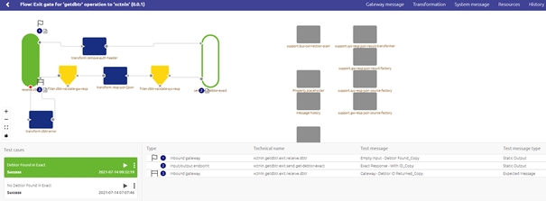

    

        <main class="micro-learning">
        <ul class="doc-nav">
            <li class="doc-nav__item"><a href="../../docs/microlearning/intermediate-testing-emagiz-api-gateway-index" class="doc-nav__link">Home</a></li>
            <li class="doc-nav__item"><a href="#intro" class="doc-nav__link">Intro</a></li>
            <li class="doc-nav__item"><a href="#theory" class="doc-nav__link">Theory</a></li>
            <li class="doc-nav__item"><a href="#practice" class="doc-nav__link">Practice</a></li>
            <li class="doc-nav__item"><a href="#solution" class="doc-nav__link">Solution</a></li>
        </ul>

##### Intro

# Testing API Gateway

In this microlearning, we will focus on testing your API Gateway (operations) with the help of two functionalities that the platform offers. First, we take a look at flow testing, secondly, we turn our attention to Swagger UI.

Should you have any questions, please contact academy@emagiz.com.

- Last update: July 22th 2021
- Required reading time: 5 minutes

## 1. Prerequisites
- Basic knowledge of the eMagiz platform
- Basic knowledge of the API Gateway pattern

## 2. Key concepts
This microlearning centers around testing the API Gateway (operations).
With testing, we mean: Verifying that the operation does what it is supposed to do

- Flow testing is meant for testing the exit gates
- Swagger UI is meant for testing the whole operation as a client
- Both play an intricate part in testing your API Gateway

##### Theory

## 3. Testing API Gateway

In this microlearning, we will focus on testing your API Gateway (operations) with the help of two functionalities that the platform offers. First, we take a look at flow testing, secondly, we turn our attention to Swagger UI.

- Flow testing is meant for testing the exit gates
- Swagger UI is meant for testing the whole operation as a client
- Both play an intricate part in testing your API Gateway

### 3.1 Flow Testing

In the [Crash Course Platform](../microlearning/crashcourse-platform-index.md) we have several microlearnings on the topic of flow testing. Please take a look at those microlearnings first if the concept of flow testing is new to you. As described there the flow testing functionality also works for API Gateway exit gates. With the help of the flow testing functionality, you can test the functional part of the API Gateway exit flow (i.e. transformation, authentication logic, filtering, and error handling) without testing the connectivity to the external system. This way you can increase the chances of being first time right before deploying your solution on the Test (or Acceptance) environment. A typical flow test for an exit gate looks as follows.

### 3.2 Testing with Swagger UI

When you navigate to the Swagger UI page you will see that there is a try-it-out button per operation. After you have pressed this button you will see a button called Execute appear. 
By pressing this button you will test the API Gateway functionality of a specific operation as if you were the client.

The Swagger UI will give feedback based on what happened after you have pressed the button to execute

##### Practice

## 4. Assignment

Execute a flow test on the exit gate belonging to one operation. When satisfied please run your API Gateway locally and access the Swagger UI via the browser. Authenticate yourself and test at least one operation.
This assignment can be completed with the help of the (Academy) project that you have created/used in the previous assignment.

## 5. Key takeaways

- Flow testing is meant for testing the exit gates
- Swagger UI is meant for testing the whole operation as a client
- Both play an intricate part in testing your API Gateway

##### Solution

## 6. Suggested Additional Readings

If you are interested in this topic and want more information on it please read the help text provided by eMagiz.

## 7. Silent demonstration video

There is no demonstration video of this functionality.

</main>

