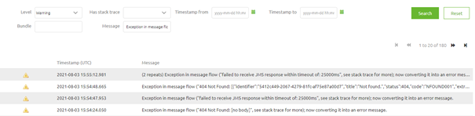

    

        <main class="micro-learning">
        <ul class="doc-nav">
            <li class="doc-nav__item"><a href="../../docs/microlearning/intermediate-understanding-error-handling-in-emagiz-index" class="doc-nav__link">Home</a></li>
            <li class="doc-nav__item"><a href="#intro" class="doc-nav__link">Intro</a></li>
            <li class="doc-nav__item"><a href="#theory" class="doc-nav__link">Theory</a></li>
            <li class="doc-nav__item"><a href="#practice" class="doc-nav__link">Practice</a></li>
            <li class="doc-nav__item"><a href="#solution" class="doc-nav__link">Solution</a></li>
        </ul>

##### Intro

# Support Perspective
 
In a previous microlearning, we have discussed the error handling of the API Gateway from the perspective of the client that is calling the API. In this microlearning, we will focus on how you can provide support to those clients based on the information that is captured and stored in eMagiz. This will help you to better support your clients.

Should you have any questions, please contact academy@emagiz.com.

- Last update: August 4th, 2021
- Required reading time: 4 minutes

## 1. Prerequisites
- Intermediate knowledge of the eMagiz platform

## 2. Key concepts
This microlearning centers on error handling for API Gateway from a support perspective.

- The key aspects are:
    - The client is responsible for handling the error correctly
    - eMagiz will log the exception to provide support
    - You can use the log to determine what went wrong where and when

##### Theory
  
## 3. Support Perspective

In a previous microlearning, we have discussed the error handling of the API Gateway from the perspective of the client that is calling the API. In this microlearning, we will focus on how you can provide support to those clients based on the information that is captured and stored in eMagiz. This will help you to better support your clients.

- The key aspects are:
    - The client is responsible for handling the error correctly
    - eMagiz will log the exception to provide support
    - You can use the log to determine what went wrong where and when

As we learned from the previous [microlearning](crashcourse-api-gateway-error-handling-from-a-client-perspective.md) surrounding this topic is that the error message is given back to the client. As a result, the client is primarily responsible for introducing proper error handling to safeguard against data loss. Having said that eMagiz does also log the exception. You can find these exceptions in the Manage phase of eMagiz under Monitoring -> Log entries. Here you can filter on the API Gateway runtime, on level warning, and message (Exception in message flow). This will provide you with a list of warnings on the API Gateway level.

Each of these warnings corresponds with an error message that has been sent back to the client. In case a client wants to have more information before resending a certain message you can help him by browsing through this page. Do note that these log entries disappear after fourteen days so you cannot get to them indefinitely.

##### Practice

## 4. Assignment

Check out if you have a project in which the API Gateway pattern is used. If so, check out if you can find any errors that have occurred and see whether you can interpret them.

## 5. Key takeaways

- The key aspects are:
    - The client is responsible for handling the error correctly
    - eMagiz will log the exception to provide support
    - You can use the log to determine what went wrong where and when

##### Solution

## 6. Suggested Additional Readings

If you are interested in this topic please read the help text eMagiz provides you.

## 7. Silent demonstration video

As this is a more theoretical microlearning we have no video for this.

</main>

