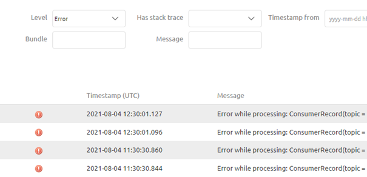

    

        <main class="micro-learning">
        <ul class="doc-nav">
            <li class="doc-nav__item"><a href="../../docs/microlearning/intermediate-understanding-error-handling-in-emagiz-index" class="doc-nav__link">Home</a></li>
            <li class="doc-nav__item"><a href="#intro" class="doc-nav__link">Intro</a></li>
            <li class="doc-nav__item"><a href="#theory" class="doc-nav__link">Theory</a></li>
            <li class="doc-nav__item"><a href="#practice" class="doc-nav__link">Practice</a></li>
            <li class="doc-nav__item"><a href="#solution" class="doc-nav__link">Solution</a></li>
        </ul>

##### Intro

# Event Streaming
 
In this microlearning, we will learn how error handling works for event processors. In a later module, we will learn more about event processors and we will learn how to configure them. In this microlearning, the focus will remain on error handling and not on flow configuration.

Should you have any questions, please contact academy@emagiz.com.

- Last update: August 4th, 2021
- Required reading time: 5 minutes

## 1. Prerequisites
- Intermediate knowledge of the eMagiz platform

## 2. Key concepts
This microlearning centers on error handling for Event Streaming.

- The key aspects are:
    - The producer and consumer are responsible for handling the error correctly
    - eMagiz will only log exceptions that occur within an event processor
    - You can use the log to determine what went wrong where and when
    - When eMagiz only provides the topic no additional logging functionality is available in eMagiz

##### Theory
  
## 3. Event Streaming

In this microlearning, we will learn how error handling works for event processors. In a later module, we will learn more about event processors and we will learn how to configure them. In this microlearning, the focus will remain on error handling and not on flow configuration.

- The key aspects are:
     The producer and consumer are responsible for handling the error correctly
    - eMagiz will only log exceptions that occur within an event processor
    - You can use the log to determine what went wrong where and when
    - When eMagiz only provides the topic no additional logging functionality is available in eMagiz

As we learned in previous microlearnings on the subject of Event Streaming the idea behind it is that producers and consumers can act completely independently of one another. They do not have to be aware of each other. Facilitating Event Streaming in eMagiz can be done in two ways:

- eMagiz will only be the broker providing the topics
- eMagiz will process data between topics via an Event Processor

In the first case, the producer and consumer will be solely responsible for error handling in case something goes wrong. This is in line with the philosophy of Event Streaming. In case eMagiz is used to process data between topics the data will pass through an eMagiz flow. Within this flow, things can go wrong. In case they go wrong an exception is written to the log of eMagiz. You can find these exceptions in the Manage phase of eMagiz under Monitoring -> Log entries. Here you can filter on the Event Streaming runtime, on level error, and message (Error while processing). This will provide you with a list of errors on the Event Streaming level.

Each of these errors corresponds with a failed attempt to process a certain message. Keep an eye out for this logging to prevent data loss. If an error persists you should start thinking about finding out and subsequently solving the underlying problem.

##### Practice

## 4. Assignment

Check out if you have a project in which the Event Streaming pattern is used. If so, check out if you can find any errors that have occurred and see whether you can interpret them.

## 5. Key takeaways

- The key aspects are:
    - The producer and consumer are responsible for handling the error correctly
    - eMagiz will only log exceptions that occur within an event processor
    - You can use the log to determine what went wrong where and when
    - When eMagiz only provides the topic no additional logging functionality is available in eMagiz

##### Solution

## 6. Suggested Additional Readings

If you are interested in this topic please read the help text eMagiz provides you.

## 7. Silent demonstration video

As this is a more theoretical microlearning we have no video for this.

</main>

