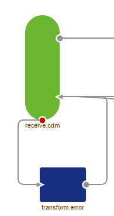
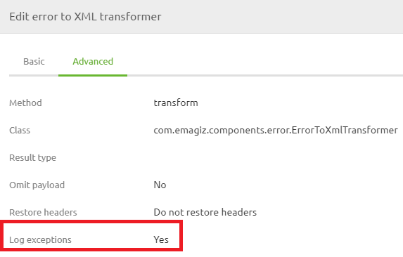
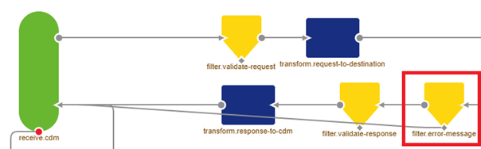

    

        <main class="micro-learning">
        <ul class="doc-nav">
            <li class="doc-nav__item"><a href="../../docs/microlearning/intermediate-understanding-error-handling-in-emagiz-index" class="doc-nav__link">Home</a></li>
            <li class="doc-nav__item"><a href="#intro" class="doc-nav__link">Intro</a></li>
            <li class="doc-nav__item"><a href="#theory" class="doc-nav__link">Theory</a></li>
            <li class="doc-nav__item"><a href="#practice" class="doc-nav__link">Practice</a></li>
            <li class="doc-nav__item"><a href="#solution" class="doc-nav__link">Solution</a></li>
        </ul>

##### Intro

# Messaging Synchronous
 
In previous microlearnings, we have already explained some things about asynchronous error handling. In this microlearning, we will take a look at how error handling works for synchronous messaging flows. Note that the error handling for synchronous flows mimics the error handling for API Gateway flows as both are synchronous.

Should you have any questions, please contact academy@emagiz.com.

- Last update: August 4th, 2021
- Required reading time: 5 minutes

## 1. Prerequisites
- Intermediate knowledge of the eMagiz platform

## 2. Key concepts
This microlearning centers on error handling for synchronous messaging.

- The key aspects are:
    - The error handling behaves the same way as for API Gateway
    - For old synchronous flows the error handling behaves differently, please migrate
    - The client will become responsible for handling the error correctly
    - eMagiz will log the exception to provide support

##### Theory
  
## 3. Messaging Synchronous

In previous microlearnings, we have already explained some things about asynchronous error handling. In this microlearning, we will take a look at how error handling works for synchronous messaging flows. Note that the error handling for synchronous flows mimics the error handling for API Gateway flows as both are synchronous.

- The key aspects are:
    - The error handling behaves the same way as for API Gateway
    - For old synchronous flows the error handling behaves differently, please migrate
    - The client will become responsible for handling the error correctly
    - eMagiz will log the exception to provide support

When looking at synchronous messaging flows you will see that the error handling (the lower part of your flow) differs from when you look at the asynchronous error handling. The synchronous error handling is shown below.

What you can see here is that when an error is raised it is given back to the original part of our messaging integration that was calling this part of the messaging integration. As you know messaging is always conducted over five layers (entry, onramp, routing, offramp, exit). This means that when the offramp throws an error (i.e. validation error) he gives the error back to the routing. That flow will in turn give back the error to the onramp. This process continues to the entry. At that point, you should send the error back to the client so they can properly handle the error.

Apart from giving back the error to the previous step eMagiz will also log the exception so it can be used to analyze further. This is done via the following setting on the error to the XML component. This way the client can be supported by someone who has access to eMagiz to figure out what went wrong.

As you can imagine there is another part of the flow needed to ensure that an error does not cause another error when it arrives in the previous step. To prevent this from happening an additional check is introduced that filters error messages. In case the message is an error message it will bypass the functional part of the flow and will be directly sent back to the previous step. This is to prevent an error on an error.

Please note that we have changed the way the error handling works for synchronous flows in the last year. This means that probably not all synchronous flows have been migrated to make use of this new functionality. In case you are interested in migrating please check out this [guide](../howto/userguide-legacyconstructs.md).

Hopefully, this microlearning has made it somewhat clearer how to handle errors when dealing with synchronous messaging flows.

##### Practice

## 4. Assignment

Check out if your synchronous messaging solutions are up to date. If not open up a discussion on why those choices are made to learn from that.

## 5. Key takeaways

- The key aspects are:
    - The error handling behaves the same way as for API Gateway
    - For old synchronous flows the error handling behaves differently, please migrate
    - The client will become responsible for handling the error correctly
    - eMagiz will log the exception to provide support

##### Solution

## 6. Suggested Additional Readings

If you are interested in this topic please read the help text eMagiz provides you.

## 7. Silent demonstration video

As this is a more theoretical microlearning we have no video for this.

</main>

