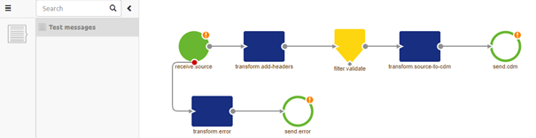
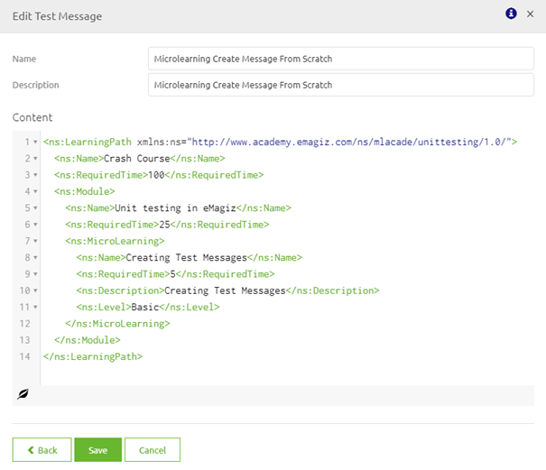
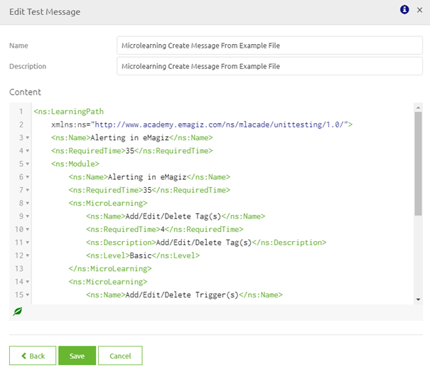
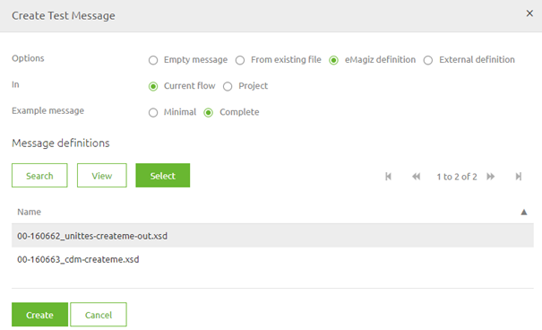
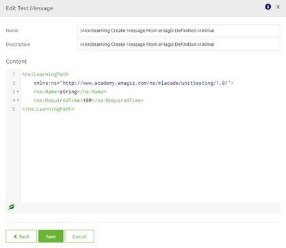
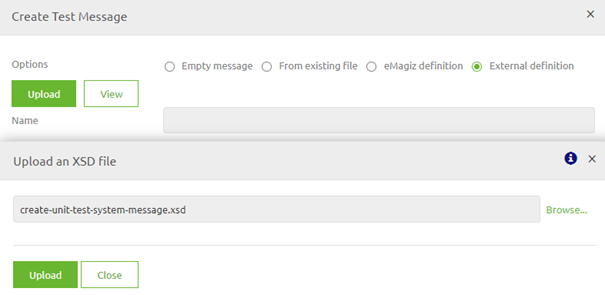
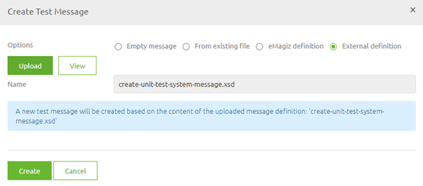

# Creating Test Messages for Unit Testing

In this microlearning we will focus on the creation of test messages which you can use while configuring and executing unit tests.

Should you have any questions, please contact academy@emagiz.com.

Last update: December 17th 2020

Required reading time: 5 minutes

## Pre-requisites
- Basic knowledge of the eMagiz platform
- Understanding of Unit testing concept
- On- or offramp (without splitter or router) that needs to be tested

## Key concepts
This micro learning centers around the creation of test messages for unit testing.
With unit testing we mean: Testing each separate component (unit) within the context of a flow based on a supplied input (and an expected outcome).

To create test messages you can use for unit testing in eMagiz we provide you with four options:

- Create message from scratch
- Create message based on a example message
- Create message based on eMagiz definition
- Create message based on external definition

By choosing one of these option as your starting point you can easily create a test message.

Below we will explain how you can best use each of these methods to your advantage

## Creating Test messages

To create a test message you navigate to the Create phase of eMagiz. Within the Create phase of eMagiz you open the flow you want to unit test.
After you have opened the flow you should press the button on the bottom bar called Configure tests 

In this overview you can drag a new message on an input or output component to Create a new message:

eMagiz provides you with four distinct options to add/create test messages on the basis of certain elements within or outside the portal. Each of these options are discussed in detail below:

- Create message from scratch
- Create message based on a example message
- Create message based on eMagiz definition
- Create message based on external definition

### Create message from scratch

In some cases you have no information to go on when you want to unit test your flow. In these cases you can use the option called Empty message.
With this option you can create a message from scratch.

This means that you have the option to copy paste or write out your own message by hand.

Simply select the option Empty message and press Create. In the pop-up that follows you have to fill in a name (make it clear what the message is about) and fill in the content of the message

When you are satisfied press Save. If you have doubts about the choice you made press back. If you made a mistake and want to start over again completly press Cancel.

### Create message based on a example message

Ideally example messages are known in advance and part of the Discovery. 
In eMagiz there is a centralized place where you store all relevant files and data belonging to an integration and that is Capture. 
You can also use this place to store example messages you have received from an external source

If you have added example messages in Capture or if there are existing messages in Create already you can now use these messages to create test messages for your unit test.
First select the option From existing file. Secondly you have to make a choice whether you want your input message from Capture or Create

If you choose Capture you can select all example messages you have added to this flow in Capture. 
If you choose Create you can select either all existing test messages attached to the current flow or select existing test messages within your project.
Remember our definition of what a unit test is. Based on that definition it is logical to choose the option Capture.

Regardless of the chosen option, the moment you are satisfied with your choice you should select the message and press Select. After you have selected one specific message you press Create. 
eMagiz will now create a new test message based on your selection. In the pop-up that follows verify the name (make it clear what the message is about) and check the content.

When you are satisfied press Save. If you have doubts about the choice you made press back. If you made a mistake and want to start over again completly press Cancel.

### Create message based on eMagiz definition

If you have used the eMagiz tooling in Design you have yet another choice to base your test messages on. This option is the option to create a message based on a eMagiz definition.
To start things off let us select the option eMagiz definition. 
Within this context we have to make the choice whether we want to use a eMagiz definition linked to this flow or one that is linked to the project as a whole.
Remember our definition of what a unit test is. Based on that definition it is logical to choose the option Current flow.

Furthermore you have to make a choice between Minimal or Complete. By selecting Complete you get an example message based on all elements and attributes. 
If you choose Minimal you get an example message based on all required elements and attributes.

Regardless of the chosen option, the moment you are satisfied with your choice you should select the message and press Select. After you have selected one specific message you press Create. 
eMagiz will now create a new test message based on your selection. In the pop-up that follows verify the name (make it clear what the message is about) and check the content.

When you are satisfied press Save. If you have doubts about the choice you made press back. If you made a mistake and want to start over again completly press Cancel.

### Create message based on external definition

If you have an external definition (.XSD) that is not yet attached to Capture nor the basis of a eMagiz definition you have the option to manually upload this definition so it can be the basis of your test message.
To do so you have to select the option External definition. Within this context you have to press the Upload button and select the file you want to Upload.

After you have succesfully uploaded the file you can either view the message so you can verify that you have uploaded the correct definition or press Create

After you press Create eMagiz will create a new test message based on your selection. In the pop-up that follows verify the name (make it clear what the message is about) and check the content.

When you are satisfied press Save. If you have doubts about the choice you made press back. If you made a mistake and want to start over again completly press Cancel.

## Assignment

Create a test message for a onramp or offramp flow within your (Academy) project based on a eMagiz definition and create a test message for a onramp or offramp flow within your (Academy) project based on a example message.

## Key takeaways

To create test messages you can use for unit testing in eMagiz we provide you with four options:

- Create message from scratch
- Create message based on a example message
- Create message based on eMagiz definition
- Create message based on external definition

By choosing one of these option as your starting point you can easily create a test message.

## Suggested Additional Readings

If you are interested in this topic and want more information on it please read the helptext provided by eMagiz when executing these actions and read the user guide on unit testing which you can find in the documentation portal.
