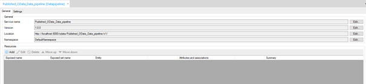
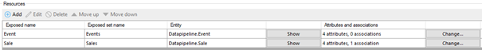
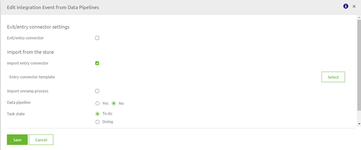
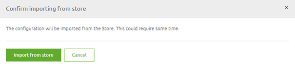
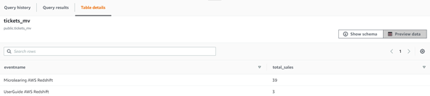

# Data pipeline - Mendix to AWS Redshift

In this microlearning we will learn how you can set up a data pipeline between Mendix and AWS Redshift with the help of eMagiz. 
With the help of such a data pipeline you can transfer large volumes of data between Mendix and AWS Redshift for data warehousing / BI analytics purposes.

Should you have any questions, please contact academy@emagiz.com.

- Last update: February 2th 2021
- Required reading time: 10 minutes

## 1. Prerequisites
- Basic knowledge of the eMagiz platform
- Knowledge of AWS Redshift
- A AWS Redshift license
- Basic knowledge of the Mendix platform

## 2. Key concepts
This micro learning centers around configuring a data pipeline that will transfer large volumes of data between Mendix and AWS Redshift.

With data pipeline we mean: A integration pattern that can transfer large volumes of data between a specific set of source and sink systems
With AWS Redshift we mean: A AWS offering that is best suited for data warehousing which gives us the ability to create a denser overview based on various source tables.

To learn about this topic we start with a business question to which we want an answer to make this a little bit more concrete.
The business question is as follows:

- What were the total sales per event?

## 3. Data pipeline - Mendix to AWS Redshift

Imagine you are a global event organizer and want to track which events were hits and misses during the year. 
By using a materialized view in AWS Redshift you can easily combine the information from several source tables to create a overview of exactly what you want to see.
In this case a table with two attributes would suffice:
- eventname
- total_sales

As a data pipeline always transfers data from source to sink system we will start at the source of this data pipeline. 
Afterwards we will continue with the transfer part and we will finish at the sink system.

### 3.1 Setting up Mendix

To let the data pipeline retrieve data from your Mendix application you need to publish your data via a Published OData service.

 

The result of this action should look similar to this

In order to add resources to this OData service you can press the Add icon in this screen or navigate to the domain model to add the relevant resources.
Regardless of the option that you choose, the end result should be something like this:

Now we have succesfully published the relevant data that we need to answer our question.

### 3.2 Setting up eMagiz
Now that we have made the relevant information available we need to make sure we can retrieve the information via a eMagiz data pipeline. 
Because we have two tables (Sales and Events) we need two data pipelines.

#### 3.2.1 Design

Selecting the correct data pipeline can be done in Design. This way eMagiz will do all the heavy lifting for you. 
Double click on the integration that you want to edit and select Import Entry Connector

Next step would be to select the correct entry connector that you want to import from the store. In this case the Mendix Redshift one.

To finish up our Design phase set the option Data pipeline to Yes. This will ensure that you only need to deploy the entry and not the onramp when you are in Deploy.
The result should look as follows.

Don't forget to do the same for the other data pipeline that you need to configure

#### 3.2.1 Create

After you have transferred the data pipelines to Create you can edit the entry flows. 
eMagiz will tell you that the information will be retrieved from the store.

Select Import from Store and let eMagiz do all the heavy lifting. The result of this action will be a flow that looks as follows:

As you can see the complete setup is already created for you and the various parts have been nicely organized and separated. Let us do a quick walkthrough:
- Starting at the top left corner we have the Job configuration. 
	- This configuration specifies the source system (Item reader), transformation (Item processor) and the sink system (Item writer). All of them are pre-filled for you
- Next to that you have all support objects needed to run the flow.
- One down we have the job launch configuration. 
	- This configuration makes sure that the job, with certain parameters, is launched at a certain point in time. It is up to the user what this point of time is.
- All the way in the left corner we have the job listener configuration
	- This piece of the flow waits for a signal that the job is complete and upon completion will refresh the materialized view (and therefore updating the overview we want).
- In the bottom center we have some specific support objects that are relevant for this particular data pipeline implementation
- Last but not least, on the right hand bottom corner we have the functionality that automatically cleans up the job dashboard.

The only thing you need to do is to rename the properties where it says message to the technicalname of what you have just added (i.e. sale, event) 

#### 3.2.2 Deploy

Although you don't need to build this flow by yourself you still need to fill in various property values to make sure that you retrieve the correct data from Mendix and send it to the correct table in AWS Redshift. 
A complete list of these property can be found on flow level (under Other -> Properties).

Before you can activate your data pipeline we first have to ensure that AWS Redshift is ready to receive the data.

### 3.3 Setting up AWS Redshift

We will start with creating two separate tables (one for sales and one for events). This to make sure that we can later fill and update these tables.
A example SQL query could be:

CREATE TABLE IF NOT EXISTS sales_dp
(
	salesid int8 PRIMARY KEY,
	customer varchar(255),
	price decimal,  
	eventid int8
);

Furthermore we create a materialized view with the help of the following SQL query:

CREATE MATERIALIZED VIEW tickets_mv AS
SELECT event.eventname, SUM(sales.price) as total_sales
FROM public.sales_dp sales, public.event_dp event
WHERE sales.eventid = event.eventid
GROUP BY event.eventname

See below for an explanation of how this SQL query works.

### 3.4 Running the data pipeline
Now that we have configured Mendix (source), eMagiz (transfer) and AWS Redshift (sink) it is time to run the data pipelines. Don't forget to configure the properties correctly.

To illustrate the effect of setting up your data pipeline via eMagiz to refresh the materialized view that can answer our question I have two pictures. A before and a after picture.

## 4. Assignment

The assignment is complex this time and comes with a lot of requirements as this talks about a complete integration. 
So only proceed with this assignment if you have access to Mendix and AWS Redshift in addition to eMagiz.

If so, the assignment is to succesfully refresh a AWS materialized view that answers the question What were the total sales per event?

This assignment can be completed with the help of a associated Mendix project linked to the (Academy) project that you have created/used in the previous assignment.

## 5. Key takeaways

- A data pipeline is usefull when transferring large volumes of data without the need for transformation
- With the help of materialized views in AWS Redshift you can easily zoom in and aggregate on data after it has happened for BI reporting
- Data pipelines are a standardized piece of software in eMagiz that can be implemented with ease

## 6. Suggested Additional Readings

If you are interested in this topic and want more information on it please read the help text provided by eMagiz and visit the following links:
- https://docs.aws.amazon.com/redshift/latest/dg/materialized-view-overview.html
- https://docs.aws.amazon.com/redshift/latest/dg/materialized-view-create-sql-command.html
- https://docs.mendix.com/refguide/published-odata-services

## 7. Silent demonstration video

This video demonstrates a working solution and how you can validate whether the refresh has actually worked in AWS Redshift.

<iframe width="1280" height="720" src="../../vid/microlearning/microlearning-datapiline-mendix-to-aws-redshift.mp4" frameborder="0" allow="accelerometer; autoplay; clipboard-write; encrypted-media; gyroscope; picture-in-picture" allowfullscreen></iframe>