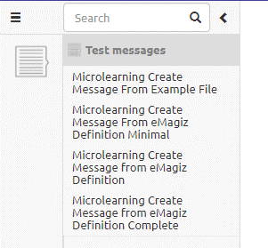

# Deleting Test Messages for Unit Testing

In this microlearning we will focus on deleting test messages which you can use while configuring and executing unit tests.

Should you have any questions, please contact academy@emagiz.com.

Last update: December 17th 2020

Required reading time: 2 minutes

## Pre-requisites
- Basic knowledge of the eMagiz platform
- Understanding of Unit testing concept
- On- or offramp (without splitter or router) that needs to be tested

## Key concepts
This micro learning centers around deleting test messages for unit testing.
With unit testing we mean: Testing each separate component (unit) within the context of a flow based on a supplied input (and an expected outcome).

Deleting a test message can be done via the left hand panel menu showing all messages related to that specific flow and selecting the message you want to delete by hoovering over it.

## Deleting Test messages

To delete a test message you navigate to the Create phase of eMagiz. Within the Create phase of eMagiz you open the flow where you want to delete a test message from.
After you have opened the flow you should press the button on the bottom bar called Configure tests 

In this overview you can open the left hand panel by selecting the arrow pointing to the right in the left hand part of your screen to show all messages linked to that flow:

The moment you hover over a certain message you will see two icons appear. One, the X symbol, indicates the possiblity to delete the message.

When you are satisfied with your choice you can click on the delete icon. This will remove the message from the list of messages linked to that flow.
Be aware that when a test message is already used as input or output of a specific unit test you cannot remove the message anymore. 

## Assignment

Delete one of the test messages for a onramp or offramp flow within your (Academy) project.

## Key takeaways

Deleting a test message is easy and can be quickly done by clicking the X icon. Be aware that gone is gone and there is no undo button after you have deleted something.

## Suggested Additional Readings

If you are interested in this topic and want more information on it please read the helptext provided by eMagiz when executing these actions and read the user guide on unit testing which you can find in the documentation portal.
