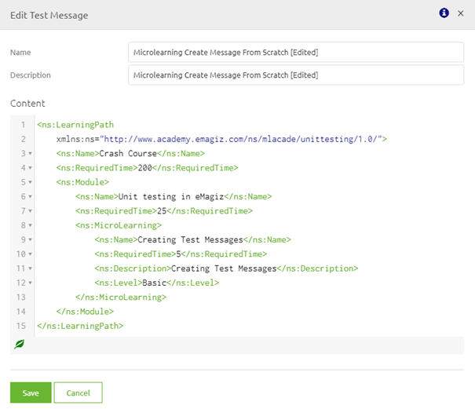

# Editing Test Messages for Unit Testing

In this microlearning we will focus on editing test messages which you can use while configuring and executing unit tests.

Should you have any questions, please contact academy@emagiz.com.

Last update: December 17th 2020

Required reading time: 2 minutes

## Pre-requisites
- Basic knowledge of the eMagiz platform
- Understanding of Unit testing concept
- On- or offramp (without splitter or router) that needs to be tested

## Key concepts
This micro learning centers around editing test messages for unit testing.
With unit testing we mean: Testing each separate component (unit) within the context of a flow based on a supplied input (and an expected outcome).

Editing a test message can be done via the left hand panel menu showing all messages related to that specific flow and selecting the message you want to edit by hoovering over it.

## Editing Test messages

To edit a test message you navigate to the Create phase of eMagiz. Within the Create phase of eMagiz you open the flow you want to unit test.
After you have opened the flow you should press the button on the bottom bar called Configure tests 

In this overview you can open the left hand panel by selecting the arrow pointing to the right in the left hand part of your screen to show all messages linked to that flow:

The moment you hover over a certain message you will see two icons appear. One, the pencil, indicates the possiblity to edit the message.

When you are satisfied with your choice you can click on the edit icon. The result will be a popup showing you the message you can edit. 

When you are satisfied with the changes you have made press Save. If you made a mistake or are unsure about whether you really want these changes press Cancel.
Please do remember that the moment you have succesfully edited and saved your test message you cannot go back to the previous version of the test message as there is no undo option at that point in time anymore.

## Assignment

Edit one of the test messages for a onramp or offramp flow within your (Academy) project that you have created in the previous assignment.

## Key takeaways

Editing a test message is easy and can be quickly done by clicking the edit icon and making the necessary changes to the message.

## Suggested Additional Readings

If you are interested in this topic and want more information on it please read the helptext provided by eMagiz when executing these actions and read the user guide on unit testing which you can find in the documentation portal.
