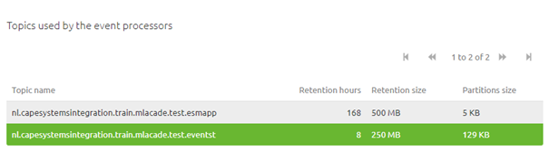
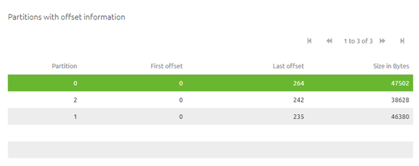
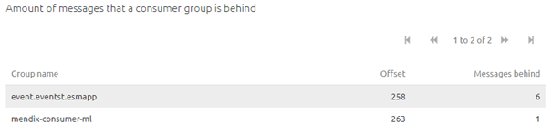

# Managing your Event Streaming Solution

In this microlearning we will focus on how you can manage your event streaming solution.

Should you have any questions, please contact academy@emagiz.com.

- Last update: January 22th 2021
- Required reading time: 7 minutes

## 1. Prerequisites
- Basic knowledge of the eMagiz platform
- Understanding of Event Streaming concept
- An active Event Streaming license

## 2. Key concepts
This micro learning centers around managing your event streaming solution.

The eMagiz platform gives you three views that can help manage your event streaming solution:

- Per topic overview of the configuration of your topics within the eMagiz cluster
- Per topic, per partition overview of the size in Bytes of each partition.
- Per topic, per consumer group overview how many message those consumers are behind

## 3. Managing your Event Streaming Solution

Based on the topics you have configured in the previous phases and based on the consumers (external users with read access) you have configured eMagiz generates three seperate overviews for you in the Manage phase of emagiz
You can access this overview by navigating to Manage -> Monitoring -> Topic statistics

 ----------TO-DO-------------

This overview consists of three perspectives on your configuration and actual use of the topic that can help you manage your event streaming solution:

- Per topic overview of the configuration of your topics within the eMagiz cluster
- Per topic, per partition overview of the size in Bytes of each partition.
- Per topic, per consumer group overview how many message those consumers are behind

### 3.1 Per topic overview of the configuration of your topics within the eMagiz cluster

In the grid on the left side of your screen you see all topics that are related to your event streaming solution. 
Per topic eMagiz has specified the settings that you have configured in the Design phase of eMagiz (retention hours and retention bytes).

Furthermore it shows the size of each partition.

 ----------TO-DO-------------

### 3.2 Per topic, per partition overview of the size in Bytes of each partition.

In the grid on the top right of your screen you can see (after you have selected one of the topics in the left hand grid) per partition of that topic how much data is currently being stored on each partition.

 ----------TO-DO-------------

This information is very helpful to make a comparison between the Actual vs Budget retention size. 
In other words with the help of these information points you can calculate the actual retention bytes of a topic. 
Simply sum up the retention bytes per partition and you have the actual retention size.
With that piece of information you can see how much it differs from the configured retention size. 

The moment there is a big gap between what is configured and what is actually used you should adapt your configuration based on what is actually used.
If you fail to do so you can run out of Topic Storage for other topics which will mean that you cannot further extend your event streaming solution.

### 3.3 Per topic, per consumer group overview how many message those consumers are behind

The third overview related to event streaming is located at the bottom right of your screen. After you have selected a specific topic you can see per consumer (group) how much messages they are behind.

 ----------TO-DO-------------

In Event Streaming terms we call this consumer lag. Measuring consumer lag gives you insight into whether consumers are quick to consume data or are slow to consume.

Based on this information you could reduce or increase the number of hours a record stays on your topic.
For example, if you notice that all consumers consume data within the hour there is no reason to hold that record 7 days.

Configuring this as close as possible (with safety margins obviously) to the reality (measured over an extended period of time) can help in controlling the amount of GB that needs to be retained on a topic.

## 4. Assignment

Control for the topic you have registered in the previous assignment whether you can see these overviews and verify that all data is still at 0 (meaning no data traffic has happened)
This assignment can be completed with the help of the Topic you have registered in the previous assignment on your (Academy) project.

## 5. Key takeaways

eMagiz provides you with three separate overviews that can help you manage your event streaming solution:

- Per topic overview of the configuration of your topics within the eMagiz cluster
- Per topic, per partition overview of the size in Bytes of each partition.
- Per topic, per consumer group overview how many message those consumers are behind

Based on these overviews you can make a comparison between what you have configured and what is the reality on the following levels:

- Retention bytes
- Retention hours

Configuring this as close as possible (with safety margins obviously) to the reality (measured over an extended period of time) can help in controlling the amount of GB that needs to be retained on a topic.

## 6. Suggested Additional Readings

If you are interested in this topic and want more information on it please read the helptext provided by eMagiz when executing these actions.

## 7. Silent demonstration video

This video demonstrates how you could have handled the assignment and gives you some context on what you have just learned.

<iframe width="1280" height="720" src="../../vid/microlearning/microlearning-managing-your-event-streaming-solution.mp4" frameborder="0" allow="accelerometer; autoplay; clipboard-write; encrypted-media; gyroscope; picture-in-picture" allowfullscreen></iframe>  ----------TO-DO-------------