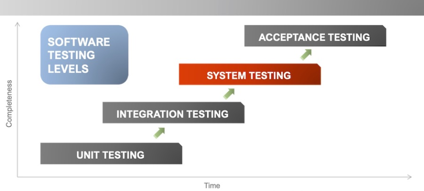

# Understanding Unit Testing

In this microlearning we will focus on the positioning of Unit Testing in the eMagiz platform. Should you have any questions, please contact academy@emagiz.com.

- Last update: December 17th 2020
- Required reading time: 2 minutes

## 1. Pre-requisites
- Basic knowledge of the eMagiz platform
- Understanding of Unit testing concept

## 2. Key concepts
Unit testing refers to the idea that units of developed code, or in this case integration flows/components, are tested agains fit for use. Often these unit test are run automatically to verify each individual component, but in this case the unit test are also supporting the actual development of a eMagiz flows. Unit test are always combined with specific pieces of elements that make the unit operational, such as test data, test messages, or access to services that produce data. Sometimes specific mock services are used to simulate real time behavior.

## 3. Creating Unit tests in eMagiz

Unit tests in eMagiz are created in the Create phase while developing your flow. Key reason is that this will allow the eMagiz developer to validate the correction function of the flow without the need to deploy. 

1. It will speed up the developement of the flow itself
2. The unit test allows to have a better reference for other team members how the flow should behave
3. The unit test can help to validate the entire integration flow during User Acceptance Testing
4. During issue resolution, the unit test can be reused with the attached test messages to pinpoint issues.

Configuring the right test messages to validate the flow are key in eMagiz. These test messages allow to represent the specific user scenario's that the business has provide for validation.

## 4. Assignment

There is no specific assignment for this Micro Learning

## 5. Key takeaways

Unit tests are a powerful way in which flows components can be tested without the specific need to deploy them on the eMagiz runtimes using releases and deployment plans. Individual behavior can be tested and verified, without the to run expensive debug components inside the actual flow. its recommend to maximize the use of unit tests during the development of new flows, so that issues can be fixed quicker and reproduced easily.

## 6. Suggested additional readings

- https://en.wikipedia.org/wiki/Unit_testing

## 7. Silent demonstration video

There is no specific demonstration video for this Micro Learning

<iframe width="1280" height="720" src="../../vid/microlearning/microlearning-creating-test-messages.mp4" frameborder="0" allow="accelerometer; autoplay; clipboard-write; encrypted-media; gyroscope; picture-in-picture" allowfullscreen></iframe>

