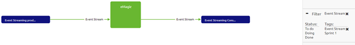

# Using a tag

In this microlearning we will focus on using a tag. 
As discussed in the previous microlearning it is nice to configure a tag but without using it you should not even start configuring it.
In this microlearning we will look into how you can use the tagging functionality to improve your work.

Should you have any questions, please contact academy@emagiz.com.

- Last update: February 1th 2021
- Required reading time: 4 minutes

## 1. Prerequisites
- Basic knowledge of the eMagiz platform

## 2. Key concepts
This microlearning centers around using a tag.
With using we mean: Utilizing functionality to assist the user in achieving their goal
With tag we mean: A label under which you can group a set of systems and/or integrations

## 3. Using a tag

As specified before with uszing we mean utilizing functionality to assist the user in achieving their goal. 
In this case the main goal of tagging is to create several overviews (i.e. determine scope, determine message pattern, determine dependencies) based on the overviews available in each ILM phase.

After you have added a tag and linked it to one or more systems and integrations you can use this tag to filter. In this example we will filter our Capture overview based on two different parameters:
- Scope (which systems and integrations are in Sprint 1)
- Message Pattern(which systems and integrations are using the Event Streaming pattern)

The starting point of this illustrative example is the Capture Overview. As you can see in the picture below you see all integrations and systems in Capture of your eMagiz project.

The moment you select the tag called Sprint 1 (which identifies our scope) you will see that the overview only shows the relevant systems and integrations.

The same happens when you select the tag called Event Stream (which identifies a pattern).

Good to know that these tags are also available in all other ILM phases to help you get a better overview of your integration landscape.

## 4. Assignment

This time we have a two part assignment:
- Add a tag identifying the scope of a project or sprint and link it to the systems and integrations that are part of this scope
- Filter the Capture overview based on this tag to see what tagging can do for you

This assignment can be completed with the help of a associated Mendix project linked to the (Academy) project that you have created/used in the previous assignment.

## 5. Key takeaways

- With tagging you can make several overviews based on the standard overview created by eMagiz
- Tags are available in all ILM phases to create a overview

## 6. Suggested Additional Readings

If you are interested in this topic and want more information on it please read the help text provided by eMagiz.

## 7. Silent demonstration video

This video demonstrates how you could have handled the assignment and gives you some context on what you have just learned. Disclaimer, you only see the eMagiz part but if you follow the above steps you are good to go!

<iframe width="1280" height="720" src="../../vid/microlearning/microlearning-using-a-tag.mp4" frameborder="0" allow="accelerometer; autoplay; clipboard-write; encrypted-media; gyroscope; picture-in-picture" allowfullscreen></iframe>