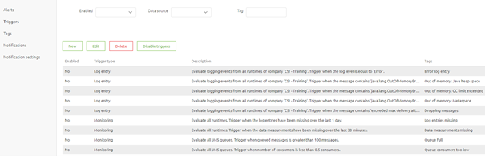

    

        <main class="micro-learning">
        <ul class="doc-nav">
            <li class="doc-nav__item"><a href="../../docs/microlearning/novice-alerting-index" class="doc-nav__link">Home</a></li>
            <li class="doc-nav__item"><a href="#intro" class="doc-nav__link">Intro</a></li>
            <li class="doc-nav__item"><a href="#theory" class="doc-nav__link">Theory</a></li>
            <li class="doc-nav__item"><a href="#practice" class="doc-nav__link">Practice</a></li>
            <li class="doc-nav__item"><a href="#solution" class="doc-nav__link">Solution</a></li>
        </ul>

##### Intro

# Manage Alerting Tags

In this microlearning, we will focus on how you can manage your tags that are used within the context of Alerting within eMagiz.
In a previous microlearning we already discussed parts of this. In this microlearning we will zoom in on the Tags section of Alerting.

Should you have any questions, please contact academy@emagiz.com.

- Last update: April 1th 2021
- Required reading time: 5 minutes

## 1. Prerequisites
- Basic knowledge of the eMagiz platform

## 2. Key concepts
This microlearning centers around managing your alerting tags.
With manage, we mean: Stay in control of which alerting tags are used within your project and what they mean

- Make tags descriptive in nature
- Differentiate who requested the tag (Business, Support, Standard)
- Remove tags that are not linked to a trigger anymore

##### Theory

## 3. Manage Alerting Tags

In our previous dalliance with this subject we already discussed parts of what we will discuss in this microlearning. This microlearning is mainly meant to reiterate the importance of using proper tags when setting up your alerting. Managing your tags means staying in control what the function of a certain tag is, knowing whether tags are still used and acting on that knowledge. There are three key aspects you should take into account when managing your alerting tags:

- Make tags descriptive in nature
- Differentiate who requested the tag (Business, Support, Standard)
- Remove tags that are not linked to a trigger anymore

To manage your alerting tags you navigate to Manage -> Alerting -> Tags

### 3.1 Make tags descriptive in nature

The beneficial nature of having the option to tag certain triggers within alerting is that the tag tells you and those you work with why that specific tag is chosen to be linked to a trigger. Therefore it is of utmost importance that the tag is descriptive in nature. A good example of a descriptive tag is the following:

On the other hand a tag, such as the following, is consider a bad practice

### 3.1 Differentiate who requested the tag (Business, Support, Standard)

On top of making a tag descriptive it can also really help to differentiate within your tagging who requested a certain trigger. This way you can identify who maintains certain triggers, who benefits from having a certain trigger, who will most likely receive notifications, etc. Especially in larger more complex environments it gives you the option to quickly see whether a comparable tag already exists or not.

### 3.2 Remove tags that are not linked to a trigger anymore

In order to stay in control of your alerting tags you should remove tags that are not linked to any trigger anymore. Fair warning on this one is that the Cloud Alert, Error Message and Data limit reached tag can and must not be deleted. You can determine wheter a tag is still in use in a trigger by navigating to the trigger overview and search on the Tag name. If no results come up you should remove the tag from your enviroment.

After you have verified that a certain tag is indeed not used anymore you navigate back to the tags overview, select the tag in question and press Delete. As a result the tag will disappear from the list.

##### Practice

## 4. Assignment

Remove tags from the alerting tag overview that are not used anymore.
This assignment can be completed with the help of the (Academy) project that you have created/used in the previous assignment.

## 5. Key takeaways

- There are three key aspects you should take into account when managing your alerting tags:
    - Make tags descriptive in nature
    - Differentiate who requested the tag (Business, Support, Standard)
    - Remove tags that are not linked to a trigger anymore

##### Solution

## 6. Suggested Additional Readings

If you are interested in this topic and want more information on it please read the help text provided by eMagiz.

## 7. Silent demonstration video

This video demonstrates how you could have handled the assignment and gives you some context on what you have just learned. 

<iframe width="1280" height="720" src="../../vid/microlearning/novice-alerting-manage-alerting-in-emagiz.mp4" frameborder="0" allow="accelerometer; autoplay; clipboard-write; encrypted-media; gyroscope; picture-in-picture" allowfullscreen></iframe>	

</main>

