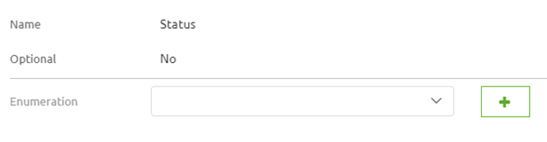
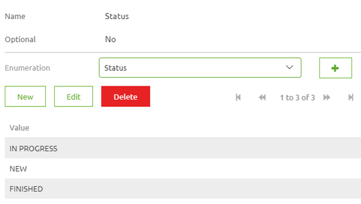
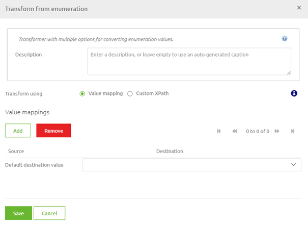
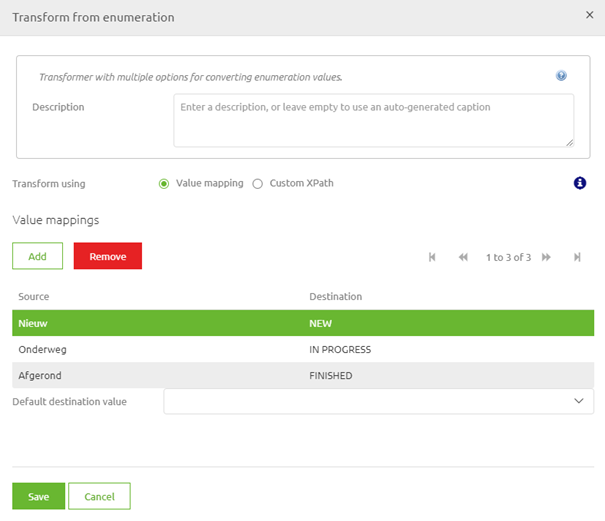

    

        <main class="micro-learning">
        <ul class="doc-nav">
            <li class="doc-nav__item"><a href="../../docs/microlearning/novice-create-your-transformations-index" class="doc-nav__link">Home</a></li>
            <li class="doc-nav__item"><a href="#intro" class="doc-nav__link">Intro</a></li>
            <li class="doc-nav__item"><a href="#theory" class="doc-nav__link">Theory</a></li>
            <li class="doc-nav__item"><a href="#practice" class="doc-nav__link">Practice</a></li>
            <li class="doc-nav__item"><a href="#solution" class="doc-nav__link">Solution</a></li>
        </ul>

##### Intro

# Enumerations

In this microlearning, we will focus on the use of enumerations when transforming data within eMagiz. With the help of this microlearning, you will know how you can easily define the valid enumeration values and transform them from enumeration to another enumeration with the help of the eMagiz tooling.

Should you have any questions, please contact academy@emagiz.com.

- Last update: May 6th, 2021
- Required reading time: 6 minutes

## 1. Prerequisites
- Basic knowledge of the eMagiz platform

## 2. Key concepts
This microlearning centers around enumerations.
By enumeration we mean: A defined list of accepted values by a system (i.e. external or eMagiz)

eMagiz natively supports the use of enumerations in transformations with the help of:
- Data models in Design
- Message mapping in Design
- Create message definitions in Create
- Create transformation in Create

##### Theory

## 3. Enumerations

In this microlearning, we will focus on the use of enumerations when transforming data within eMagiz. With the help of this microlearning, you will know how you can easily define the valid enumeration values and transform them from enumeration to another enumeration with the help of the eMagiz tooling.

eMagiz natively supports the use of enumerations in transformations with the help of:
- Data models in Design
- Message mapping in Design
- Create message definitions in Create
- Create transformation in Create

### 3.1 Data models in Design

Just as you are used to you simply create the correct system definition in Design as you would. When you create, change, or import an attribute you define the dataType. One of the data types that are supported by eMagiz is an enumeration. By defining this data type for an attribute in Design you say that the attribute in question will only accept certain values. Apart from that, there is nothing else to do in Design.

### 3.2 Message mapping in Design

The action taken within the message mapping layer in Design does not differ when using enumerations within your transformation.

### 3.3 Create message definitions in Create

In Create we have to define which values are accepted by the system. To do so you can navigate to the system message or CDM message on flow level (in "Start Editing" mode) and select the attribute in question. If you click on it you will see something appearing on the right. This part that just appeared allows you to define a new enumeration list or pick an existing enumeration. To define a new enumeration list press on the + icon

If you press on the icon a pop-up will be shown that gives you the option to give the list a name and define the accepted values. When you are finished press Save. Subsequently, select the correct enumeration list from the drop-down menu. This should all lead to the following configuration:

Note that when you have imported the message definition in Design eMagiz will automatically have created the enumeration lists and the accepted values for you. If you have done this for both message definitions it is time to move on to the transformation part.

### 3.4 Create transformation in Create

When you navigate to the transformation you have an option. If the lists between input and output match (i.e. are identical) you don't have to do anything. However, if there is the slightest difference between them you can use the transformation component to execute what we call a value mapping.

With the help of this functionality, you can simply add and/or remove value mappings. A value mapping is nothing more and nothing less than a definition that when you receive value X eMagiz will output value Y (hence the term). After you have mapped all possible combinations you will end up with something as follows:

If you are satisfied you can select the Save button and eMagiz will ensure that the correct values are mapped. Note that you have the option of selected a default output value. This can come in handy if you want to set a default value if there is no input value.

After having done this you have successfully configured the possible enum values and have successfully transformed the values from A to B.

##### Practice

## 4. Assignment

Create a transformation in which you transform from one enum to another enum value for an attribute. Ensure that you have a working solution by running a unit test.
This assignment can be completed with the help of the (Academy) project that you have created/used in the previous assignment.

## 5. Key takeaways

- eMagiz natively supports the use of enumerations in transformations with the help of:
    - Data models in Design
    - Message mapping in Design
    - Create message definitions in Create
    - Create transformation in Create
- Think whether you want a default output value

##### Solution

## 6. Suggested Additional Readings

If you are interested in this topic and want more information on it please read the help text provided by eMagiz.

## 7. Silent demonstration video

This video demonstrates how you could have handled the assignment and gives you some context on what you have just learned. 

<iframe width="1280" height="720" src="../../vid/microlearning/novice-create-your-transformations-enumerations.mp4" frameborder="0" allow="accelerometer; autoplay; clipboard-write; encrypted-media; gyroscope; picture-in-picture" allowfullscreen></iframe>

</main>

