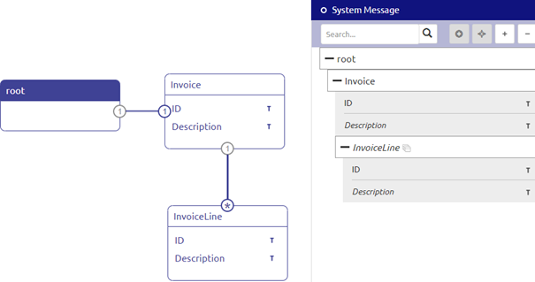
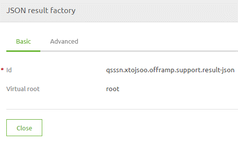
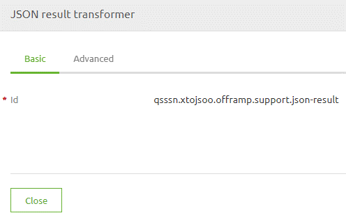

	

		<main class="micro-learning">
		<ul class="doc-nav">
			<li class="doc-nav__item"><a href="../../docs/microlearning/novice-create-your-transformations-index" class="doc-nav__link">Home</a></li>
			<li class="doc-nav__item"><a href="#intro" class="doc-nav__link">Intro</a></li>
			<li class="doc-nav__item"><a href="#theory" class="doc-nav__link">Theory</a></li>
			<li class="doc-nav__item"><a href="#practice" class="doc-nav__link">Practice</a></li>
			<li class="doc-nav__item"><a href="#solution" class="doc-nav__link">Solution</a></li>
		</ul>

##### Intro

# Transformation - XML to JSON

In this microlearning, we will focus on transforming XML to JSON within the tooling of eMagiz. With the help of this microlearning you will know how to transform from XML to JSON with the help of the tooling in Design and Create. To illustrate the functionality we define what needs to be done in various phases of eMagiz.

Should you have any questions, please contact academy@emagiz.com.

- Last update: April 8th, 2021
- Required reading time: 7 minutes

## 1. Prerequisites
- Basic knowledge of the eMagiz platform

## 2. Key concepts
This microlearning centers around transforming XML to JSON
By transforming we mean: Making sure that the input message is transformed in a valid output message by defining how this should happen

eMagiz natively supports the transformation of XML to JSON with the help of:
- Data models in Design
- Message mapping in Design
- Create transformation in Create
- Support Objects

##### Theory

## 3. Transformation - XML to JSON

In this microlearning, we will focus on transforming XML to JSON within the tooling of eMagiz. With the help of this microlearning you will know how to transform from XML to JSON with the help of the tooling in Design and Create. To illustrate the functionality we define what needs to be done in various phases of eMagiz.

eMagiz natively supports the transformation of XML to JSON with the help of:
- Data models in Design
- Message mapping in Design
- Create transformation in Create
- Support Objects

### 3.1 Data models in Design

Just as you are used to you simply create the correct system definition in Design as you would do when you would create a data model for XML message. If you are unsure how to do this please revisit the section on Design in the Crash Course Platform. 

One extra thing to take into account when handling JSON is the root entity. Contrary to XML it is not mandatory to name your root entity when handling JSON. This means that when you create your data model you should verify beforehand whether the system to which you want to send your messages has a named root entity or not.

An example of a JSON message where the root entity is not named is shown below as the first example. The second example you see below is an example of a JSON message where the root entity is named.

{ 
    {"ID": 1234}
}

{"Root":
    {"ID": 1234}
}

If you need to send a name along with the JSON root in your output message you should create an extra entity in your data model with which your system message definition will start.

Regardless whether the root of your output JSON message is named you also don't need to forget to define your message format. This can be done on system level (in case all communication happens in JSON) or it can happen on system message level. On system message level you have a button called Change message format which you can press while being in "Start Editing Mode". This action will show a pop-up. In here you can switch between XML and JSON as message format. Ensure that the message format is JSON

### 3.2 Message mapping in Design

Just as you are used to you simply create the correct message mapping in Design as you would do when you would create a message mapping for XML messages. If you are unsure how to do this please revisit the section on Design in the Crash Course Platform. 

### 3.2 Create transformation in Create

Just as you are used to you simply create the correct transformation functionality (filter, transformation, static input, etc.) as you would do when you would create the correct transformation functionality for XML messages. If you are unsure how to do this please revisit the section on Create in the Crash Course Platform.

### 3.3 Needed support objects

However eMagiz needs to be told whether a input and/or output message is JSON. To tell this to the flow component you will need some support objects. If you build an API Gateway flow this will be done automatically based on the settings in Design. The crucial part in this is the virtual root. Remember we told you to create an extra entity in Design in your system message when the root of the JSON had a name? This is the reason why. As JSON can in theory have multiple roots which XML cannot have, yet we use the same underlying technology in eMagiz to transform both of them (JSON to JSON, JSON to XML, XML to JSON, XML to XML) you need to take this into account.

In this case we want to transform from XML to JSON and therefore you need a JSON Result factory within your flow. In this component you need to define your virtual root based on your system message in Design. This is always the name of the root entity as defined as your system message in Design. In the example shown above this will mean that the virtual root for this example is root.

The JSON result factory is needed for your validation. However to also support the transformation from XML to JSON you need an additional support object called JSON result transformer

Don't forget to properly link the support objects to the correct flow components in order for it to work. In the offramp you need to link the support objects to the transformation. In the exit you need to link the JSON result factory to the validation.

After having done this you can use the unit testing functionality of eMagiz to test your work. If you are unsure how this functionality works please take a look at the segment on unit testing in the Crash Course Platform.

##### Practice

## 4. Assignment

Create a transformation between XML and JSON. Ensure that you have a working solution by running a unit test.
This assignment can be completed with the help of the (Academy) project that you have created/used in the previous assignment.

## 5. Key takeaways

- eMagiz natively supports the transformation of XML to JSON with the help of:
    - Data models in Design
    - Message mapping in Design
    - Create transformation in Create
    - Support Objects
- Ensure that you link the support objects correctly
- Don't forget to define the message format

##### Solution

## 6. Suggested Additional Readings

If you are interested in this topic and want more information on it please read the help text provided by eMagiz.

## 7. Silent demonstration video

This video demonstrates how you could have handled the assignment and gives you some context on what you have just learned. 

<iframe width="1280" height="720" src="../../vid/microlearning/novice-create-your-transformations-xml-to-json.mp4" frameborder="0" allow="accelerometer; autoplay; clipboard-write; encrypted-media; gyroscope; picture-in-picture" allowfullscreen></iframe>

</main>

