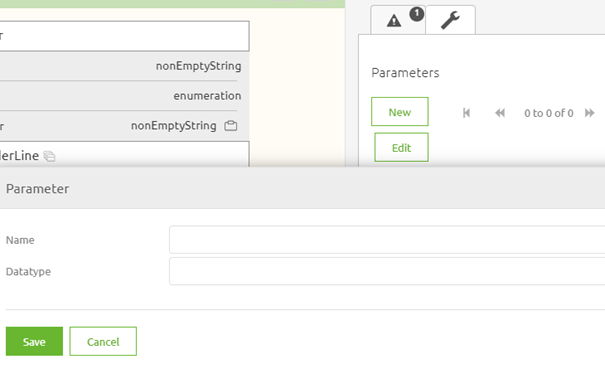
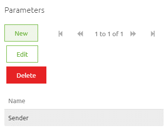
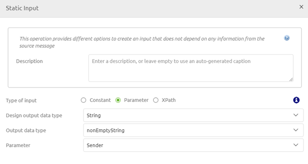
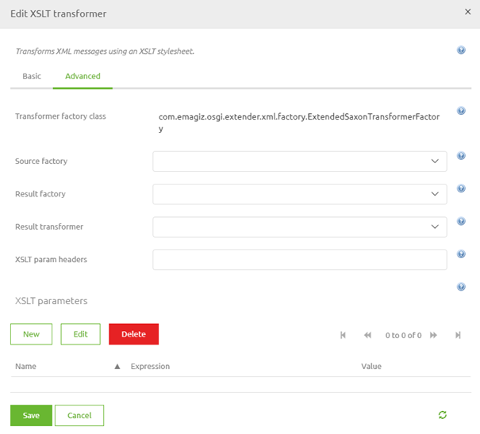
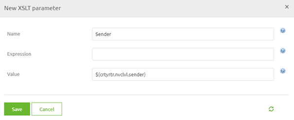

    

        <main class="micro-learning">
        <ul class="doc-nav">
            <li class="doc-nav__item"><a href="../../docs/microlearning/novice-create-your-transformations-index" class="doc-nav__link">Home</a></li>
            <li class="doc-nav__item"><a href="#intro" class="doc-nav__link">Intro</a></li>
            <li class="doc-nav__item"><a href="#theory" class="doc-nav__link">Theory</a></li>
            <li class="doc-nav__item"><a href="#practice" class="doc-nav__link">Practice</a></li>
            <li class="doc-nav__item"><a href="#solution" class="doc-nav__link">Solution</a></li>
        </ul>

##### Intro

# XSLT Parameters

In this microlearning, we will focus on XSLT parameters. With the help of this microlearning, you will learn what XSLT parameters are and how you can use them within the eMagiz platform to successfully transform data.

Should you have any questions, please contact academy@emagiz.com.

- Last update: May 6th, 2021
- Required reading time: 6 minutes

## 1. Prerequisites
- Basic knowledge of the eMagiz platform

## 2. Key concepts
This microlearning centers around XSLT parameters
By XSLT parameters we mean: A functionality within the XSLT language with which you can inject a static (i.e. property) or dynamic (i.e. message header) value into the output message

XSLT parameters need to be:
- Defined on transformation level
- Defined as static input (or part of an XPath) in the transformation
- Filled with a static or dynamic value

##### Theory

## 3. XSLT Parameters

In this microlearning, we will focus on XSLT parameters. With the help of this microlearning, you will learn what XSLT parameters are and how you can use them within the eMagiz platform to successfully transform data.

XSLT parameters need to be:
- Defined on transformation level
- Defined as static input (or part of an XPath) in the transformation
- Filled with a static or dynamic value

With the help of such an XSLT parameter, you can inject a static or dynamic value. These values can be supplied with the help of properties or with the help of headers. In this case, we want to fill the attribute Sender in the output message with a static value that differs per environment. To do so we opt for a property as we can specify the value for it on a per-environment basis.

To correctly set up the logic to inject an XSLT parameter into your transformation you need to do three things in the Create phase. Before we delve into the specifics let us first navigate to the Create phase, open a flow and enter "Start Editing" mode.

After you have done so please navigate to the Transformation view in Create. Here you first need to define the parameter in terms of name and datatype. To do so select the wrench icon and press New. You will see the following pop-up on your screen

In this pop-up, you can enter the name and the datatype. In this case, we will call the parameter Sender with a nonEmptyString as a datatype. After you have pressed Save you should end up with the following result.

Now that we have defined the parameter we need to use it to fill the output for the element called Sender. In this case, we use a static input as input. You can also use parameters as part of an XPath or an XSLT snippet. When you select the option static input you can choose the option called Parameter. Here you can select the parameter you have just defined. The result should be something similar to this.

After we have finished configuring the transformation we need to ensure that we fill the actual parameter with a value. This we do on the component level in the flow itself. Open the transformation component and navigate to the Advanced tab.

As you can see this Advanced tab houses a section for your XSLT parameters. Here you can define the name of the XSLT parameter and the corresponding value. If you want to use a static value use the Value option in the pop-up. If you want to use a dynamic value use the Expression option in the pop-up. In our case, you should fill in something like below. When you are satisfied press Save.

After this press Save on the component itself and you are good to go. You have successfully managed to configure the flow to use an XSLT parameter while transforming data. Note that in this example you still need to define the property and assign it a value for the flow to work.

##### Practice

## 4. Assignment

Create a transformation while using an XSLT parameter to fill in something in the output message. Ensure that you have a working solution by running a unit test.
This assignment can be completed with the help of the (Academy) project that you have created/used in the previous assignment.

## 5. Key takeaways

- For a working solution you need to execute three steps
    - Define the parameter on transformation level
    - Defined as static input (or part of an XPath) in the transformation
    - Define on component level how the parameter should be filled

- A parameter can be filled with the help of a static (i.e. property) or dynamic (i.e. message header) value

##### Solution

## 6. Suggested Additional Readings

If you are interested in this topic and want more information on it please read the help text provided by eMagiz.

## 7. Silent demonstration video

This video demonstrates how you could have handled the assignment and gives you some context on what you have just learned. 

<iframe width="1280" height="720" src="../../vid/microlearning/novice-create-your-transformations-xslt-parameters.mp4" frameborder="0" allow="accelerometer; autoplay; clipboard-write; encrypted-media; gyroscope; picture-in-picture" allowfullscreen></iframe>

</main>

