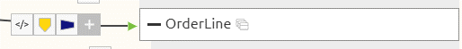
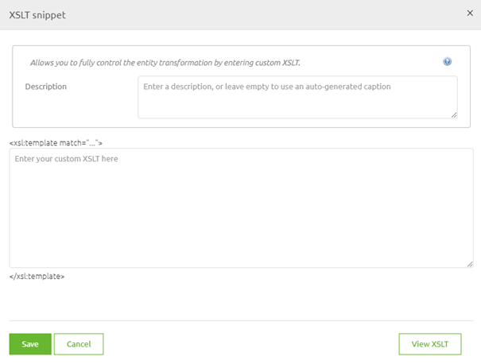
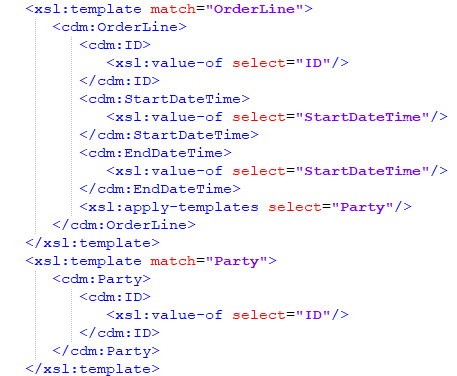
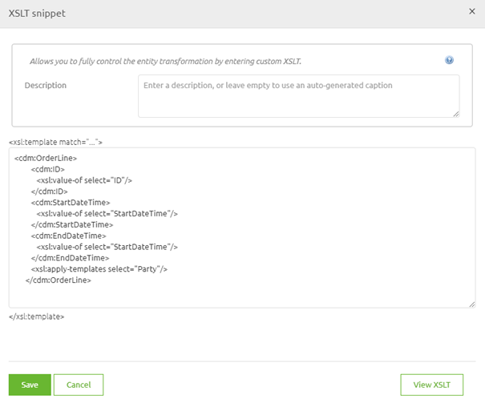
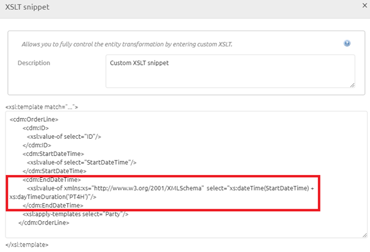

    

        <main class="micro-learning">
        <ul class="doc-nav">
            <li class="doc-nav__item"><a href="../../docs/microlearning/novice-create-your-transformations-index" class="doc-nav__link">Home</a></li>
            <li class="doc-nav__item"><a href="#intro" class="doc-nav__link">Intro</a></li>
            <li class="doc-nav__item"><a href="#theory" class="doc-nav__link">Theory</a></li>
            <li class="doc-nav__item"><a href="#practice" class="doc-nav__link">Practice</a></li>
            <li class="doc-nav__item"><a href="#solution" class="doc-nav__link">Solution</a></li>
        </ul>

##### Intro

# XSLT Snippet

In this microlearning, we will focus on XSLT snippets. In most cases the transformation functionality that eMagiz offers are suitable enough to transform the data from A to B. However there are some cases where you need to use custom adaptations. One of the most invasive custom adaptations is the use of a custom XSLT snippet. With the help of such an XSLT snippet, you can inject a custom piece of the XSLT that you have written by hand to overwrite the eMagiz transformation logic.

Should you have any questions, please contact academy@emagiz.com.

- Last update: May 6th, 2021
- Required reading time: 6 minutes

## 1. Prerequisites
- Basic knowledge of the eMagiz platform

## 2. Key concepts
This microlearning centers around the XSLT Snippet
By XSLT snippet we mean: A custom piece of XSLT that is handwritten by the user to replace the generated code by eMagiz

Sometimes you need to use an XSLT snippet to achieve the intended end goal. When doing so note the following:

- Always ensure that when there are more elements within the XSLT you refer to them
- Use the auto-generated XSLT by eMagiz as a starting point for your customization
- Think whether there is an alternative means to the end before implementing the XSLT snippet

##### Theory

## 3. XSLT Snippet

In this microlearning, we will focus on XSLT snippets. In most cases the transformation functionality that eMagiz offers are suitable enough to transform the data from A to B. However there are some cases where you need to use custom adaptations. One of the most invasive custom adaptations is the use of a custom XSLT snippet. With the help of such an XSLT snippet, you can inject a custom piece of the XSLT that you have written by hand to overwrite the eMagiz transformation logic.

Sometimes you need to use an XSLT snippet to achieve the intended end goal. When doing so note the following:

- Always ensure that when there are more elements within the XSLT you refer to them
- Use the auto-generated XSLT by eMagiz as a starting point for your customization
- Think whether there is an alternative means to the end before implementing the XSLT snippet

Under the bonnet, the visual transformation tooling that you draw in Design and adjust (if needed) in Create is turned into an XSLT. XSLT is a transformation language that can be used to transform various message formats (XML, JSON, etc.) to one another. The eMagiz tooling offers the possibility on entity level to replace the standard logic generated by eMagiz by what we call an XSLT snippet. The XSLT snippet is in essence simply a piece of XSLT code that you inject into a certain place within your visual tooling.

One of the reasons why you might want to do so is because you want to calculate with dates. To do so a specific function is needed that is not natively supported via the platform and requires an additional namespace. That combination makes it perfectly suitable for using an XSLT snippet as using the snippet gives you the option to unlock the full potential of the XSLT standard. However, do note that writing XSLT can be tricky for those that are inexperienced so don't see this as an encouragement to color outside the lines if that is not necessary.

To add an XSLT snippet to your transformation you open the flow in Create and enter "Start Editing" mode. Subsequently, you open the transformation view and you press the + icon in front of the entity for which you want to inject the XSLT snippet. Doing so gives you three options. The option that is located on the left of the three (with the icon that indicates code) is the one we need to add an XSLT snippet to the transformation.

When you activate this option you see the following pop-up:

Note what the pop-up states above and below the segment where you can enter your custom XSLT snippet. It speaks of templates. If you translate this to the XSLT that is created you will see that each new entity is granted a new template match.

So for me to swap the auto generated xslt snippet for the OrderLine entity I simply need to copy+paste everything between <xsl:template match="OrderLine"> and </xsl:template>. If I do so the result will be as followed:

I know this works, yet there is absolutely no reason why I would want to keep it this way as the result would be the same compared to me not doing anything. So now it becomes time to customize the XSLT snippet to serve my purpose. In this example, I want to ensure that the EndDateTime is always 4 hours later than the StartDateTime. This I can do with a simple dateTime function in XSLT (https://my.emagiz.com/p/question/172825635700358186). However to make this work I have to also define the xs namespace. The result of all this will look as follows:

Note that the PT4H I use to ensure that 4 hours are added to the StartDateTime can also be injected with the help of an XSLT parameter. In this example, I wrote it out to make clear what the function does.

By this example, you have learned how to apply an XSLT snippet within your standard eMagiz transformation and saw a case in which it will be beneficial to you. To close off this section remember to always look at the possibilities of what can be achieved within the tooling before starting to think outside the tooling.

##### Practice

## 4. Assignment

Inject an XSLT snippet into a transformation. Ensure that it works by running a unit test on it and validating the results.
This assignment can be completed with the help of the (Academy) project that you have created/used in the previous assignment.

## 5. Key takeaways

- Sometimes you need to use an XSLT snippet to achieve the intended end goal. When doing so note the following:
    - Always ensure that when there are more elements within the XSLT you refer to them
    - Use the auto-generated XSLT by eMagiz as a starting point for your customization
    - Think whether there is an alternative means to the end before implementing the XSLT snippet

##### Solution

## 6. Suggested Additional Readings

If you are interested in this topic and want more information on it please read the help text provided by eMagiz.

## 7. Silent demonstration video

This video demonstrates how you could have handled the assignment and gives you some context on what you have just learned. 

<iframe width="1280" height="720" src="../../vid/microlearning/novice-create-your-transformations-xslt-snippet.mp4" frameborder="0" allow="accelerometer; autoplay; clipboard-write; encrypted-media; gyroscope; picture-in-picture" allowfullscreen></iframe>

</main>

