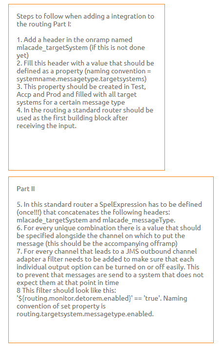
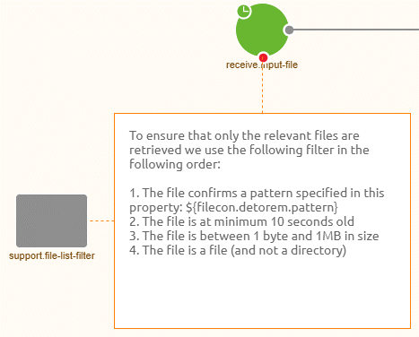
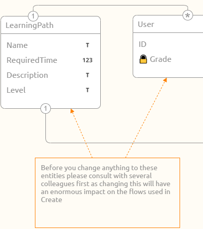

    

        <main class="micro-learning">
        <ul class="doc-nav">
            <li class="doc-nav__item"><a href="../../docs/microlearning/novice-devops-perspectives-index" class="doc-nav__link">Home</a></li>
            <li class="doc-nav__item"><a href="#intro" class="doc-nav__link">Intro</a></li>
            <li class="doc-nav__item"><a href="#theory" class="doc-nav__link">Theory</a></li>
            <li class="doc-nav__item"><a href="#practice" class="doc-nav__link">Practice</a></li>
            <li class="doc-nav__item"><a href="#solution" class="doc-nav__link">Solution</a></li>
        </ul>

##### Intro

# Annotations

In this microlearning, we will focus on using annotations to clarify your thought process. In the annotation, you either describe a best practice everyone should follow when they change that flow (i.e. within the asynchronous routing), describe how the (more complex) parts of the flow work or describe (parts of) of your message definitions (i.e. CDM, API Gateway Data model, system message, etc.). This will help yourself and others every time changes are needed.

Should you have any questions, please contact academy@emagiz.com.

- Last update: May 9th, 2021
- Required reading time: 5 minutes

## 1. Prerequisites
- Basic knowledge of the eMagiz platform

## 2. Key concepts
This microlearning centers around using annotations.
With annotations, we mean: A piece of text to explain something to yourself and others 

Annotations can be used for:
- Describing a best practice everyone should follow
- Describing (more complex) parts of the flow
- Describe (parts of) your message definitions

##### Theory

## 3. Annotations

In this microlearning, we will focus on using annotations on the flow level to clarify our thought process. In the annotation, you either describe a best practice everyone should follow when they change that flow (i.e. within the asynchronous routing) or describe how the (more complex) parts of the flow work. This will help yourself and others every time changes are needed within the flow.

Annotations can be used for:
- Describing a best practice everyone should follow
- Describing (more complex) parts of the flow
- Describe (parts of) your message definitions

To clarify the use cases let us take a look at how annotations can be added within the eMagiz platform. In our first example, we will take a look at asynchronous routing. In many eMagiz projects, a best practice is followed on how to add something to the asynchronous routing (or change something within the asynchronous routing). Because the best practice contains multiple steps it makes sense to use the annotation functionality of eMagiz to define all these steps and register them at the place you need them (i.e. the asynchronous routing). Having done so will result in something like this:

The second example is about using annotations on the flow level to describe parts of the flow. In this example, we will use the annotation to describe that we use a filter to determine which messages are picked up from a local directory and how we filter. That way anyway opening the flow has to merely read the annotation to get the context. Having done so will result in something like this:

The third example does not take place on the flow level but the message definition level. Therefore instead of going to Create, we go to Design. In Design when you navigate to the CDM, API Gateway Data model, Event Streaming Data model, message definitions, etc. you have the option to add annotations to the canvas. In this example, we want to make clear to all that make changes that a certain part of our CDM is used by a lot of integrations within eMagiz and therefore everyone should be careful and think twice before adjusting anything related to that part. Having done so will result in something like this:

Now that we saw some examples let us turn our attention to the how. How can I add an annotation and how can I link it. Adding the annotation is simple. You drag the annotation icon from the left context menu onto the canvas. As a result, an empty annotation will be shown on the canvas. By double-clicking on it you can type whatever you want. Note that you need to be in "Start Editing" mode to change anything, including annotations.

When you are satisfied with what you have written down you can press the Save button. After you have done so you can rescale the annotation to ensure that the complete text is visible. To link the annotation to a component (on flow level) or an entity (on message definition level) you hover over the annotation until your mouse indicator changes to a + icon, execute a right-click and drag from the annotation to the component in question.

Now you know what annotations are good for and how you can add them within the eMagiz platform.

##### Practice

## 4. Assignment

Add annotation on the flow level that describes how (a part of) a flow works.
This assignment can be completed with the help of the (Academy) project that you have created/used in the previous assignment.

## 5. Key takeaways

- Annotations can be used for:
    - Describing a best practice everyone should follow
    - Describing (more complex) parts of the flow
    - Describe (parts of) your message definitions
- You can add annotations by dragging and dropping the annotation icon on the canvas.

##### Solution

## 6. Suggested Additional Readings

There are no suggested additional readings on this topic

## 7. Silent demonstration video

This video demonstrates how you could have handled the assignment and gives you some context on what you have just learned. 

<iframe width="1280" height="720" src="../../vid/microlearning/novice-devops-perspectives-annotations.mp4" frameborder="0" allow="accelerometer; autoplay; clipboard-write; encrypted-media; gyroscope; picture-in-picture" allowfullscreen></iframe>   

</main>

