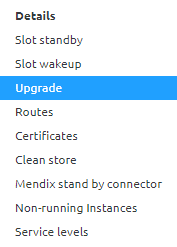
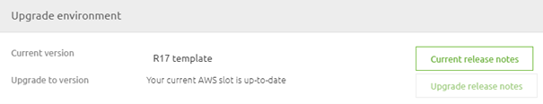
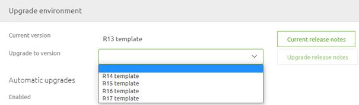
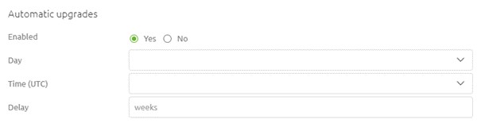
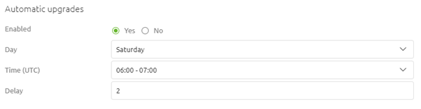
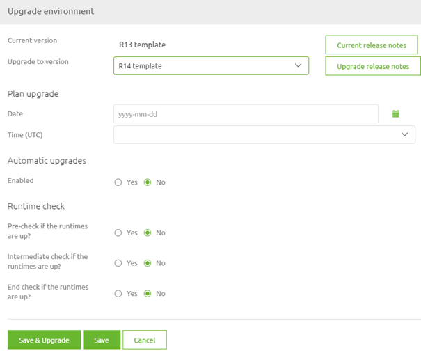
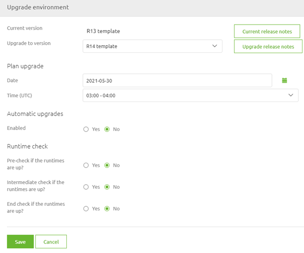
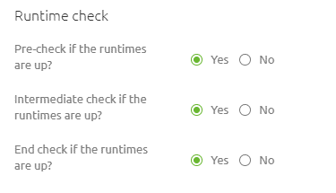

    

        <main class="micro-learning">
        <ul class="doc-nav">
            <li class="doc-nav__item"><a href="../../docs/microlearning/novice-emagiz-cloud-management-index" class="doc-nav__link">Home</a></li>
            <li class="doc-nav__item"><a href="#intro" class="doc-nav__link">Intro</a></li>
            <li class="doc-nav__item"><a href="#theory" class="doc-nav__link">Theory</a></li>
            <li class="doc-nav__item"><a href="#practice" class="doc-nav__link">Practice</a></li>
            <li class="doc-nav__item"><a href="#solution" class="doc-nav__link">Solution</a></li>
        </ul>

##### Intro

# Cloud Templates Explained

In this microlearning, we will focus on the cloud templates that eMagiz offers. The cloud template is an intrinsic part of the eMagiz cloud solution. In other words, the cloud template is a configuration, specified by eMagiz, how deploy Architecture will run in AWS, and which supporting tools (such as auto-healing, auto-recovery, and improved alerting for instance) are available for your environment.

Should you have any questions, please contact academy@emagiz.com.

- Last update: May 27th, 2021
- Required reading time: 7 minutes

## 1. Prerequisites
- Basic knowledge of the eMagiz platform

## 2. Key concepts
This microlearning centers around cloud templates.
With cloud template, we mean: A Cloud template is a configuration, specified by eMagiz, how deploy Architecture will run in AWS, and which supporting tools (such as auto-healing, auto-recovery, and improved alerting for instance) are available for your environment.

Cloud Templates:
- Determine what runtime runs where
- Determine which eMagiz Cloud version will we use
- Determine which supporting tools are available
- Are updateable

##### Theory

## 3. Cloud Templates Explained

In this microlearning, we will focus on the cloud templates that eMagiz offers. The cloud template is an intrinsic part of the eMagiz cloud solution. In other words, the cloud template is a configuration, specified by eMagiz, how deploy Architecture will run in AWS, and which supporting tools (such as auto-healing, auto-recovery, and improved alerting for instance) are available for your environment. With each new cloud template, these functionalities will improve the autonomous use and stability of the instance. Which changes exactly are made in a particular cloud template can be found in the Release notes section under Community -> Documentation in the eMagiz portal.

Cloud Templates:
- Determine what runtime runs where
- Determine which eMagiz Cloud version will we use
- Determine which supporting tools are available
- Are updateable

### 3.1 Determining Current Cloud Template

One key aspect of managing the eMagiz Cloud is to stay up to date in terms of your cloud template. Therefore it is interesting to know which version of the cloud template you are running and whether there is a new version of the cloud template available. You can determine both with the help of the Upgrade functionality within Deploy Architecture. When you navigate to Deploy and open the Architecture you can enter "Start Editing" mode.

After you have done so you can access the context menu on the white part of the canvas just shy of the integration platform itself. This will show you the following context menu. Please select the option called Upgrade.

Selecting this option will show you a pop-up. When you are on the latest available cloud template eMagiz will tell you. If you are not on the latest available cloud template you will see a dropdown menu indicating that you can select a newer version (more on updating the cloud template later). When you open the dropdown menu eMagiz will tell you how many versions there are between your current version and the latest available version.

Note that in both cases the current cloud template that you use is specified in the top line.

### 3.2 Updating Cloud Template

As specified cloud templates need to be updated from time to time to stay in control of your eMagiz Cloud Management. To make it easy to update eMagiz has created functionality that can automate this process for you. In the same pop-up (Upgrade) we just used to determine our current cloud template and to determine whether we are behind or not we can also configure our upgrading process. eMagiz offers two options with this functionality. Each of them is discussed below.

### 3.2.1 Automatic Cloud Template Upgrade

This is the preferred option when updating your cloud template. With the help of this functionality, you can define that eMagiz will check on a specific time on a specific day of the week whether a new cloud template is available. If so eMagiz will automatically update towards the latest cloud template. To activate this functionality navigate to the Upgrade screen via the context menu in Deploy -> Architecture and enable the option Automatic Upgrade.

After you have done so please select the time (in UTC) and the day of the week the automatic cloud template should run. Optionally there is the option to set a delay. This delay gives you the option to wait a little bit longer after a new cloud template has been released before eMagiz will automatically update the cloud template. For more information on this option please see the help text of this option while configuring.

When you are satisfied with your settings you can press Save and eMagiz will have activated the automatic cloud template upgrade option on your project.

Please note that due to surrounding support processes we advise against using this functionality on Production.

### 3.2.2 Manual Cloud Template Upgrade

Another alternative is the option to manually upgrade the cloud template directly. To do so select the cloud template to which you want to upgrade from the dropdown menu and press the button called Save & Upgrade. After that eMagiz will take care of the rest.

### 3.2.2 Planned Manual Cloud Template Upgrade

A third alternative is an in-between form between upgrading directly and letting eMagiz do it automatically. With this option, you can manually select the version to which you want to upgrade (just as with the manual option) and you must select a specific date and time when the upgrade must take place (comparable to the automatic option). You can utilize this option when you fill in the details under the section called Planned. After you have done so you will notice that the Save & Upgrade button disappears.

### 3.3 Runtime checks

In the previous section, we have talked about the various methods to upgrade your cloud template. To ensure a good quality of when the cloud template is updated automatically eMagiz provides you with the option to do several runtime checks before, during, and after the cloud template upgrade. When you activate these checks it will mean that when one of the checks fails eMagiz will do an automatic rollback of the cloud template upgrade to the latest stable version.

Please note that when not all runtimes are running (but should be according to the release) you cannot use this option as it will always enter the rollback scenario. So once more, ensure that your releases match the reality.

For the exact impact of each of the checks please check out the help text when configuring the upgrade functionality for your eMagiz project.

##### Practice

## 4. Assignment

Verify for one (or more) of the projects you are currently working on how the upgrade functionality for the cloud template is configured and see whether there are improvements to be made.

## 5. Key takeaways

- Cloud Templates:
    - Determine what runtime runs where
    - Determine which eMagiz Cloud version will we use
    - Determine which supporting tools are available
    - Are updateable
- Preferred option of updating is automatic (unless on Production)
- Use the runtime checks if your release is in line with reality

##### Solution

## 6. Suggested Additional Readings

There are no suggested additional readings on this topic

## 7. Silent demonstration video

There is no demonstration video of this functionality. 

</main>

