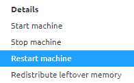

    

        <main class="micro-learning">
        <ul class="doc-nav">
            <li class="doc-nav__item"><a href="../../docs/microlearning/novice-emagiz-cloud-management-index" class="doc-nav__link">Home</a></li>
            <li class="doc-nav__item"><a href="#intro" class="doc-nav__link">Intro</a></li>
            <li class="doc-nav__item"><a href="#theory" class="doc-nav__link">Theory</a></li>
            <li class="doc-nav__item"><a href="#practice" class="doc-nav__link">Practice</a></li>
            <li class="doc-nav__item"><a href="#solution" class="doc-nav__link">Solution</a></li>
        </ul>

##### Intro

# (Re)start or stop the machine

In this microlearning, we will focus on the action to (re)start or stop a machine. In some cases, it can be beneficial to (re)start or stop a machine.

Should you have any questions, please contact academy@emagiz.com.

- Last update: May 27th, 2021
- Required reading time: 5 minutes

## 1. Prerequisites
- Basic knowledge of the eMagiz platform

## 2. Key concepts
This microlearning centers around (re)starting or stopping a machine
With a machine, we mean: This is the component in which the various runtimes are deployed into

- By restarting the machine, you restart the machine you have just selected
    - The machine will stay on the same physical hardware.
    - Flows return in original state
- By stopping the machine, you stop the machine (double lane) or you terminate the machine (single lane)
    - Termination of the machine (single lane)
    - Runtime states are temporarily stored in EFS (single lane)
    - Dorment machine (double lane)
    - In case you stop the core machine on which the JMS is running no data traffic can happen (single and double lane)
- By starting the machine, you start the machine (double lane) or you generate a new machine (single lane)
    - Generation of the machine (single lane)
    - Runtime states are retrieved from EFS (single lane)
    - Start the virtual machine, the machine may have moved to different physical hardware (double lane)

##### Theory

## 3. Restart runtime

In this microlearning, we will focus on the action to (re)start or stop a machine. In some cases, it can be beneficial to (re)start or stop a machine. Before we delve into how to let us first consider the effect and implications of our actions.

- By restarting the machine, you restart the machine you have just selected
    - The machine will stay on the same physical hardware.
    - Flows return in original state
- By stopping the machine, you stop the machine (double lane) or you terminate the machine (single lane)
    - Termination of the machine (single lane)
    - Runtime states are temporarily stored in EFS (single lane)
    - Dorment machine (double lane)
    - In case you stop the core machine on which the JMS is running no data traffic can happen (single and double lane)
- By starting the machine, you start the machine (double lane) or you generate a new machine (single lane)
    - Generation of the machine (single lane)
    - Runtime states are retrieved from EFS (single lane)
    - Start the virtual machine, the machine may have moved to different physical hardware (double lane)

As you can see these actions depending on your architectural setup could alter the physical hardware on which the machine is running. However, it does not alter the state of what is running on each of the runtimes within the machine (as that state is kept in EFS). Do note that when you stop a machine, particularly the one on which the JMS is running your data traffic will be impacted.

To execute these actions please navigate to Deploy -> Architecture (if you are not there already). After you have done so you can access the context menu of a particular machine (via a right mouse click) and select one of the options (Restart, Start or Stop).

After a grace period please execute the standard checks, i.e checking the logs under Manage -> Log Entries and verify if you can access the runtimes via runtime dashboard.

##### Practice

## 4. Assignment

There is no assignment for this microlearning.

## 5. Key takeaways

- By restarting the runtime, you restart all flows (including infra) of the runtime you have selected
    - Flows return in original state

##### Solution

## 6. Suggested Additional Readings

There are no suggested additional readings on this topic

## 7. Silent demonstration video

There is no demonstration video of this functionality. 

</main>

