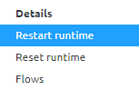

    

        <main class="micro-learning">
        <ul class="doc-nav">
            <li class="doc-nav__item"><a href="../../docs/microlearning/novice-emagiz-cloud-management-index" class="doc-nav__link">Home</a></li>
            <li class="doc-nav__item"><a href="#intro" class="doc-nav__link">Intro</a></li>
            <li class="doc-nav__item"><a href="#theory" class="doc-nav__link">Theory</a></li>
            <li class="doc-nav__item"><a href="#practice" class="doc-nav__link">Practice</a></li>
            <li class="doc-nav__item"><a href="#solution" class="doc-nav__link">Solution</a></li>
        </ul>

##### Intro

# Restart runtime

In this microlearning, we will focus on the action to restart a runtime. In some cases, it can be beneficial to restart a runtime.

Should you have any questions, please contact academy@emagiz.com.

- Last update: May 27th, 2021
- Required reading time: 4 minutes

## 1. Prerequisites
- Basic knowledge of the eMagiz platform

## 2. Key concepts
This microlearning centers around restarting a runtime
With runtime, we mean: This is the component in which the individual integration flows are deployed into

- By restarting the runtime, you restart all flows (including infra) of the runtime you have selected
    - Flows return in original state

##### Theory

## 3. Restart runtime

In this microlearning, we will focus on the action to restart a runtime. In some cases, it can be beneficial to restart a runtime. Before we delve into how to let us first consider the effect and implications of our actions.

- By restarting the runtime, you restart all flows (including infra) of the runtime you have selected
    - Flows return in original state

As you can see this action does not alter the state of your runtime by being executed. To execute this action please navigate to Deploy -> Architecture (if you are not there already). After you have done so you can access the context menu of a particular runtime (via a right mouse click) and select the option called restart runtime.

After a grace period please execute the standard checks, i.e checking the logs under Manage -> Log Entries and verify if you can access the runtimes via runtime dashboard.

##### Practice

## 4. Assignment

There is no assignment for this microlearning.

## 5. Key takeaways

- By restarting the runtime, you restart all flows (including infra) of the runtime you have selected
    - Flows return in original state

##### Solution

## 6. Suggested Additional Readings

There are no suggested additional readings on this topic

## 7. Silent demonstration video

There is no demonstration video of this functionality. 

</main>

