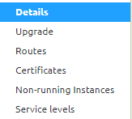
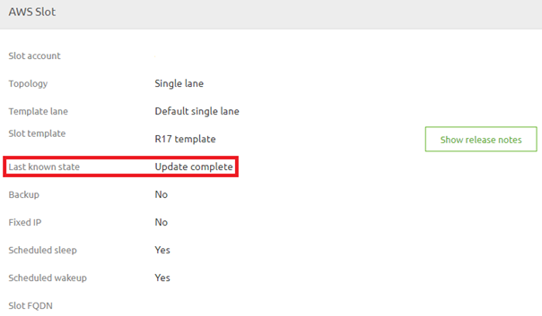

    

        <main class="micro-learning">
        <ul class="doc-nav">
            <li class="doc-nav__item"><a href="../../docs/microlearning/novice-emagiz-cloud-management-index" class="doc-nav__link">Home</a></li>
            <li class="doc-nav__item"><a href="#intro" class="doc-nav__link">Intro</a></li>
            <li class="doc-nav__item"><a href="#theory" class="doc-nav__link">Theory</a></li>
            <li class="doc-nav__item"><a href="#practice" class="doc-nav__link">Practice</a></li>
            <li class="doc-nav__item"><a href="#solution" class="doc-nav__link">Solution</a></li>
        </ul>

##### Intro

# Verify the status of ongoing change

In this microlearning, we will focus on how you can verify the status of an ongoing change. Whatever the action may be (add a runtime, cloud template upgrade, remove a route, etc.) the eMagiz platform will send a command to the eMagiz cloud. After the command is sent, you might want to verify the status of said change. In this microlearning, we will learn how you can verify that status.

Should you have any questions, please contact academy@emagiz.com.

- Last update: May 27th, 2021
- Required reading time: 4 minutes

## 1. Prerequisites
- Basic knowledge of the eMagiz platform

## 2. Key concepts
This microlearning centers around verifying the status of ongoing change.
With status, we mean: An indication of whether the action is started, in progress, or finished.

- The status verification gives you the option to monitor the progress of your change

##### Theory

## 3. Verify the status of ongoing change

In this microlearning, we will focus on how you can verify the status of an ongoing change. Whatever the action may be (add a runtime, cloud template upgrade, remove a route, etc.) the eMagiz platform will send a command to the eMagiz cloud. After the command is sent, you might want to verify the status of said change. In this microlearning, we will learn how you can verify that status.

- The status verification gives you the option to monitor the progress of your change

To verify the status simply navigate to Deploy -> Architecture (if you are not there already). After you have done so you can access the context menu on the white part of the canvas just shy of the integration platform itself. This will show you the following context menu. Please select the option called Details.

In the pop-up, that eMagiz shows you the 'Last known state'. This field is updated during a change and is, therefore, a good indicator of the status of said change. Please note that you need to re-open the pop-up to see whether a change in status has occurred.

Selecting this option will show you a pop-up. When you are on the latest available cloud template eMagiz will tell you. If you are not on the latest available cloud template you will see a dropdown menu indicating that you can select a newer version (more on updating the cloud template later). When you open the dropdown menu eMagiz will tell you how many versions there are between your current version and the latest available version.

##### Practice

## 4. Assignment

There is no assignment for this microlearning.

## 5. Key takeaways

- The status verification gives you the option to monitor the progress of your change
- Via the details screen in Deploy -> Architecture you can view the last known state

##### Solution

## 6. Suggested Additional Readings

There are no suggested additional readings on this topic

## 7. Silent demonstration video

There is no demonstration video of this functionality. 

</main>

