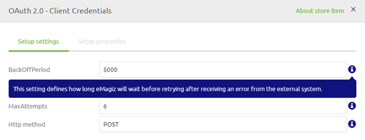
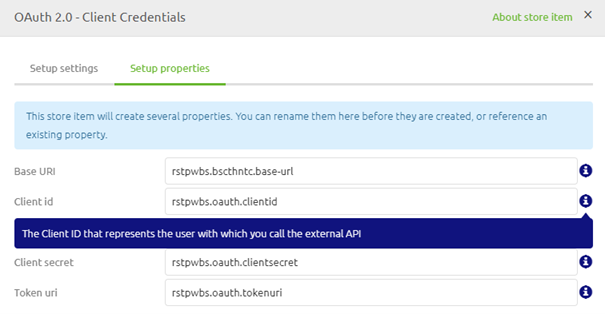

    

        <main class="micro-learning">
        <ul class="doc-nav">
            <li class="doc-nav__item"><a href="../../docs/microlearning/novice-emagiz-store-index" class="doc-nav__link">Home</a></li>
            <li class="doc-nav__item"><a href="#intro" class="doc-nav__link">Intro</a></li>
            <li class="doc-nav__item"><a href="#theory" class="doc-nav__link">Theory</a></li>
            <li class="doc-nav__item"><a href="#practice" class="doc-nav__link">Practice</a></li>
            <li class="doc-nav__item"><a href="#solution" class="doc-nav__link">Solution</a></li>
        </ul>

##### Intro

# Configuring Store Items

In this microlearning, we will learn how you can configure the imported store item from the eMagiz store in order to prevent you from opening each component manually. The goal of this microlearning is to get you acquainted with the wizard that eMagiz uses so you know how to succesfully finish the import of an eMagiz store item.

Should you have any questions, please get in touch with academy@emagiz.com.

- Last update: October 18th, 2021
- Required reading time: 5 minutes

## 1. Prerequisites
- Basic knowledge of the eMagiz platform

## 2. Key concepts
This microlearning centers around configuring store items
With eMagiz Store, we mean: A content library that is available to the community for the selection of re-usable solutions within the eMagiz platform

Within the configuration there are three segments:
- Setup settings
- Setup properties
- Setup resources

##### Theory

## 3. Configuring Store Items

Now that we have imported our store item it has become time to configure it so it suits our needs. To make this easier for you eMagiz has created a wizard that will guide you through three seperate steps (if applicable) as the last phase of importing your store item. These three segments are:
- Setup settings
- Setup properties
- Setup resources

In the remainder of the microlearning, we will discuss each of these segments.

### 3.1 Setup settings

The first tab will show all settings for components for which you need to consider how you want to use them within your solution. For example, a best practice when calling a REST service is to add a request handler advice chain that consists of a backoff period. In most cases the advised value for this is 5000 milliseconds (5 seconds). However there might be valid reasons why you want to deviate from this. As a result you need to consider settings like these upon importing the store item. Note that when we export we consider which of the settings need to filled in via this wizard and which are not relevant to be considered and touched by a user. Only those settings a user needs to consider are shown in this wizard. If there are no settings a user should consider this tab is not shown.

To help you determine what the settings actually mean you can check out the help text that is provided per setting. This alongside the alias should give you enough information to determine if the predefined setting is fine or that it needs some alteration.

### 3.2 Setup properties

The second tab will show all property placeholders that will be used within your flow. For example, a best practice when calling a REST service is to use a property to define (parts of) the URL. In this tab you can rename the property placeholders to your liking. Just as with the setup settings there are also help texts shown in this tab of the wizard. These help text should provide you with some context what the property is used for. Note that these properties will be available when you create the property via the releases functionality in Deploy for the deployer. That way the context of what is build is directly transferred upon the person that is deploying the latest functionality. Note that when there are no property placeholders needed in a store component the tab would not be shown.

### 3.3 Setup resources

The third tab will only be shown when there are resources that are missing but are needed to make the store item work. Therefore in most cases this page will not be shown to the user as the relevant resources will be linked to the store item. Note that references to resources in certain components are not automatically recognized and are therefore in need of a change after the import has succesfully been finished. An example of this behavior is the SSL reference on the Kafka connection components.

### 3.4 General

When you have moved through all relevant steps you will see a button that is called Add store item. This will lock your configuration and will make sure that all the components including the changed configuration is applied to your flow. Note that when the name of a channel matches a channel that is already existing in your flow eMagiz will automatically link the two together.

##### Practice

## 4. Assignment

See if you can finish the wizard and the import process of one store item so you get a feel of what to consider. This assignment can be completed with the help of the (Academy) project that you have created/used in the previous assignment.

## 5. Key takeaways

- When importing there might be certain configuration elements that you need to consider and subsequently configure
- Those settings are presented to you via a wizard in eMagiz
- When channels are named the same eMagiz will automatically link up the components

##### Solution

## 6. Suggested Additional Readings

There are no suggested additional readings on this topic.

## 7. Silent demonstration video

This video demonstrates how you could have handled the assignment and gives you some context on what you have just learned.

<iframe width="1280" height="720" src="../../vid/microlearning/novice-emagiz-store-configuring-store-items.mp4" frameborder="0" allow="accelerometer; autoplay; clipboard-write; encrypted-media; gyroscope; picture-in-picture" allowfullscreen></iframe>

</main>

