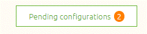

    

        <main class="micro-learning">
        <ul class="doc-nav">
            <li class="doc-nav__item"><a href="../../docs/microlearning/novice-emagiz-store-index" class="doc-nav__link">Home</a></li>
            <li class="doc-nav__item"><a href="#intro" class="doc-nav__link">Intro</a></li>
            <li class="doc-nav__item"><a href="#theory" class="doc-nav__link">Theory</a></li>
            <li class="doc-nav__item"><a href="#practice" class="doc-nav__link">Practice</a></li>
            <li class="doc-nav__item"><a href="#solution" class="doc-nav__link">Solution</a></li>
        </ul>

##### Intro

# Importing Store Items - Design Phase

In this microlearning, we will learn how you can import store items from the eMagiz store in Design after finding the one for you. This microlearning aims to get you acquainted with the various options of importing a store item in the Design phase of eMagiz.

Should you have any questions, please get in touch with academy@emagiz.com.

- Last update: April 5th, 2021
- Required reading time: 5 minutes

## 1. Prerequisites
- Basic knowledge of the eMagiz platform

## 2. Key concepts
This microlearning centers around importing store items in the Design Phase.
With eMagiz Store, we mean A content library available to the community to select re-usable solutions within the eMagiz platform.

- To import a store item in Design, you need to follow the import wizard
- When importing in Design, you can import the system message and accompanying flow fragments

##### Theory

## 3. Importing Store Items - Design Phase

In contrast with the Create phase store items (which provide you a set of components to achieve a particular objective), the Design Phase store items give you the additional functionality to import the system message(s). For example, to import a system message from the Store in Design, you must navigate to the system message via the context menu. When doing so for the first time, eMagiz will show you the following options after entering the "Start Editing" mode.

When you select the option Store, eMagiz will show you all alternatives within the eMagiz store to which a Message Definition is linked. Note that you can search by Name and by Brand in this overview.

Once you have found the item of your liking, you can select it by clicking on it. This action will lead you to the details page associated with the store item. Here you will find the relevant information related to this store item. On top of that, we provide you with a Versions & Variants tab that shows you all existing versions you could import.

In cases where you want the latest version use the button titled "Use latest version" on the Information tab. Once you have selected a version, eMagiz will show the following step of the process. Here you can choose whether you want to import the message definition(s), and it will ask you whether you wish to select accompanying flow fragments which are of use later on in Create. Since it is a GET operation, we only have a response definition to import. On top of that, we have two flow fragments. One that handles the authentication and one that holds the logic of the store item.

It is up to you what you exactly want to import. Maybe only the definition is enough for you, or perhaps you want the whole package. So here you have the choice to do so. Once you are satisfied with your selection, press "Use message(s)." This will start the import process. As a result, eMagiz will import the model on the canvas and define the system message(s) in the right panel.

Now you should create the mapping from your data model to the system message(s) yourself, and when you are finished, you can transfer the solution to Create just as you are used to doing.

### 3.1 Importing Design Store Item - Effect in Create

Once you have transferred the solution to the Create phase and open the relevant flow for which you have imported the store item, you will see a "Pending configuration" button on the bottom of your canvas.

After pressing this button, you will see a pop-up showing all flow fragments to import. You can select each flow fragment separately by pressing the Setup button. Note that if you want to configure this at a later moment, you can choose the option "Do this later" and come back later to finish the job. On top of that, you can press Cancel if you change your mind and don't want to import the flow fragments.

 When pressing this, eMagiz will show you the import wizard. This configuration wizard finishes the import process.

For all the details on this wizard, please check out the following [microlearning](novice-emagiz-store-configuring-store-items.md).

##### Practice

## 4. Assignment

Import a Store item in Design to import the system message(s) and subsequently transfer it to Create to see how to import the pending configurations. This assignment can be completed with the help of the (Academy) project that you have created/used in the previous assignment.

## 5. Key takeaways

- To import a store item in Design, you need to follow the import wizard
- When importing in Design, you can import the system message and accompanying flow fragments
- After importing the system message in Design, you can configure the flow fragments in Create with the help of the button called "Pending configurations."

##### Solution

## 6. Suggested Additional Readings

There are no suggested additional readings on this topic.

## 7. Silent demonstration video

This video demonstrates how you could have handled the assignment and gives you some context on what you have just learned.

<iframe width="1280" height="720" src="../../vid/microlearning/novice-emagiz-store-importing-store-items-design.mp4" frameborder="0" allow="accelerometer; autoplay; clipboard-write; encrypted-media; gyroscope; picture-in-picture" allowfullscreen></iframe>

</main>

