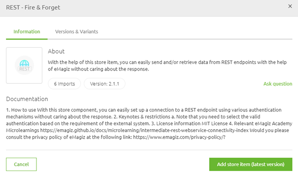
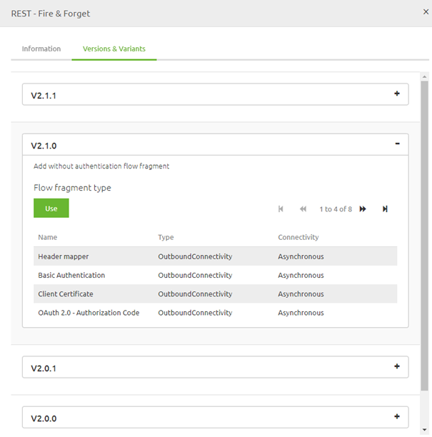
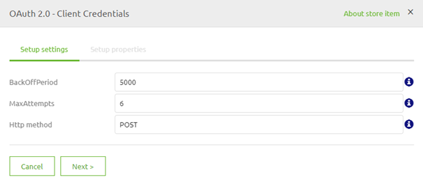

    

        <main class="micro-learning">
        <ul class="doc-nav">
            <li class="doc-nav__item"><a href="../../docs/microlearning/novice-emagiz-store-index" class="doc-nav__link">Home</a></li>
            <li class="doc-nav__item"><a href="#intro" class="doc-nav__link">Intro</a></li>
            <li class="doc-nav__item"><a href="#theory" class="doc-nav__link">Theory</a></li>
            <li class="doc-nav__item"><a href="#practice" class="doc-nav__link">Practice</a></li>
            <li class="doc-nav__item"><a href="#solution" class="doc-nav__link">Solution</a></li>
        </ul>

##### Intro

# Importing Store Items

In this microlearning, we will learn how you can import store items from the eMagiz store after finding the one for you. This microlearning aims to get you acquainted with the various options of importing a store item.

Should you have any questions, please get in touch with academy@emagiz.com.

- Last update: October 18th, 2021
- Required reading time: 5 minutes

## 1. Prerequisites
- Basic knowledge of the eMagiz platform

## 2. Key concepts
This microlearning centers around importing store items
With eMagiz Store, we mean: A content library that is available to the community for the selection of re-usable solutions within the eMagiz platform

There are several ways of importing a store item:
- Drag and drop on the canvas (with or without selecting a specific variant)
- Via Details -> Add store item
- Via Details -> Version & Variants

##### Theory

## 3. Importing Store Items

After you have found the store item of your liking, it has become time to import the store item so you can use it within your eMagiz model. To do so, we offer three options in eMagiz. These options are:
- Drag and drop on the canvas (with or without selecting a specific variant)
- Via Details -> Add store item
- Via Details -> Version & Variants

In the remainder of the microlearning, we will discuss each of these solutions in detail. While doing so, we will highlight the added value of each option. Note that for each option to work, you need to be in "Start Editing" mode on flow level in Create.

### 3.1 Drag and drop
The first option we will discuss is the drag and drop option available when importing store items. Hover over the item you want to drag, right-click to grab it, and move your mouse over the canvas to drop it. Note that the position of where you drop the store item matters. The position you drop the store item on will be where the left-most item will be placed. After you have dropped the store item on the canvas, you will either be presented with a pop-up asking you which variant of the store item you want, or you will be presented with the configuration pop-up. We will discuss the latter in the next microlearning. The former pop-up will look something as follows.

As a result of the drag and drop, you will ultimately end up in the configuration wizard to finish the import process. More on that in the next microlearning. Note that when you opt for the drag and drop option, you will always get the latest version of the store item.

### 3.2 Details -> Add store item
A second option for importing a store item is to press the button Add store item on the Details pop-up. In essence, this button yields the same results as the drag and drop we discussed earlier. However, this option is preferable over the drag and drop option when you are unsure which store item you need exactly and want to check out the details. This way, you do not have to close the pop-up and subsequently drag and drop but press the button to achieve the same result.

As a result of this option (just as with the drag and drop option), you will ultimately end up in the configuration wizard to finish the import process. More on that in the next microlearning. Note that you will always get the latest version of the store item when you opt for this option.

### 3.3 Details -> Version & Variants
The third and final option to import a store item is to navigate to Details and select the tab called version & variants. Contrary to the previous two options, this option provides you with the alternative of choosing an older version of a store item. This could be useful in cases where the system you are connecting with is not yet working with the latest version of a store item. In those situations, you want to opt for this route to select the specific version that will work for your solution.

Note that after selecting the correct flow fragment of a particular version, you will be shown the configuration wizard to finish the import process. More on that in the next microlearning.

### 3.4 End result
Regardless of which option you choose, the last step is to configure various parts of the components (such as values, properties, and resources) in such a way that they suit your specific use case. For this, we have the configuration wizard that finishes the import process.

For all the details on this wizard, please check out the following [microlearning](novice-emagiz-store-configuring-store-items.md).

##### Practice

## 4. Assignment

Try out all three import options up to the point of seeing the configuration wizard. This assignment can be completed with the help of the (Academy) project that you have created/used in the previous assignment.

## 5. Key takeaways

- eMagiz offers several import options that all have a specific use case
- As a result of your import, eMagiz will show a configuration wizard so you can configure everything before the import is finalized.

##### Solution

## 6. Suggested Additional Readings

There are no suggested additional readings on this topic.

## 7. Silent demonstration video

This video demonstrates how you could have handled the assignment and gives you some context on what you have just learned.

<iframe width="1280" height="720" src="../../vid/microlearning/novice-emagiz-store-importing-store-items.mp4" frameborder="0" allow="accelerometer; autoplay; clipboard-write; encrypted-media; gyroscope; picture-in-picture" allowfullscreen></iframe>

</main>

