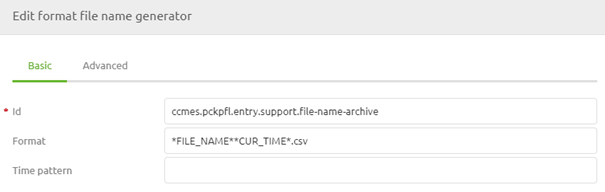
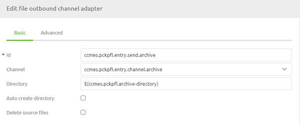
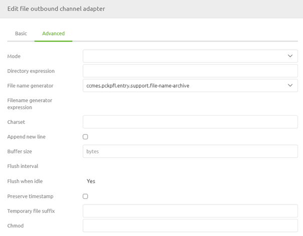
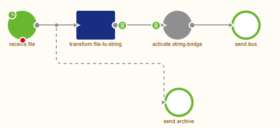
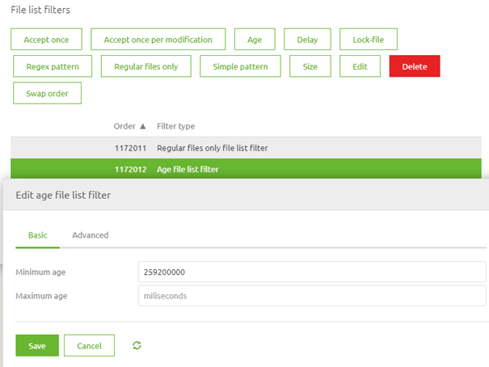
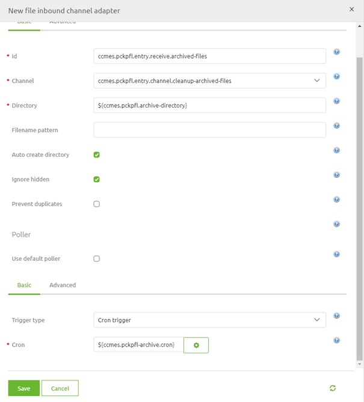
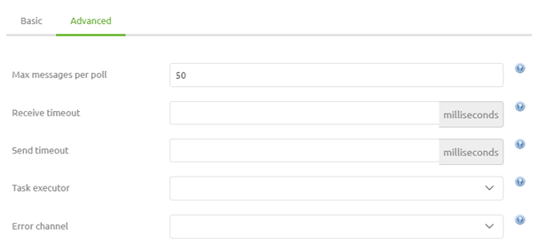
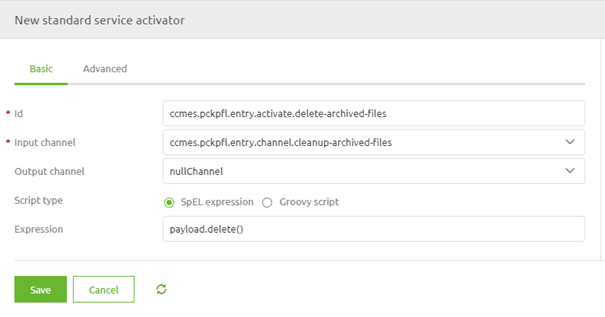

    

        <main class="micro-learning">
        <ul class="doc-nav">
            <li class="doc-nav__item"><a href="../../docs/microlearning/novice-file-based-connectivity-index" class="doc-nav__link">Home</a></li>
            <li class="doc-nav__item"><a href="#intro" class="doc-nav__link">Intro</a></li>
            <li class="doc-nav__item"><a href="#theory" class="doc-nav__link">Theory</a></li>
            <li class="doc-nav__item"><a href="#practice" class="doc-nav__link">Practice</a></li>
            <li class="doc-nav__item"><a href="#solution" class="doc-nav__link">Solution</a></li>
        </ul>

##### Intro

# Archiving
 
In most cases, the customer wants some kind of insurance policy to determine whether a file has entered or left eMagiz. One way of supplying such functionality for file-based data exchange is through the use of archiving functionality. With the help of this functionality can you easily write the file as received (or about to be sent) to a separate location. By ensuring that the data stays in that location for a certain amount of time and by giving the customer and yourself access you have a sort of audit trail that details the messages that have been exchanged. This archive could also be used to analyze problems in case things go wrong. In this microlearning, we will learn how you can set up that archiving and learn how to clean up the archiving to ensure that data is only kept for a limited period.

Should you have any questions, please contact academy@emagiz.com.

- Last update: May 31th, 2021
- Required reading time: 6 minutes

## 1. Prerequisites
- Basic knowledge of the eMagiz platform

## 2. Key concepts
This microlearning centers around learning how to archive correctly.

By archiving, we mean: Temporarily storing data for audit purposes and possible retry scenarios.

- Archiving is used for audit purposes
- Archiving is used for retry scenarios
- Ensure that data is cleaned after a retention period to keep in control of the data

##### Theory
  
## 3. Archiving

In most cases, the customer wants some kind of insurance policy to determine whether a file has entered or left eMagiz. One way of supplying such functionality for file-based data exchange is through the use of archiving functionality. With the help of this functionality can you easily write the file as received (or about to be sent) to a separate location. By ensuring that the data stays in that location for a certain amount of time and by giving the customer and yourself access you have a sort of audit trail that details the messages that have been exchanged. This archive could also be used to analyze problems in case things go wrong. In this microlearning, we will learn how you can set up that archiving and learn how to clean up the archiving to ensure that data is only kept for a limited period.

### 3.1 Archiving itself

To make this work in eMagiz you need to navigate to the Create phase of eMagiz and open the entry flow in which you want to archive the files. Within the context of this flow, we need to add functionality that will ensure that each input file is archived and cleaned up when older than three days. To do so first enter "Start Editing" mode on flow level. The first decision we have to take is how we are going to name the files within the archiving. The best practice, in this case, is the original filename + the current time as a suffix. You can define this by dragging a format file name generator (support object) to the canvas. 

After we have done this please add a file outbound channel adapter to the flow including an input channel. Ensure that you use a property for the directory that references another directory compared to the input directory to prevent creating an infinite loop.

Now that we have configured the basics let us turn our attention to the advanced configuration. In the advanced tab of this component, we need to select the file name generator to ensure that the files are named correctly. In case you process each line separately you have to choose whether to save them as separate files in the archive or by appending them again. This can be achieved by selecting the correct Mode. In most cases, however, the default Mode of Replace will suffice.

The moment you are satisfied press Save. Now that we have configured this it becomes time to determine how we get the needed input to write to our archive. In the example we are using here we want to archive our input file so we need to ensure that the data we received is written to the archive as soon as possible. To do so place a wiretap on the first channel after retrieving the file. This will make sure that the message is archived before processed further. The result should be something as shown below. Note that this same piece of logic could be applied in other flows within the eMagiz platform in a similar manner.

### 3.2 Clean up the Archive

To ensure that the data is not kept indefinitely we need to clean up the archive. We do so to prevent problems with disk space but also to prevent data leaks of old data that could impact the privacy of others. Before we can set up the logic in eMagiz we need to talk to the customer to see what an acceptable term is within which the data is kept. In most cases, this is a week or two weeks. In this example, we have chosen three days.

Now that we know the limit it is time to configure the components. We start with a composite file filter (support object). Within this filter, we at least define how old a file must be before it can be deleted (in milliseconds). If we turn three days into milliseconds we get 259200000. Furthermore, we at least define that we only want to delete regular files.

Having done so we can add a file inbound channel adapter to the canvas including an output channel. Ensure that the property reference for the directory matches the one you have used before in the outbound channel adapter. Furthermore link the filter to the component and define the poller according to the best practice.

One thing we should not forget within this configuration is to set the Max messages per poll on the Advanced tab of the poller-configuration to a sufficiently high number (i.e. 50). If you forget to do so and you only check once a day it will mean that only one message will be deleted that day.

Now eMagiz will check on a set time interval whether there are files that are older than three days that are ready for deletion. One last step to go. This last step will ensure that all files that fit the bill will be deleted from the archive. Simply add a standard service activator to the canvas and define the following SPeL expression within the component: payload.delete().

This will ensure that each file that is retrieved will indeed be deleted from the archive.

##### Practice

## 4. Assignment

Configure an entry in which you build the archiving and the clean up of the archiving.
This assignment can be completed with the help of the (Academy) project that you have created/used in the previous assignment.

## 5. Key takeaways

- Archiving is used for audit purposes
- Archiving is used for retry scenarios
- Ensure that data is cleaned after a retention period to keep in control of the data
- Don't forget the max messages per poll

##### Solution

## 6. Suggested Additional Readings

If you are interested in this topic and want more information on it please read the help text provided by eMagiz.

## 7. Silent demonstration video

<iframe width="1280" height="720" src="../../vid/microlearning/novice-file-based-connectivity-archiving.mp4" frameborder="0" allow="accelerometer; autoplay; clipboard-write; encrypted-media; gyroscope; picture-in-picture" allowfullscreen></iframe>

</main>

