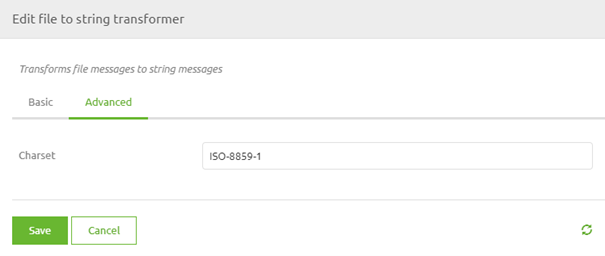

    

        <main class="micro-learning">
        <ul class="doc-nav">
            <li class="doc-nav__item"><a href="../../docs/microlearning/novice-file-based-connectivity-index" class="doc-nav__link">Home</a></li>
            <li class="doc-nav__item"><a href="#intro" class="doc-nav__link">Intro</a></li>
            <li class="doc-nav__item"><a href="#theory" class="doc-nav__link">Theory</a></li>
            <li class="doc-nav__item"><a href="#practice" class="doc-nav__link">Practice</a></li>
            <li class="doc-nav__item"><a href="#solution" class="doc-nav__link">Solution</a></li>
        </ul>

##### Intro

# Character set
 
In some cases, the input you receive or the output that you need to send to an external party cannot handle all characters or the input or output is written with the help of a character set. In this microlearning, we will learn how you can define the character set for file-based connectivity to ensure that you can process and deliver files according to the specifications.

Should you have any questions, please contact academy@emagiz.com.

- Last update: May 31th, 2021
- Required reading time: 5 minutes

## 1. Prerequisites
- Basic knowledge of the eMagiz platform

## 2. Key concepts
This microlearning centers around learning how to define the character set to ensure that eMagiz processes the information correctly.

By character set, we mean: The composite number of different characters that are being used and supported by computer software and hardware. It consists of codes, bit patterns, or natural numbers used in defining some particular character.

- Some external system talk in a different character set
- eMagiz talks in default UTF-8 as a character set and assumes everyone else also does this
- In cases of mismatch correct is at the point where you talk with the other system (i.e. entry or exit)

##### Theory
  
## 3. Character set

In some cases, the input you receive or the output that you need to send to an external party cannot handle all characters or the input or output is written with the help of a character set. In this microlearning, we will learn how you can define the character set for file-based connectivity to ensure that you can process and deliver files according to the specifications.

Sometimes external systems only talk in a specific character set. To ensure that all the data is properly communicated between eMagiz and the other system we need to make sure that we define which character set that is so we can tell it to eMagiz via a component. That way eMagiz will deviate from its default (i.e. UTF-8) and will process the file according to that different character set. In practice, we mainly see windows-1252 as an alternative that pops up once in a while. In various components that deal with file handling, you can define the character set on which eMagiz should act. Examples of such components are:

- File to string transformer
- Flat file to XML transformer
- File outbound channel adapter

In all these components you have the option to define the character set within the Advanced tab of the component. In this microlearning, we will use the File to string transformer to illustrate how that will look.

In this field, you can define the character set of your choice. To make this work in eMagiz you need to navigate to the Create phase of eMagiz and open the entry flow in which you want to retrieve the file to a certain location. Within the context of this flow, we need to add functionality that will ensure that the correct character set is used. To do so first enter "Start Editing" mode on flow level. After that open, the File to string transformer, navigate to the Advanced tab, and fill in the correct character set. After you have defined the correct character set the only thing left to do is to Save the component. See the suggested additional readings section on the complete list of character sets that are supported by Java 8. 

Congratulations you have successfully learned how to specify the character set.

##### Practice

## 4. Assignment

Configure an entry in which you define the component and configuration needed to process a file on a per-line basis.
This assignment can be completed with the help of the (Academy) project that you have created/used in the previous assignment.

## 5. Key takeaways

- Some external system talk in a different character set
- eMagiz talks in default UTF-8 as a character set and assumes everyone else also does this
- In cases of mismatch correct is at the point where you talk with the other system (i.e. entry or exit)
- eMagiz provides several components within which you can define the character set

##### Solution

## 6. Suggested Additional Readings

If you are interested in this topic and want more information on it please read the help text provided by eMagiz and read the following links:

- https://docs.oracle.com/javase/8/docs/technotes/guides/intl/encoding.doc.html
- https://www.techopedia.com/definition/941/character-set
- https://www.smashingmagazine.com/2012/06/all-about-unicode-utf8-character-sets/

## 7. Silent demonstration video

<iframe width="1280" height="720" src="../../vid/microlearning/novice-file-based-connectivity-characterset.mp4" frameborder="0" allow="accelerometer; autoplay; clipboard-write; encrypted-media; gyroscope; picture-in-picture" allowfullscreen></iframe>

</main>

