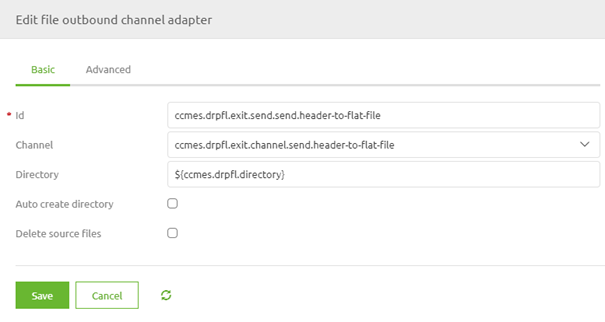
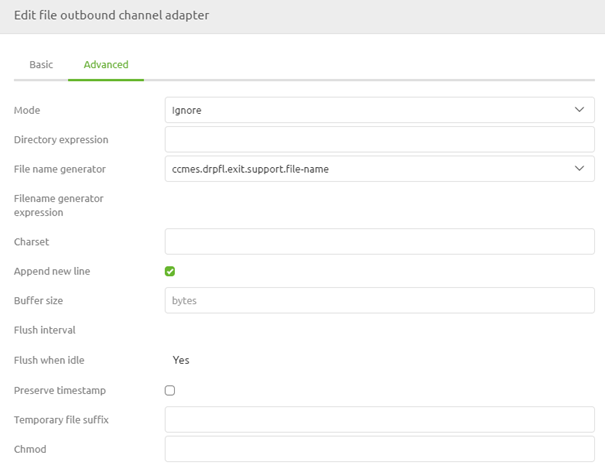
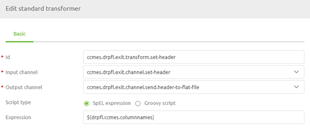
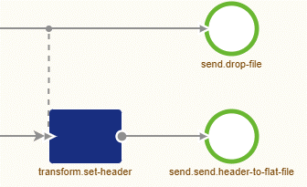

    

        <main class="micro-learning">
        <ul class="doc-nav">
            <li class="doc-nav__item"><a href="../../docs/microlearning/novice-file-based-connectivity-index" class="doc-nav__link">Home</a></li>
            <li class="doc-nav__item"><a href="#intro" class="doc-nav__link">Intro</a></li>
            <li class="doc-nav__item"><a href="#theory" class="doc-nav__link">Theory</a></li>
            <li class="doc-nav__item"><a href="#practice" class="doc-nav__link">Practice</a></li>
            <li class="doc-nav__item"><a href="#solution" class="doc-nav__link">Solution</a></li>
        </ul>

##### Intro

# Header line
 
In this microlearning, we will learn how you can define a header line in which you specify the naming of the various columns. Some external systems require a header line when you supply them with data via a flat file that is placed somewhere.

Should you have any questions, please contact academy@emagiz.com.

- Last update: May 28th, 2021
- Required reading time: 5 minutes

## 1. Prerequisites
- Basic knowledge of the eMagiz platform

## 2. Key concepts
This microlearning centers around learning how to place a header line on a flat-file output.

By header line we mean: A line in the output that defines the naming of the various columns

Some external parties require that the first line in the flat file output (i.e. CSV) is filled with column names (i.e. headers). In eMagiz, we call this line a header line.

##### Theory
  
## 3. Header line

In this microlearning, we will learn how you can define a header line in which you specify the naming of the various columns. Some external systems require a header line when you supply them with data via a flat file that is placed somewhere. The header line is the first line in the flat file output. Within this line, the various column names are specified for clarity.

To add such a header line in eMagiz you need to navigate to the Create phase of eMagiz and open the exit flow in which you want to drop the file to a certain location. Within the context of this flow, we need to add functionality that will ensure that a header line is written to the output before any functional lines are added. To do so first enter "Start Editing" mode on flow level. After you have done so please add a file outbound channel adapter to the flow including an input channel. We will use this component to write our header line to the flat file output. 

Ensure that the directory to which you reference is the same as in your functional file outbound channel adapter. 

Now it is time to turn our attention to the Advanced tab. For the Mode select Ignore. Select this option to ensure that the header line is only written down once when there is no output created yet and not somewhere in the middle, in the end, or every time. Furthermore, select the option Append New Line to ensure that the remainder of the information is not appended to the same line.

After you have done so we need to add a standard transformer that defines the various column names to be written to the flat file output. To do so add the standard transformer component to the canvas including an input channel. After you have done so define the relevant SpEL expression. In this case, we advise using a property value that represents a string of column names. The value of the property should be something as follows:

'Header1;Header2;Header3;Header4'

Do note that the separator, in this case, needs to match the requirements of the external system. At the flow configuration level, the standard transformer should look as follows.

Our last step is to ensure that this piece of logic is tied to the main flow and is executed before writing the functional line(s) to the output file. To make that happen we need to add a wiretap to the flow. With the help of this functionality, you can define which part of the logic takes precedence over another part of the logic. To do so double click on the channel on which you want to place a wiretap, select the option wiretap and select the correct wiretap channel. After you have done this the result should be something as follows:

With these couple of steps, you have now successfully added logic to your flow that will ensure that a header line is added before any functional line(s) are written to the output file.

##### Practice

## 4. Assignment

Configure an exit in which you define and write a header line to a flat-file output before adding functional lines.
This assignment can be completed with the help of the (Academy) project that you have created/used in the previous assignment.

## 5. Key takeaways

- The header line contains the names of the columns of the flat file output
- Use the Ignore mode to ensure the header line is created once
- Use the wiretap to ensure the header line is created first

##### Solution

## 6. Suggested Additional Readings

If you are interested in this topic and want more information on it please read the release notes provided by eMagiz

## 7. Silent demonstration video

<iframe width="1280" height="720" src="../../vid/microlearning/novice-file-based-connectivity-header-line.mp4" frameborder="0" allow="accelerometer; autoplay; clipboard-write; encrypted-media; gyroscope; picture-in-picture" allowfullscreen></iframe>

</main>

