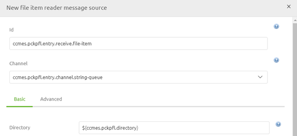
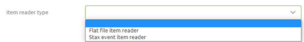
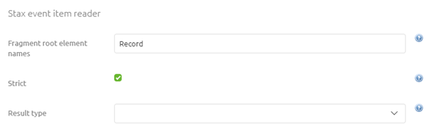
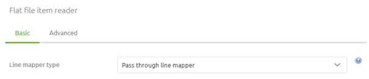
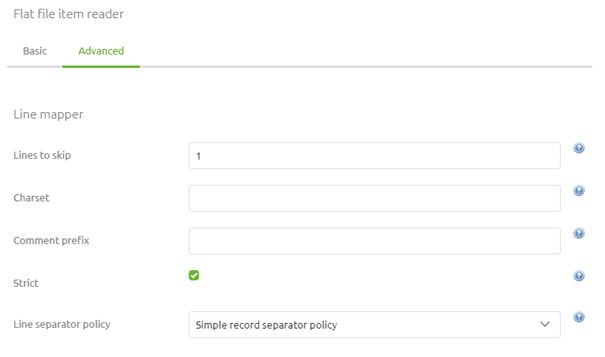
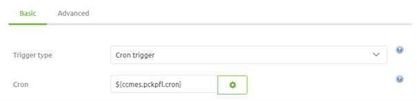

    

        <main class="micro-learning">
        <ul class="doc-nav">
            <li class="doc-nav__item"><a href="../../docs/microlearning/novice-file-based-connectivity-index" class="doc-nav__link">Home</a></li>
            <li class="doc-nav__item"><a href="#intro" class="doc-nav__link">Intro</a></li>
            <li class="doc-nav__item"><a href="#theory" class="doc-nav__link">Theory</a></li>
            <li class="doc-nav__item"><a href="#practice" class="doc-nav__link">Practice</a></li>
            <li class="doc-nav__item"><a href="#solution" class="doc-nav__link">Solution</a></li>
        </ul>

##### Intro

# Processing a File per Line
 
In some cases, you want to treat each unique part of your input file as its message instead of processing the complete file as its message. In this microlearning, we will learn how you can process a (large) file on a per-line basis.

Should you have any questions, please contact academy@emagiz.com.

- Last update: May 31th, 2021
- Required reading time: 7 minutes

## 1. Prerequisites
- Basic knowledge of the eMagiz platform

## 2. Key concepts
This microlearning centers around learning how to process an incoming file per line.

By processing per line, we mean: Splitting up the input into discernable pieces that each will become a unique message

- Easy way of reading a file line by line and sending it to eMagiz (Low on memory)
- Ability to process each line based on distinctive logic that is relevant on line level
- Can be used for flat file as well as XML input files

##### Theory
  
## 3. Processing a File per Line

In some cases, you want to treat each unique part of your input file as its message instead of processing the complete file as its message. In this microlearning, we will learn how you can process a (large) file on a per-line basis.

To make this work in eMagiz you need to navigate to the Create phase of eMagiz and open the entry flow in which you want to retrieve the file to a certain location. Within the context of this flow, we need to add functionality that will ensure that each line is read and processed separately and will become its unique message. To do so first enter "Start Editing" mode on flow level. After you have done so please add a file item reader message source to the flow. We will use this component to read and process our input file on a per-line basis. 

The first step would be to define the directory from which we read our messages. As always reference to the directory with the help of a property.

Secondly, just as when reading the file as a whole ensure that you use a filter to retrieve only the correct files from the directory.

### 3.1 Item reader Type

Now it is time to select our Item reader Type. As the help text of the eMagiz component suggest there are two choices with this component. The first (and most frequently used) option is the Flat file item reader. With this option, you can read each line within the flat file input file and output is at a separate message. The second option is called the Stax event item reader. With this option, you can read your input XML and output messages on a per-record basis.

Based on your choice the exact configuration will differ. 

#### 3.1.1 Stax Event Item Reader

For the Stax event item reader, you need to define the name of the element on which you want to split the XML and define whether you want to throw an error in case no such element exists in the input file (By (de)selecting the option Strict). The default setting of eMagiz is advisable for this option.

#### 3.1.2 Flat File Item Reader

For the Flat File item reader, there are some more choices and configurations to be made. There are three options you can choose from:
- Pass through line mapper
- Default line mapper
- Pattern matching composite line mapper

Each of these options has some advantages and disadvantages. Adhering to the best practices of eMagiz (i.e. no transformation in the entry) the best option would be to use the pass-through line mapper. As the name suggests this option does nothing except give a string back to the flow on a per line basis. However, choosing this option means that the actual transformation from that string to XML needs to happen later in the process (most likely in the onramp) with the help of a flat-file to XML transformer (more on that component in a later course).

The other two options transform the input line into an XML output. So you win one step in the process. However, no standard eMagiz error handling is advisable when you start transforming data within the entry. So in case, something goes wrong to analyze the error will become more difficult. Furthermore, another potential disadvantage is that when one line fails the processing of the rest of the file also halts.

For the remainder of this microlearning, we will assume that the option pass through line mapper is chosen.

As you can see on the Basic level we are done. However, it is always good to check out the settings on the Advanced tab, especially in this case, to see if there are additional configuration options that could benefit us. The setting of most interest, in this case, is the Lines to Skip setting (default setting is 0). With this setting, you can define whether or not you want to process the header line(s) that exists within your input file. The remainder of the settings is (in most cases) good the way eMagiz has set them up.

### 3.2 Poller

Now that we have selected and configured the item reader type it becomes time to fill in the last part of the configuration, the poller. For polling eMagiz offers three options:

- Fixed Delay Trigger
- Fixed Rate Trigger
- Cron Trigger

Of these options, the cron trigger is used most frequently in eMagiz. The reason being is that you can define this option via a property that you can alter without having to alter the flow version in Create.

After finishing all these configuration steps we can press Save to save our work and ensure that we can process the input file on a per-line basis.

##### Practice

## 4. Assignment

Configure an entry in which you define the component and configuration needed to process a file on a per-line basis.
This assignment can be completed with the help of the (Academy) project that you have created/used in the previous assignment.

## 5. Key takeaways

- Easy way of reading a file line by line and sending it to eMagiz (Low on memory)
- Ability to process each line based on distinctive logic that is relevant on line level
- Can be used for flat file as well as XML input files
- Try to avoid complex transformations within the entry

##### Solution

## 6. Suggested Additional Readings

If you are interested in this topic and want more information on it please read the release notes provided by eMagiz

## 7. Silent demonstration video

<iframe width="1280" height="720" src="../../vid/microlearning/novice-file-based-connectivity-processing-a-file-per-line.mp4" frameborder="0" allow="accelerometer; autoplay; clipboard-write; encrypted-media; gyroscope; picture-in-picture" allowfullscreen></iframe>

</main>

