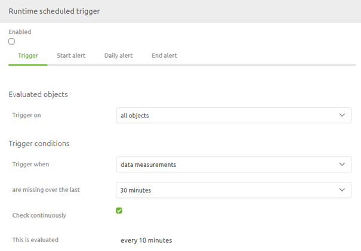
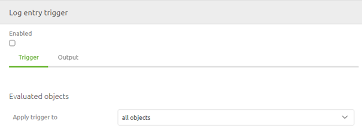
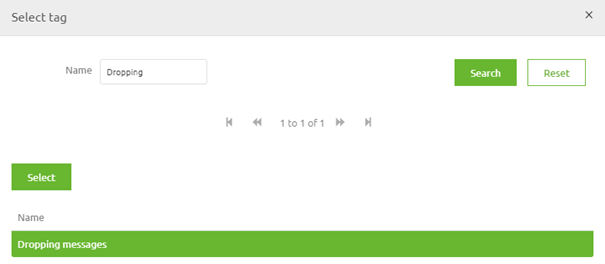

    

        <main class="micro-learning">
        <ul class="doc-nav">
            <li class="doc-nav__item"><a href="../../docs/microlearning/novice-flow-management-index" class="doc-nav__link">Home</a></li>
            <li class="doc-nav__item"><a href="#intro" class="doc-nav__link">Intro</a></li>
            <li class="doc-nav__item"><a href="#theory" class="doc-nav__link">Theory</a></li>
            <li class="doc-nav__item"><a href="#practice" class="doc-nav__link">Practice</a></li>
            <li class="doc-nav__item"><a href="#solution" class="doc-nav__link">Solution</a></li>
        </ul>

##### Intro

# Remove flows from Create

In this microlearning, we will focus on how you can link your alerting tag(s) to alerting trigger(s).
In a previous microlearning we already discussed parts of this. In this microlearning we will zoom in on the Trigger section of Alerting.

Should you have any questions, please contact academy@emagiz.com.

- Last update: April 1th 2021
- Required reading time: 5 minutes

## 1. Prerequisites
- Basic knowledge of the eMagiz platform

## 2. Key concepts
This microlearning centers around linking tag(s) to trigger(s).
With linking, we mean: Categorize a certain trigger with the help of tag functionality

- Make tags descriptive in nature
- Re-use tags over multiple triggers that have the same aim
- In case of a start, daily and end alert use the same tag for all of them

##### Theory

## 3. Remove flows from Create

In our previous dalliance with this subject we already discussed parts of what we will discuss in this microlearning. This microlearning is mainly meant to reiterate the importance of using proper tags when setting up your alerting. Linking the correct tag(s) to your trigger(s) will help you to clarify how the alerting structure for your project is set up. This is not only nice when you want to revisit the alerting section but it is also very usefull in communication with the business and with a support desk. This way you can create a common truth surrounding a common language. Key parts in achieving this are:

- Make tags descriptive in nature
- Re-use tags over multiple triggers that have the same aim
- In case of a start, daily and end alert use the same tag for all of them

To link tag(s) to trigger(s) you navigate to Manage -> Alerting -> Triggers

In this overview you can simply select a specific trigger to see the detailed configuration of the trigger. Depending on the type of trigger that you open the avaiable tabs within the pop-up and the information shown in the pop-up can differ. Below we show two distinct examples:

As you can see from these examples is that the number of tabs within the pop-up differ. The first tab is were the configuration of the trigger happens. In all the other tabs you need to link the tag(s) to the trigger. To do so simply press Add in one of these tabs, search for the Tag you want to link to this trigger, select it and press Select.

When you are happy with your selection you can press Save on trigger level and eMagiz will link the tag to the trigger.

##### Practice

## 4. Assignment

Link an (extra) tag to a trigger.
This assignment can be completed with the help of the (Academy) project that you have created/used in the previous assignment.

## 5. Key takeaways

- Assist in creating a common language
- Make tags descriptive in nature
- Re-use tags over multiple triggers that have the same aim
- In case of a start, daily and end alert use the same tag for all of them

##### Solution

## 6. Suggested Additional Readings

If you are interested in this topic and want more information on it please read the help text provided by eMagiz.

## 7. Silent demonstration video

This video demonstrates how you could have handled the assignment and gives you some context on what you have just learned. 

<iframe width="1280" height="720" src="../../vid/microlearning/novice-alerting-linking-tags-to-triggers.mp4" frameborder="0" allow="accelerometer; autoplay; clipboard-write; encrypted-media; gyroscope; picture-in-picture" allowfullscreen></iframe>	

</main>

